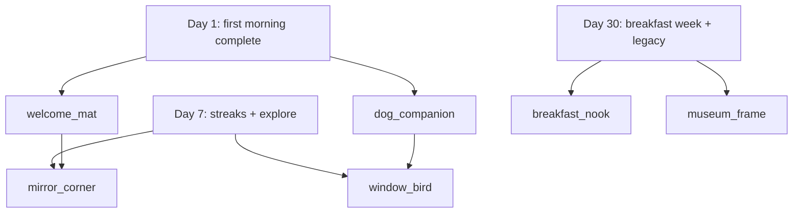

# Progression Bible — Unlock Graph & Day Beats

**Version:** 1.0 (skeleton)  
**Status:** Production template — links gameplay time to world reveals  
**Authority:** WDB progression nodes → this Bible → World/Entity Bibles  
**Cross-ref:** [WORLD_DESIGN_BIBLE.md](../WORLD_DESIGN_BIBLE.md) §8+ · LWES §23 Discovery

---

## Purpose

Maps **Day 1 / Day 7 / Day 30** (and milestone triggers) to concrete world changes. WDB owns node definitions; this Bible owns **when the child sees what** in Min värld (`home` pilot).

---

## Progression entry schema

| Field | Type | Required | Notes |
|-------|------|----------|-------|
| `beat_id` | string | ✓ | Unique |
| `wdb_node_id` | string | ✓ | WDB progression node reference |
| `progression_key` | string | ✓ | Pack JSON path e.g. `progression.routine_home.welcome_mat` |
| `unlock_trigger` | string | ✓ | Human-readable + machine trigger |
| `earliest_day` | int | | Soft floor (not hard gate unless WDB says) |
| `scene_id` | string | ✓ | Where change visible |
| `entity_or_slot` | string | ✓ | What appears/changes |
| `emotion` | enum | ✓ | Five feelings filter |
| `celebration_class` | enum | | whisper · small · placement (LWES §27) |
| `world_event_ref` | string | | Optional World Events Bible link |
| `copy_sv` | string | | Max one line; optional |

---

## Example — `home` world (routine_home / Mitt hem)

### Day 1 — first visit

```yaml
- beat_id: home_d1_first_foot_inside
  wdb_node_id: routine_home_welcome_mat
  progression_key: progression.routine_home.welcome_mat
  unlock_trigger: first_activity_complete:morning
  earliest_day: 1
  scene_id: home_exterior
  entity_or_slot: build_welcome_mat
  emotion: ownership
  celebration_class: whisper
  copy_sv: ""                    # No modal — mat appears, child notices

- beat_id: home_d1_dog_present
  wdb_node_id: routine_home_mira_arrives
  progression_key: progression.routine_home.npc_mira
  unlock_trigger: milestone:root + first_world_enter
  earliest_day: 1
  scene_id: home_hall
  entity_or_slot: dog_companion
  emotion: comfort
  celebration_class: whisper
  world_event_ref: evt_dog_first_greet
```

### Day 7 — familiarity

```yaml
- beat_id: home_d7_mirror_corner
  wdb_node_id: routine_home_mirror_corner
  progression_key: progression.routine_home.mirror
  unlock_trigger: activity_streak:brush_teeth:3
  earliest_day: 7
  scene_id: home_bathroom
  entity_or_slot: mirror_corner_room
  emotion: capability
  celebration_class: small

- beat_id: home_d7_bird_window
  wdb_node_id: routine_home_window_bird
  progression_key: progression.routine_home.bird
  unlock_trigger: explore:taps:5
  earliest_day: 7
  scene_id: home_hall
  entity_or_slot: window_bird
  emotion: curiosity
  celebration_class: whisper
```

### Day 30 — depth

```yaml
- beat_id: home_d30_breakfast_nook
  wdb_node_id: routine_home_breakfast_nook
  progression_key: progression.routine_home.breakfast_nook
  unlock_trigger: activity_group:breakfast:complete_week
  earliest_day: 30
  scene_id: home_kitchen
  entity_or_slot: breakfast_nook_room
  emotion: comfort
  celebration_class: placement

- beat_id: home_d30_museum_frame
  wdb_node_id: routine_home_museum_frame
  progression_key: progression.routine_home.museum
  unlock_trigger: milestone:legacy + parent_export_opt_in
  earliest_day: 30
  scene_id: home_hall
  entity_or_slot: museum_frame_feature
  emotion: belonging
  celebration_class: small
```

---

## Unlock graph (Mermaid)



---

## Rules

1. **WDB node MUST exist** before beat ships.  
2. **No guilt triggers** — missed days do not revoke beats.  
3. **Celebration class** must match LWES caps.  
4. Every beat updates World Bible + Entity Bible before implementation.

---

*WDB is source of truth for node IDs; this Bible is source of truth for child-visible timing.*
