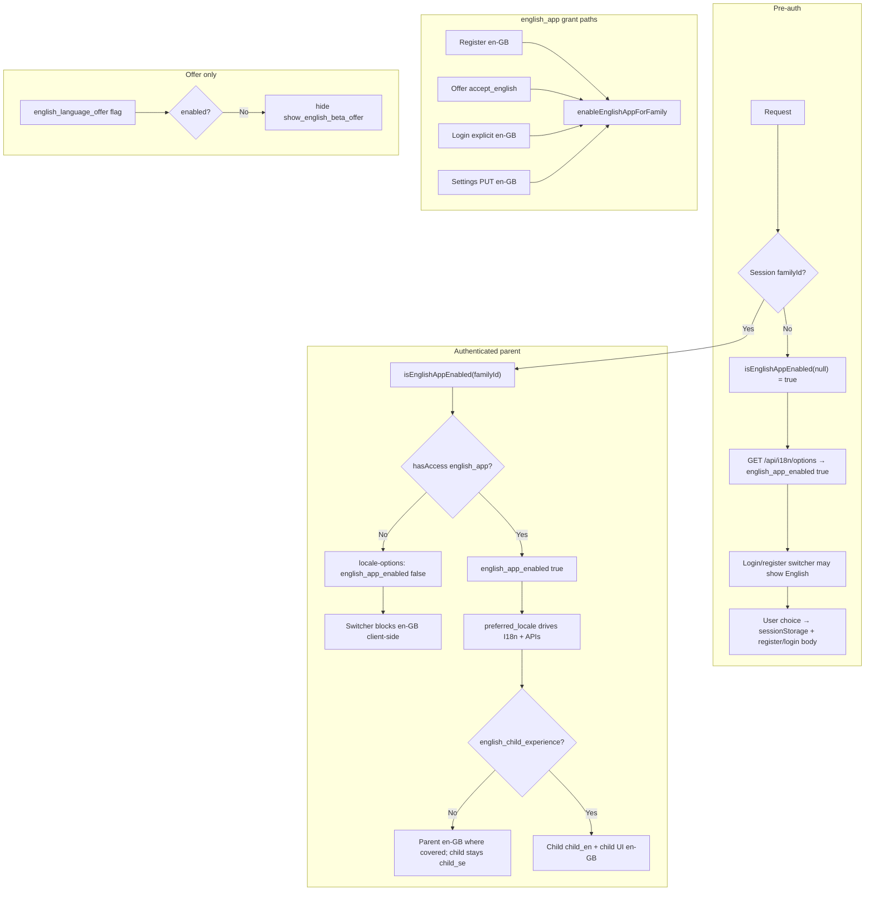

# Global English Beta — source audit (2026-08-04)

Read-only audit. No code, flag, deploy, or merge actions were performed.

## Executive summary

| Item | Finding |
|------|---------|
| **Classification** | **B. PARTIAL_SOURCE_FOUND** (see §9) |
| **Exact label “Global English Beta”** | **Not found** in repo docs, branches, PR titles, commit messages, or searched agent metadata |
| **Hypothesized deliverable** (English for all families without per-family `english_app` allowlist / global kill-switch flip) | **Not implemented** in any verified branch or `origin/main` |
| **Related shipped work** | English Beta **Sweden-controlled rollout** merged on `main` under other names (#709–#842, foundation **#717**) |

The FINAL SHIP assumption that a dedicated **Global English Beta** branch/PR exists was **incorrect** for that exact name and for a verified “remove family allowlist / globally enable English app” package. The **i18n English beta platform** is largely on `main`; **global rollout without per-family gating** is still absent.

---

## 1. Main SHA (audit baseline)

| Ref | SHA |
|-----|-----|
| `origin/main` | `2c542358cc2512a4a1b98f65938db16985c73bc6` |
| Detached audit worktree | Same (`2c542358`) |
| Commit message | `fix(auth): native child-first session restore (PR #858)` |

Audit worktree: detached checkout of `origin/main` (created via `git worktree add --detach` per audit runbook).

---

## 2. Remote branches (inventory)

- **Total remote branches:** 265 (`git branch -r`).
- **Tags:** none matching `english` / `i18n` / `global` / `beta`.
- **Remote branches whose names still mention i18n/english/locale** (merged work; branches often retained):

| Branch |
|--------|
| `origin/cursor/child-login-locale-persist-fbe1` |
| `origin/cursor/child-rewards-i18n-fbe1` |
| `origin/cursor/contact-i18n-fbe1` |
| `origin/cursor/daily-log-boot-locale-fbe1` |
| `origin/cursor/english-launch-rc-audit` |
| `origin/cursor/extend-sv-en-content-locale-b0f7` |
| `origin/cursor/forgot-password-email-locale-b2ec` |
| `origin/cursor/planning-calendar-library-i18n-fbe1` |
| `origin/cursor/rc1-i18n-safe-rewards-profile-fordig-b0f7` |
| `origin/cursor/today-children-load-i18n-fbe1` |

**No remote branch** matched names such as `global-english`, `english-global`, `english_app_global`, or `Global English Beta`.

---

## 3. GitHub PRs (verified via `gh`, not inferred from branch names)

### Search: “Global English Beta” / `english_app_global`

- Issues/PR search for **“Global English Beta”:** no hits.
- PR search for **`english_app_global`:** no hits.

### English / i18n program (merged — source of current `main` behavior)

Representative merged PRs (not an exhaustive list):

| PR | Branch | Title (abbrev.) | State |
|----|--------|-----------------|-------|
| #709 | `cursor/i18n-en-gb-platform-b8ba` | i18n foundation for en-GB | MERGED |
| #717 | `cursor/i18n-language-launch-foundation-4cb6` | Language launch foundation (beta offer, public web) | MERGED |
| #723 | `cursor/i18n-parent-locale-fix-4cb6` | English beta parent locale + banner | MERGED |
| #722 | `cursor/i18n-store-beta-builds-4cb6` | Store metadata + beta builds | MERGED |
| #764 | `cursor/i18n-child-remaining-fbe1` | Complete remaining English child experience | MERGED |
| #842 | `cursor/english-launch-rc-audit` | English Launch 5A closeout + RC gate | MERGED |
| #859 | `cursor/login-brand-i18n-c873` | My Starday in English on login welcome | MERGED |

### Open drafts (same day as audit — not Global English Beta)

| PR | Branch | Note |
|----|--------|------|
| #862 | `cursor/activation-recoverable-steps-22e8` | Activation coach — **global flag OFF**; unrelated to English gating |
| #861 | `cursor/forgot-password-email-locale-b2ec` | Forgot-password email locale |

---

## 4. Relevant commits (pickaxe / history)

### Symbols searched — presence in Git history

| Symbol / pattern | In `git log -S` / `-G` across all refs |
|------------------|----------------------------------------|
| `isEnglishAppEnabled` | `d9b15c7a` (#717), `0bf9689a` (PR #709 hardening) |
| `english_app_global` | **Never** |
| `I18N_ENGLISH` / `I18N_ENGLISH_KILL` / `ENGLISH_KILL` | **Never** |
| `englishAppGlobal` | **Never** |
| `english.*allowlist` (regex) | No meaningful English-family allowlist removal commits |

### Anchor commits (on `main`)

| SHA | On `origin/main` | Role |
|-----|------------------|------|
| `aaaaa8ad` | Yes (ancestor) | Early en-GB platform / `preferred_locale` |
| `0bf9689a` | Yes | Introduced `src/lib/i18n-flags.js` + per-family gating |
| `d9b15c7a` | Yes | #717 language launch foundation (merged) |

**Semantics today (unchanged since introduction):** `isEnglishAppEnabled(familyId)` returns `true` only when `familyId` is null (pre-auth) or `hasAccess(familyId, 'english_app')` is true. No commit on `main` flips `english_app` to `features.status = 'live'` for all families.

### Migration evidence

| Migration | Content |
|-----------|---------|
| `1810000000002_english_i18n_feature_flags.js` | Seeds `english_app` + `english_child_experience` as **`status = 'dev'`** (per-family assignment) |
| `1810000000006_english_language_offer_flag.js` | Global `feature_flag` **`english_language_offer`** (existing-family **offer** kill switch only) |

No migration sets `english_app` to `live`.

---

## 5. Local artifacts (read-only)

| Artifact | Result |
|----------|--------|
| `git worktree list` | `/workspace` on `main`; audit worktree detached at `2c542358` |
| `git stash list` | **Empty** |
| `git reflog` (workspace) | Clone + checkouts only; no orphan English work |
| `git fsck --unreachable` | No unreachable objects tagged with english/i18n in commit messages (filtered) |
| Local branches with English source | **None** (only `remotes/origin/cursor/*` i18n remnants above) |

**D. LOCAL_UNPUSHED_SOURCE_FOUND:** **Not applicable** — no local-only Global English Beta implementation found.

---

## 6. Documentation and agent transcripts

### Repo docs (English Beta — not “Global English Beta”)

| Doc | Describes | vs code SHA |
|-----|-----------|-------------|
| `docs/i18n-language-selection-rollout.md` | Registration choice, existing-family offer, flag table | Matches `main` (#717) |
| `docs/i18n-beta-rollout-plan.md` | **Sweden-only** cohort stages; per-family `english_child_experience` | Process doc; aligns with `dev` flags |
| `docs/i18n-store-beta-builds.md` | Controlled English Beta in Sweden | Merged #722 |
| `docs/i18n-english-plan.md` | Platform + RC gaps | Partial vs `release-candidate-en-launch.md` “complete” |
| `docs/ENGLISH-LAUNCH-RC-AUDIT-2026-08.md` | RC audit (#842) | Merged |
| `docs/PRODUCT-PROGRAM-EXECUTION-PLAN-2026-08.md` | `english_app` **dev, per-family** | Matches migrations |

**String search:** `Global English Beta`, `global English`, `English without allowlist`, `remove family allowlist` (English context) — **no matches** in `docs/`, `.ai/`, `.cursor/`.

### Agent transcripts (this environment)

- Cursor Cloud agent list (24 runs with code changes in scope): names include **“Engelsk RC-audit”** / branch `english-launch-rc-audit` (#842), not “Global English Beta”.
- No accessible transcript title or branch referenced **Global English Beta**.

| Layer | Global English Beta (no family allowlist) |
|-------|---------------------------------------------|
| Planned in repo docs | **Not named**; cohort plan implies per-family stages |
| Implemented on `main` | **No** |
| Tested in gate | Per-family gating tests (`test/i18n-child-pack-flags.test.js`) |
| Merged PR | **None** for global enable |
| Deployed | **N/A** |

---

## 7. English gating on current `origin/main`

### 7.1 Flag and feature matrix

| Mechanism | Scope | Default (fresh migrate) | Effect |
|-----------|--------|------------------------|--------|
| `features.english_app` | Per-family (`family_features`) | `dev` — OFF until row inserted | Parent/auth en-GB when `hasAccess` true |
| `features.english_child_experience` | Per-family | `dev` — OFF | Child `child_en` pack + child UI en-GB |
| `feature_flag.english_language_offer` | **Global** | ON (`1810000000006`) | Kill switch for **existing-family beta offer UI only**; registration unaffected |
| `feature_flag` `market_uk_open` / `market_us_open` | Global | OFF | Registration geography gates |
| `engelsk_landingssida` | Feature slug | (marketing `/en`) | Public EN landing, not app UI |

**Not present:** `english_app_global`, env `I18N_ENGLISH_KILL`, or `english_app` in `CORE_FEATURES` (always-on list).

### 7.2 `isEnglishAppEnabled` (`src/lib/i18n-flags.js`)

```text
familyId == null  → true   (pre-auth: /api/i18n/options, registration marketing)
familyId set    → hasAccess(familyId, 'english_app')
```

`hasAccess` (`db/features.js`): for `status === 'dev'`, requires `family_features` row; for `status === 'live'`, all families ( **`english_app` is not live** ).

### 7.3 Who gets English parent UI?

| Cohort | `english_app` | `preferred_locale` | Parent en-GB UI |
|--------|---------------|--------------------|-----------------|
| New registration chooses en-GB | Auto `enableEnglishAppForFamily` at register | `en-GB` | Yes |
| New registration sv-SE | No row until later opt-in | `sv-SE` | No until opt-in |
| Existing sv-SE, legacy | No row | `sv-SE` | No until offer accept / login locale / settings* |
| Existing with row | Row present | `en-GB` | Yes |

\*Settings: `PUT /api/family/settings` with `preferred_locale: en-GB` calls `enableEnglishAppForFamily` server-side. Client `locale-switcher.js` hides en-GB when `english_app_enabled === false` from `GET /api/family/locale-options`.

### 7.4 Child UI

| Condition | Child bundle |
|-----------|--------------|
| `preferred_locale` en-GB + **no** `english_child_experience` | `child_se` (Swedish child UX) — `resolveChildUiLocale` / `experiencePackIdForLocale` |
| en-GB + both `english_app` and `english_child_experience` | `child_en` / child UI en-GB |

Child login: not blocked for en-GB families without child pack.

### 7.5 Kill switches

| Switch | Pauses |
|--------|--------|
| `english_language_offer = false` | One-time offer modal + offer POST actions (except decline) |
| Removing `family_features.english_app` | Parent en-GB surfaces gated off (locale may still be en-GB in DB) |
| Does **not** exist | Global “disable all English app UI” single flag beyond per-family `english_app` |

### 7.6 Server / frontend / native

| Layer | Behavior |
|-------|----------|
| Server | Locale from `family.preferred_locale`; gates in `i18n-flags`, `locale.js`, emails via family locale |
| Frontend | `I18n.init`, `data-i18n`, switchers, `english-beta-offer.js`, `english-beta-banner.js` |
| Native | Localized shells (#719); store metadata EN (#722); beta builds doc — not a separate global English flag |

### 7.7 Flow: request → language decision



---

## 8. Missing requirements (vs inferred “Global English Beta”)

If the intended scope was **English parent (and optionally child) UI for all families without per-family allowlist**:

| Requirement | On `main`? |
|-------------|------------|
| `english_app` `features.status = 'live'` **or** `isEnglishAppEnabled` always true for families | **No** |
| Remove dependency on `family_features` for parent English | **No** |
| Global env/flag to disable English app (distinct from offer kill switch) | **No** (`I18N_ENGLISH_*` never existed) |
| Documented PR/branch named Global English Beta | **No** |
| Automated test proving global enable | **No** (tests assert per-family OFF without row) |
| Prod flag flip / deploy record for global English | **Not verified** (audit did not query prod DB) |

**Useful partial commits for a future global rollout:** #717 (`d9b15c7a`), #709 (`0bf9689a`), child i18n merges (#764, #718, etc.) — UI/content, not global gating.

---

## 9. Classification

### **B. PARTIAL_SOURCE_FOUND**

**Parts that exist (on `main`, verified by SHA `2c542358`):**

- Full **English Beta (Sweden-controlled)** product stack: locale columns, registration choice, existing-family offer, banners, en-GB bundles, child pack gating, RC docs/tests.
- Per-family **`english_app`** / **`english_child_experience`** with auto-grant on explicit en-GB choices.

**Missing for a coherent “Global English Beta” package:**

- Any verified branch/PR/commit implementing **global** parent English without per-family `english_app` (or `live` feature status).
- Repository use of the exact name **“Global English Beta”**.
- Symbols `english_app_global`, `I18N_ENGLISH_KILL` (never in history).

**Relation to PR #862:** #862 is **activation recoverable coach steps** (`activation_recoverable_steps` global flag OFF). It does **not** implement or consolidate English gating. No dependency found.

**Not E alone:** English beta **implementation** exists on `main` under other names; FINAL SHIP failure to find a **Global English Beta branch** is correct, but the underlying i18n work is not “never built.”

---

## 10. Recommended next steps

1. **Product clarify** the brief: “Global English Beta” = (a) flip `english_app` to `live`, (b) new global `feature_flag`, (c) only child cohort stage 4, or (d) something else.
2. If (a) or (b): new ADR + migration/flag PR; extend `test/i18n-child-pack-flags.test.js` and gate tests; do **not** reuse #862.
3. Reconcile docs: `i18n-english-plan.md` “in progress” vs `release-candidate-en-launch.md` “complete” before ship briefs reference “English RC.”
4. Before prod flag change: run `npm run test:gate` + `npm run test:e2e:i18n` on the explicit global-enable branch (not done in this audit).
5. Keep **Sweden cohort plan** (`docs/i18n-beta-rollout-plan.md`) as process SoT for `english_child_experience` until child global rollout is explicitly approved.

---

## Audit method

- `git fetch origin --prune`
- Detached worktree at `origin/main`
- `git branch -r`, `git tag --list`, pickaxe logs, `gh pr list` / search
- Read-only: worktrees, stash, reflog, `git fsck --unreachable`
- Code read: `src/lib/i18n-flags.js`, `db/features.js`, family locale routes, client switchers
- **No:** reset, clean, stash apply, cherry-pick, SSH, deploy, flag/DB changes
