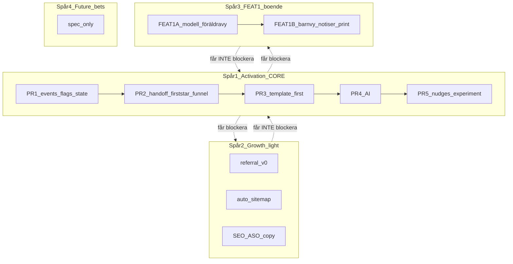

# TEMP — Sammanställning tillväxt & aktivering (v0.3)

**Skapad:** 2026-06-24  
**Uppdaterad:** 2026-06-24 — parallell programstyrning (ersätter sekventiell Fas A/B/C)  
**Status:** Temporärt samlingsdokument — **ersätter inte** källfilerna. Ta bort eller arkivera när inte längre behövs.

**Källor:**

| Dokument | Version |
|----------|---------|
| [`tillvaxt-retention-krav.md`](./tillvaxt-retention-krav.md) | v0.5 |
| [`aktivering-exekveringsplan.md`](./aktivering-exekveringsplan.md) | v0.8 |
| [`act-1-ai-startschema-spec.md`](./act-1-ai-startschema-spec.md) | v1.1 |
| [`act-1-cursor-tasklist.md`](./act-1-cursor-tasklist.md) | v1.4 |
| [`referral-program.md`](./referral-program.md) | v0 låst |

---

## 1. Executive summary

**Problemet är aktivering, inte retention vecka 3+.**

| Mått | Värde (prod 2026-06-24) |
|------|-------------------------|
| Familjer totalt | 189 |
| Aktiva 30d | 51 % |
| Någonsin aktiverade (första stjärnan) | **17 %** |
| Aldrig någon aktivitetssignal | **43 %** |
| Retention ≥14d med aktivering vs utan | 26 % vs 6,5 % (**4×**) |

**P0:** Guided activation till första stjärnan inom **48 timmar** från signup.  
**Primär metric:** `activation_rate_48h`  
**North Star (sekundär):** Family Day 14-retention.

### Styrningsbeslut (v0.2)

> **Vi kör flera spår parallellt — men inte med samma kritikalitet.**

- **ACT-1 är huvudspåret** och får alltid företräde vid konflikt.
- **Growth-spår** får inte störa activation-mätning.
- **FEAT-1** byggs parallellt bakom flagg och isolerad datamodell.
- **Future bets** (AI-bilder, print-scan, veckopeng) = spec/förberedelse — inte aktiv implementation som konkurrerar om kapacitet.

**Fas A/B/C är borttagen som sekventiell release-plan.** Ersatt med **4 parallella spår** nedan.

---

## 2. Programplan — 4 parallella spår



### Konfliktregel (LÅST)

Om du behöver välja mellan:

- fixa `activation_rate_48h` / onboarding funnel
- eller bygga boendeschema / referral / print-scan / SEO

→ **ACT-1 vinner varje gång.**

---

### Spår 1 — Activation core (**kritiskt spår**)

| | |
|--|--|
| **Ägare** | Huvudspåret |
| **Får blockera andra** | Ja |
| **Får blockeras av andra** | Nej |

**Ingår:**

- ACT-1 PR 1–5 (sekventiellt — **ordningen får inte blandas om**)
- P0 funnel i admin
- `child_access_completed` + activation state
- Non-activated nudges
- Auto-enroll treatment (D7)

**PR-ordning (fast):**

| PR | Innehåll |
|----|----------|
| PR 1 | Events, flags, `config/starter-plan-meta.js`, activation state |
| PR 2 | Handoff + first star + admin funnel |
| PR 3 | Template-first — **utan AI** |
| PR 4 | AI-personalisering + fallback |
| PR 5 | Nudges + experiment |

**Regel:** Allt som rör onboarding, analytics, familj-state eller notifications koordineras mot detta spår.

**Checkpoint:** Utvärdera efter PR 2 innan PR 3/4 — även vid parallell körning.

---

### Spår 2 — Growth light / low-risk

**Får köras parallellt** om det inte rör activation core.

| Leverans | Insats |
|----------|--------|
| Referral v0 (`?ref=`, spårning, admin — ingen belöning) | ~2 d |
| Auto-sitemap (`GET /sitemap.xml` från `SEO_INDEXABLE_PATHS`) | ~0,5 d |
| SEO/ASO copy, UTM på delningslänkar | löpande |

**Får INTE kräva omtag i:**

- onboarding
- familjens grundmodell
- ACT-1 eventmodell
- admin funnel (om det stör P0-mätning)

---

### Spår 3 — FEAT-1 Boendeschema (parallellt, isolerat)

**Produkt:** En release (BC-1 … BC-11) — men **implementation i två interna steg** för säker parallell körning med ACT-1.

#### FEAT-1A — Grundmodell + föräldravy

- `custody_home`, `custody_parent_home`, `custody_pattern`
- `weekly_schedule.week_variant` + resolver (vecka A/B, ankardatum)
- Etikett + färg per hem
- Banner “denna vecka hos …”
- Filter “Mina dagar” / “Hela veckan”
- Flagga `custody_schedule_beta`
- Egen analytics-namespace (se §5)

#### FEAT-1B — Barnvy + notiser + print

- Barnvy neutral (bara idag)
- Handoff-påminnelse + “Packa väska”
- Notiser till rätt förälder
- Utskrift “mina dagar”

**Hård regel — FEAT-1 får INTE:**

- kapa tid från ACT-1-buggar / funnel-breakage
- kräva redesign av barnvyn mitt under ACT-1 PR 2–3
- låna activation copy, handoff-logik eller onboardingutrymme
- göra schema-ändringar som blockerar starter-plan-sparande

**Produktprincip:** *Föräldern ser hem och vecka. Barnet ser idag.*

**Utanför FEAT-1:** 2–2–3, vecka ej mån–sön, rapporter per hem, iCal.

---

### Spår 4 — Future bets (backlog / spec)

**Aktiv implementation endast om kapacitet finns utan att ta från Spår 1 eller 3.**

| Feature | Status |
|---------|--------|
| FEAT-2 AI-bilder | Spec/backlog |
| FEAT-6 print-scan (foto → synk) | Spec/backlog — **paket: Basic** (`basic_app`) |
| FEAT-4 veckopeng | Spec/backlog |
| Partner NPF-guiden | Utforskning |
| Referral-belöningar (v1) | Efter `activation_rate_48h` > 25 % |

---

## 3. P0 Activation Event (LÅST)

En familj är **P0-aktiverad** inom **48h** när:

1. Minst **ett schema** sparat (`weekly_schedule`)
2. **`child_access_completed`** — PIN eller barnvy via handoff
3. Minst **en completion/stjärna**

```
signup → schema saved → child access completed → första completion
```

`child_profile_created` ≠ P0-steg i huvudtratten.

### Mål

| KPI | Baseline | 30d | 90d |
|-----|----------|-----|-----|
| `activation_rate_48h` | ~17 % | **25 %** | **40 %** |
| Aktiva 14d | 46,6 % | 55 % | 65 % |
| Family D14 (aktiverade) | ~26 % | 35 % | 45 % |

### 9-stegs huvudtratt

| # | Steg | Event |
|---|------|-------|
| 1 | Signup | `funnel_signup_started` |
| 2 | Onboarding started | `activation_onboarding_started` |
| 3 | Template selected | `starter_template_selected` |
| 4 | Plan saved | `starter_plan_saved` |
| 5 | Child access | **`child_access_completed`** |
| 6 | First completion | `first_completion_recorded` |
| 7 | P0 inom 48h | **`activation_achieved_48h`** |
| 8 | Active day 7 | retention |
| 9 | Active day 14 | Family D14 |

---

## 4. Låsta beslut (D1–D11)

| # | Beslut |
|---|--------|
| D1 | OpenAI v1 — `src/lib/starter-plan/llm.js` |
| D2 | Soft gate PIN + 24h follow-up |
| D3 | Referral v0 parallellt — spårning + admin, ingen belöning |
| D4 | Solo-läge: **nej** |
| D5 | Auto-sitemap: **bygg** |
| D6 | `config/starter-plan-meta.js` — ingen ny DB-tabell |
| D7 | Auto-enroll treatment efter PR 2 |
| D8 | `child_access_completed` i P0-tratt |
| D9 | Persisted `FamilyActivationState` per familj |
| D10 | Max 1 rutin, 3–5 aktiviteter, max 7 detaljerad — redigerbar i preview |
| D11 | FEAT-6 foto-scan → synk | **Basic** (`basic_app`) |

---

## 5. ACT-1 — detaljer (Spår 1)

> P0 är inte “bygg AI”. AI är accelerator i PR 4.

### UX-flöde (`activation_onboarding_v1`)

1. Frågor (< 90 sek)
2. `selectStarterTemplate()` → `default_schedule`
3. AI (PR 4 only): `generateStarterPlan()` — 15s timeout, fallback
4. Preview/edit → save
5. Child access (soft gate)
6. First star guide

### Planstorlek

Max **1** rutin · **3–5** aktiviteter default · max **7** detaljerad · AI-fallback alltid.

### Experiment

| Arm | Innehåll |
|-----|----------|
| Kontroll | Nuvarande onboarding |
| Variant A | Template + handoff + first star |
| Variant B | A + AI |

Go/no-go AI: B slår A med ≥5 pp på `activation_rate_48h`.

### Feature flags (ACT-1)

- `activation_onboarding_v1`
- `activation_child_handoff_v1`
- `activation_first_star_guide_v1`
- `activation_ai_starter_plan`

### Kodbas gap

Template-first saknas · preview confirm-only · handoff ej i onboarding · first star ej guidad · admin funnel ofullständig.

---

## 6. FEAT-1 — BC-1 … BC-11 (Spår 3)

| ID | Krav | Intern fas |
|----|------|------------|
| BC-1 | Vecka A / B per barn | 1A |
| BC-2 | Varannan vecka + ankardatum | 1A |
| BC-3 | Etikett + färg per hem | 1A |
| BC-4 | Dagsfärg schema/översikt | 1A |
| BC-5 | Banner “denna vecka hos …” | 1A |
| BC-6 | Filter “Mina dagar” | 1A |
| BC-7 | Barnvy neutral | 1B |
| BC-8 | `custody_schedule_beta` | 1A |
| BC-9 | Handoff + “Packa väska” | 1B |
| BC-10 | Notiser rätt förälder | 1B |
| BC-11 | Utskrift “mina dagar” | 1B |

**Datamodell:** `custody_home`, `custody_parent_home`, `custody_pattern`; `weekly_schedule.week_variant`.

### FEAT-1 analytics (egen namespace — blandas inte med ACT-1)

- `custody_home_selected`
- `custody_week_variant_changed`
- `custody_view_filtered` (mina dagar / hela veckan)
- `custody_banner_seen`
- `custody_handoff_reminder_sent`

**Insats totalt:** ~2–3 veckor.

---

## 7. Weekly scorecard (obligatorisk vid parallell körning)

Varje måndag — **per spår**, inte bara totalt.

### Spår 1 — Activation core

- `activation_rate_48h`
- signup → plan saved
- plan saved → child access
- child access → first completion
- D14 för aktiverade
- PR-status: blockerare?

### Spår 2 — Growth

- referral shares / signups / qualified
- sitemap coverage (nya URL i allowlist?)
- GSC klick (månatligt)

### Spår 3 — FEAT-1

- familjer med custody aktiverat
- andel schema med vecka A/B
- WAU custody-familjer vs övriga
- custody-specifika events

### Veckofrågor (oförändrade)

1. Hur många nya familjer aktiverade inom 48h?
2. Var i kedjan tappar vi dem?
3. Vilken förändring gav störst lyft — **och vilket spår ägde den?**

**Diagnostik:** `node scripts/diagnose-churn.js` på prod.

---

## 8. Rekommenderad kapacitetsfördelning (parallell körning)

| Spår | Kapacitet | Notering |
|------|-----------|----------|
| **1 Activation core** | ~60–70 % | Alltid först vid krock |
| **2 Growth light** | ~5–10 % | Låg risk, isolerat |
| **3 FEAT-1** | ~20–25 % | Parallellt, flagg + 1A före 1B |
| **4 Future bets** | 0 % aktivt | Spec only |

### Kör nu (3 saker parallellt)

1. **ACT-1 fullt** (Spår 1)
2. **Referral v0 + auto-sitemap** (Spår 2)
3. **FEAT-1A** → sedan **FEAT-1B** (Spår 3)

### Vänta med aktiv implementation

FEAT-2 · FEAT-6 · veckopeng · referral-belöningar

---

## 9. Paket — var nya funktioner landar (låst)

Regel ([`paket-v1.2-spec.md`](./paket-v1.2-spec.md)): *ett paket = ett primärt problem.*

| Kommande funktion | Paket | Komponent |
|-------------------|-------|-----------|
| ACT-1 (startschema, handoff, första stjärnan) | **Basic** | `basic_app` |
| Boendeschema (FEAT-1, hela BC-1–11) | **Basic** | `basic_app` |
| Utskrift “mina dagar” (BC-11) | **Basic** | `basic_app` |
| **Foto-scan utskrift → synk (FEAT-6)** | **Basic** | `basic_app` |
| AI-bilder till aktiviteter (FEAT-2) | Extra stöd | `teacch` |
| Rapporter per hem (v2, ej planerat) | Rapportering | `reporting` |
| Pedagog ser boendekontext | Pedagog | `pedagog` |
| Värvningslänk (v0) | Basic (alla) | — |

**Inget nytt paket** behövs för planerat scope. `lifetime_free` / grundare får Basic → inkluderar ACT-1, boendeschema och foto-scan.

**D11 (låst):** FEAT-6 ingår i **Basic**, inte Extra stöd.

---

## 10. Konkurrens & SEO

| | Oddrobo | Routined | Vi |
|--|---------|----------|-----|
| Synk | ❌ | ✅ | ✅ |
| Belöning | ❌ | ✅ | ✅ |
| Varannan vecka | ❌ | ? | FEAT-1 |
| Pedagog | ❌ | ❌ | ✅ |

**Smärtspråk:** *Mindre tjat · Färre konflikter · Lugnare vardag*

**SEO live:** 5 cornerstone-sidor + Guider-footer.

---

## 11. Medvetet inte nu

Solo-läge · Apple Watch · Veckopeng · AI-bilder (aktivt) · Bred AI-coach · Print-scan (aktivt)

---

## 12. Cursor brief (copy-paste)

```
Program: 4 parallella spår — ACT-1 är critical path.

SPÅR 1 (först vid konflikt): ACT-1 PR 1→2→3→4→5
  Primär metric: activation_rate_48h
  P0: schema + child_access_completed + first completion inom 48h
  Constraints: template-first; AI endast PR 4; allt bakom flags

SPÅR 2 (parallellt, isolerat): referral v0 + auto-sitemap
  Får INTE röra onboarding/events/funnel

SPÅR 3 (parallellt, flagg): FEAT-1 boendeschema
  1A: datamodell + föräldravy + custody_* events
  1B: barnvy + notiser + print
  Får INTE blockera eller redesigna ACT-1 onboarding/barnvy under PR 2–3

SPÅR 4: FEAT-2/6/veckopeng — spec only, ingen aktiv impl

Weekly scorecard per spår. Vid krock: Spår 1 vinner.

Spec: docs/act-1-ai-startschema-spec.md
Tickets: docs/act-1-cursor-tasklist.md
Samlingsdoc: docs/TEMP-sammanstallning-tillvaxt-aktivering.md
```

---

## 13. Prod-baseline (2026-06-24)

```
Total familjer: 189 | Aktiva 30d: 97 (51,3%)
Ever activated: 32 (16,9%) | Never signal: 81 (42,9%)
Retention wall (≥14d): WITH 26,3% / WITHOUT 6,5%
```

---

## 14. Dokumenthistorik (TEMP)

| Version | Ändring |
|---------|---------|
| v0.1 | Samlingsdokument från källfiler |
| v0.2 | Parallell programstyrning: 4 spår, ACT-1 critical path, FEAT-1A/1B, weekly scorecard |
| v0.3 | Paketkarta; D11: FEAT-6 foto-scan i Basic |

---

*Vid konflikt mellan detta TEMP-dokument och källfilerna: källfilerna gäller för detaljspec — detta dokument gäller för **styrning och prioritering**.*
