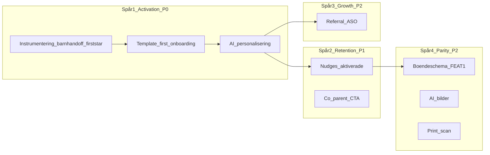

# Aktivering & exekvering — 90-dagarsplan (v0.8)

**Skapad:** 2026-06-24  
**Status:** Source of truth för P0-exekvering — **godkänd för build**. Strategi i [`tillvaxt-retention-krav.md`](./tillvaxt-retention-krav.md); implementation i [`act-1-ai-startschema-spec.md`](./act-1-ai-startschema-spec.md); tickets i [`act-1-cursor-tasklist.md`](./act-1-cursor-tasklist.md).  
**Ägare:** Produkt (Pontus)  
**Baslinje:** 189 familjer (ej arkiverade), prod-diagnostik 2026-06-24

**Relaterade dokument:**

| Dokument | Innehåll |
|----------|----------|
| [`tillvaxt-retention-krav.md`](./tillvaxt-retention-krav.md) | Övergripande strategi, konkurrens, KPI:er |
| [`act-1-ai-startschema-spec.md`](./act-1-ai-startschema-spec.md) | ACT-1 implementationsspec (template-first + AI-assist) |
| [`act-1-cursor-tasklist.md`](./act-1-cursor-tasklist.md) | Cursor-arbetsorder — epics och tickets |
| [`foraldaraktivering-7-dagar-spec.md`](./foraldaraktivering-7-dagar-spec.md) | 7-dagarsprogram (A/B, Day 14 North Star) |
| [`referral-program.md`](./referral-program.md) | Värvningsprogram (ej byggt) |
| `scripts/diagnose-churn.js` | Read-only churn/aktiveringsdiagnostik (prod) |

---

## 1. Executive summary

Min Stjärndag har **189 familjer** men **hög churn** mätt som inaktivitet. Prod-data visar att problemet i första hand är **aktivering** (time-to-first-value), inte generell retention vecka 3+.

| Mått | Värde | Implikation |
|------|-------|-------------|
| Aktiva senaste 30 dagar | 51 % (97/189) | ~hälften borta |
| Någonsin aktiverade (första stjärnan) | **17 %** (32/189) | Största läckaget |
| Aldrig någon aktivitetssignal | **43 %** (81/189) | Registrerade men startade aldrig |
| Retention wall (≥14 dagar) | 26 % med aha vs 6,5 % utan | **4×** — aktivering är avgörande |

**Huvudtes:** Min Stjärndag har inte ett generellt retentionproblem — ni har ett **“time-to-first-value”-problem**.

**P0 i en mening:** *Guided activation till första stjärnan inom 48 timmar från signup.*

**P0 Activation Event (48h) — LÅST:**

En familj är **P0-aktiverad** när alla tre har hänt **inom 48 timmar från signup**:

1. Minst **ett schema/rutin** sparat (`weekly_schedule`)
2. **`child_access_completed`** — PIN satt eller barnvy öppnad via handoff
3. Minst **en completion/stjärna** registrerad (barn eller förälder)

**Primär metric:** `activation_rate_48h` — inte “ever completed”.

**ACT-1 (P0-projekt):** *Starter plan onboarding — template-first schemaförslag med AI-assisterad personalisering.* AI är accelerator i Fas A3, inte själva produkten.

**Vad vi inte gör nu (medvetet):**

- Solo-läge (vuxnas egna rutiner)
- Apple Watch
- Automatisk veckopeng
- AI-bildgenerering
- Bred “AI coach” innan kärnaktivering sitter

**Hård regel:** Om AI-anrop misslyckas ska familjen **ändå** få ett färdigt schema från mall och kunna fortsätta onboarding utan blockerande fel. AI får aldrig vara hårt beroende.

**North Star (oförändrad):** Family Day 14-retention — familj aktiv dag 13–15 efter start.

**Kapacitetsfördelning nästa 90 dagar:** ~75 % activation engine · ~20 % retention för aktiverade · ~5 % growth (tills `activation_rate_48h` > 30 %).

---

## 2. Kritisk review av kravdokumentet

[`tillvaxt-retention-krav.md`](./tillvaxt-retention-krav.md) är **starkt** — framför allt för att det:

1. **Separerar aktivering från retention**
2. **Använder faktisk prod-data** istället för magkänsla
3. **Vågar säga “inte nu”** till funktioner som inte adresserar läckan

Värdet ligger i att dokumentet redan visar: **churnen sitter i aktivering, inte i vecka 3.**

### 2.1 Vad som är rätt

| Område | Bedömning |
|--------|-----------|
| Aktivering som flaskhals | Korrekt — 17 % ever activated, 43 % aldrig signal |
| Anti-bloat-instinkt | Korrekt — solo/Watch/veckopeng skjuts upp |
| Konkurrentanalys | Korrekt använd — efterfrågan vs positionering vs bloat-risk |
| Win-back, veckomejl, SEO | Rätt som P1/P2 — men inte före aktivering |

### 2.2 Vad som saknas eller behöver skärpas

| Lucka | Åtgärd i detta dokument |
|-------|-------------------------|
| Ingen **singulär P0-aktiveringsdefinition** | §3 låser definitionen |
| P0 kan misstolkas som “AI-projekt” | P0 = **guided activation**; AI är verktyg, inte mål |
| ACT-1 som “ren AI onboarding” | **Template-first före AI** (Fas A1→A3) |
| Inget **P0 scope freeze** | §5 låser scope |
| Fel sekvens i Fas A | Omsequenserad: instrumentering → mallar → AI |
| KPI:er för grov | §6 lägger till funnel-metrics och time-to-value |

### 2.3 Konsekvens för all prioritering

> Om något **inte ökar sannolikheten att en ny familj når första stjärnan inom 24–48 h**, ska det i princip inte vara P0 just nu.

---

## 3. Låst P0 Activation Event

För att bygga rätt behöver teamet **en enda operativ P0-aktivering** som allt under de kommande 4–6 veckorna optimeras mot.

### Definition

En familj är **P0-aktiverad** när följande har hänt **inom 48 timmar från signup**:

1. Minst **ett schema/rutin** sparat (`weekly_schedule`)
2. **Child access completed** — PIN satt *eller* barnvy öppnad via handoff (se nedan)
3. Minst **en completion/stjärna** registrerad (barn eller förälder)

Det fångar hela kedjan:

```
signup → schema saved → child access completed → första completion
```

### Child access vs barnprofil (LÅST)

Barnobjekt kan skapas **tidigt** i befintlig onboarding (steg 1 idag). Det är OK tekniskt — vi flyttar inte hela barnskapandet i v1.

**Regel för P0-funneln:**

> `child_profile_created` loggas när barnobjekt skapas, men **P0-steget “child access” räknas först när `child_access_completed` fires** — dvs. PIN satt, barnvy öppnad via handoff, eller motsvarande handoff uppfyllt.

Sub-metrics (diagnostik, inte huvudtratt): `child_profile_created`, `child_pin_created`, `child_view_opened`, `child_handoff_skipped`.

### Primär metric

```
activation_rate_48h = familjer med P0 Activation Event inom 48h / alla nya familjer
```

### Sekundära metrics

| Metric | Formel / beskrivning |
|--------|---------------------|
| `schema_saved_rate` | schema sparat / signup |
| `child_access_rate` | `child_access_completed` / signup |
| `schema_to_access` | child access / schema saved |
| `access_to_completion_48h` | first completion inom 48h / child access |
| `first_completion_same_day` | completion samma dag som signup / signup |
| `median_time_to_schema` | median signup → schema saved |
| `median_time_to_access` | median signup → child_access_completed |
| `median_time_to_completion` | median signup → first completion |
| Family D14-retention | Endast för P0-aktiverade familjer |

### Relation till befintliga mått

| Befintligt | Problem | P0-ersättning |
|------------|---------|---------------|
| “Ever completed” | För grovt, ingen tidsgräns | `activation_rate_48h` |
| Family D14 North Star | Rätt långsiktigt, för sent för daglig styrning | Behåll som sekundär North Star |
| `child_first_completion` (aktiveringsprogram) | Finns redan i analytics | Koppla till P0-event |

---

## 4. Nuvarande läge i kodbasen (as-is)

Planen måste bygga på **vad som faktiskt finns** — inte önsketänkande.

### 4.1 Onboarding idag

**Filer:** `public/onboarding.html`, `public/js/onboarding.js`, `src/routes/onboarding.js`

**Stegsekvens (6 steg + valfritt aktiveringsprogram):**

```
Register/Login (onboarding_completed=false) → /onboarding

Steg 1 — Berätta om ditt barn
  • Namn, födelsedag, emoji
  • Template group (forskola/skola/morgon/dag/kvall/helg)
  • POST /child → POST /schedule (schema skapas direkt)

Steg 2 — Barnets vy (dag vs tidslinje)

Steg 3 — Schemat är klart (preview only — redan skapat i steg 1)

Steg 4 — Belöningar (välj ≥1 från default_reward)

Steg 5 — Så loggar ni in (PIN visas, valfri ändring)

Steg 6 — Bjud in + föräldralås + complete
  • Valfritt: POST /onboarding/complete
  • Valfritt: aktiveringsprogram enroll-choice (env-gated)

Steg 7 (valfritt) — Guided 7-dagarsprogram
  • Bara om parent väljer “guided” efter complete
  • skipInvite() hoppar över enroll-choice
```

### 4.2 Mallar idag

| Lager | Tabell / källa | Roll |
|-------|----------------|------|
| Aktivitetsbibliotek | `default_activity_template` | Seedas vid registrering (~56 aktiviteter) |
| Veckolayout | `default_schedule` + `default_schedule_item` | Kopieras i onboarding steg 1 |
| Template groups | `forskola`, `skola`, `morgon`, `dag`, `kvall`, `helg` | Mappas till schema-namn i `onboarding.js` |

**Beslut (v1):** Återanvänd `default_schedule` + lägg **tunt metadata-lager** i kod/config (goal_tags, age_band, difficulty) — **ingen ny `starter_templates`-tabell** i v1. Motivering: infrastrukturen finns; minimerar migration och admin-yta.

### 4.3 Gap mot P0

| P0-krav | Idag | Gap |
|---------|------|-----|
| Template-first | Mall väljs i steg 1 **tillsammans med** barnskapande | Barn + mall kopplade; ingen mål/ålder/situation-väljare |
| Preview/edit | Steg 3 är confirm-only | Schema redan sparat innan preview |
| Child handoff | PIN i steg 5; `dashboard-child-handoff.js` bara på dashboard | Ingen gate, ingen deep link till barnvy i onboarding |
| First star | Förklaring i steg 4, ingen guidad completion | Ingen “Ge första stjärnan nu”-CTA |
| Funnel-tracking | 4 server-events + `funnel_onboarding_abandoned` | Inga per-steg-events; completion saknas i admin funnel |
| Aktiveringsprogram | Opt-in efter complete; env-gated | Inte för alla nya; `skipInvite` bypassar |

### 4.4 Analytics idag

**Server (direkt till DB):** `funnel_signup_started`, `funnel_email_verified`, `funnel_first_child_created`, `funnel_onboarding_completed`

**Client (whitelist):** `funnel_onboarding_abandoned` (+ landnings-CTA:er)

**Aktiveringsprogram (server):** `child_first_completion`, `parent_first_completion_seen`, `activation_program_*`

**Admin funnel:** 4 steg (landing → signup → verified → first_child) — **saknar** schema saved, PIN, first completion, onboarding completed.

---

## 5. P0 scope freeze

Innan implementation börjar — **vad som ingår och inte ingår**.

### Ingår i P0

| # | Leverans |
|---|----------|
| 1 | P0 Activation Event definition + `activation_rate_48h` i admin |
| 2 | Full funnel-tracking (10 steg, se §6) |
| 3 | Template-first onboarding: mål/ålder/situation → mall → preview/edit → save |
| 4 | Child handoff: soft gate PIN + “visa barnet sin vy” |
| 5 | First star guide: guidad första completion i samma session |
| 6 | Non-activated nudges (mejl/push inom 24–48 h) |
| 7 | Feature flags + A/B: legacy vs template-only vs template+AI |
| 8 | Fallback utan AI (mall fungerar alltid) |

### Ingår inte i P0

| # | Skjuts upp | Varför |
|---|------------|--------|
| 1 | AI-bildgenerering | Differentiering, inte aktivering |
| 2 | Conversational / fri chatt-onboarding | Risk för fluff utan lift |
| 3 | Veckopeng | Nytt mental model |
| 4 | Solo-läge | Ändrar positionering |
| 5 | Boendeschema (FEAT-1) | P1 — efter ACT-1 A2 |
| 6 | Pedagog/rapporter i onboarding | Bloat |
| 7 | Auto-sitemap | ~~Hygien, fel vecka~~ → **D5 låst: bygg** (generera från `SEO_INDEXABLE_PATHS`) |

### Hårda constraints

- Ingen försämring av nuvarande onboarding completion > 5 % under rollout
- Allt bakom feature flags
- Systemet måste fungera **utan AI-provider**
- Full event tracking från dag 1

---

## 6. 90-dagars exekvering

### 6.1 De tre veckofrågorna

Varje vecka ska teamet kunna svara på:

1. **Hur många nya familjer nådde aktivering inom 48 h?**
2. **Var i kedjan tappar vi dem?** (signup → schema → barn → completion)
3. **Vilken förändring gav störst lyft i aktivering?**

Om en aktivitet inte hjälper svara på dessa tre frågor är den sannolikt inte P0.

### 6.2 KPI-tratt — huvudtratt (9 steg)

För varje veckokohort — synlig per variant och acquisition source. **Detta är veckorapportens primära vy.**

| # | Steg | Event |
|---|------|-------|
| 1 | Signup completed | `funnel_signup_started` |
| 2 | Onboarding started | `activation_onboarding_started` |
| 3 | Starter template selected | `starter_template_selected` |
| 4 | Starter plan saved | `starter_plan_saved` |
| 5 | **Child access completed** | `child_access_completed` |
| 6 | First completion recorded | `first_completion_recorded` |
| 7 | **P0 activated within 48h** | `activation_achieved_48h` |
| 8 | Active day 7 | retention event |
| 9 | Active day 14 | Family D14 |

**Sub-metrics** (diagnostik under steg 5, inte separata kärnsteg i dashboard):

`child_profile_created` · `child_pin_created` · `child_view_opened` · `child_handoff_skipped`

**Server-side source of truth:** persisted activation state per familj (se [`act-1-ai-startschema-spec.md`](./act-1-ai-startschema-spec.md) §9). `activation_achieved_48h` emitteras från state, inte enbart från client events.

### 6.3 P0 funnel metrics (obligatoriska)

| Metric | Beskrivning |
|--------|-------------|
| signup → schema saved | Andel som sparar schema |
| schema saved → child access completed | Andel som fullföljer handoff |
| child access → first completion 48h | Kärn-P0 |
| median time signup → schema | Time-to-value del 1 |
| median time signup → child access | Time-to-value del 2 |
| median time signup → completion | Time-to-value del 3 |
| andel first completion samma dag | Snabb aktivering |

### 6.4 Kvalitetsmetrics (template/AI-output)

| Metric | Varför |
|--------|--------|
| Andel scheman redigerade innan save | Mäter om förslaget är användbart |
| Genomsnitt antal aktiviteter i schema | Upptäck för långa/långa scheman |
| Andel som raderar hela schemat vecka 1 | Upptäck dåliga förslag |

### 6.5 Fyrspårs-roadmap



#### Spår 1 — Activation engine (P0) — ~75 % kapacitet

| Fas | Sprint | Leveranser |
|-----|--------|------------|
| **A1** | Sprint 1 | Activation event i kod, per-steg events, **child handoff/PIN**, **first star guide**, admin funnel, non-activated reminder |
| **A2** | Sprint 2 | **Template-first** utan AI: mål/ålder/situation-väljare, 6–10 startpaket, preview + 1-klick apply |
| **A3** | Sprint 3 | AI-personalisering ovanpå mallar; experiment kontroll / template-only / template+AI |

**Byggordning (viktigt):** A1 → A2 → A3. Mät baseline för handoff innan mallar; mät mallar innan AI.

**Varför A1 före A2:** Instrumentering + handoff + first star hjälper sannolikt aktivering direkt och gör att vi kan isolera AI-lift i A3.

#### Spår 2 — Retention för aktiverade (P1) — ~20 % kapacitet

| Leverans | Beskrivning |
|----------|-------------|
| Dag 3/7/14 nudges | För aktiverade familjer som tappar aktivitet |
| Co-parent CTA | Förstärk befintlig invite-loop |
| Synliggör streaks/celebration | I barnvy |
| Veckosammanfattning | Driver tillbaka till nästa vecka (redan byggt) |

**Viktigt:** Inte stjäla fokus från activation engine.

#### Spår 3 — Growth distribution (P1) — ~5 % tills activation > 30 %

| Leverans | Status |
|----------|--------|
| **Referral v0 (D3)** | **Låst:** spårning + admin, **ingen belöning** — parallellt med ACT-1 (~2 d) |
| Auto-sitemap (D5) | **Låst:** `GET /sitemap.xml` genererad från `SEO_INDEXABLE_PATHS` |
| ASO baseline + copy | App Store mot bildschema/rutiner/NPF |
| SEO-sidor + internlänkning | Pågår (5 artiklar live) |
| UTM på alla delningsytor | Delvis |

**Referral v0:** Mät om någon delar och registrerar sig — belöningar skjuts till `activation_rate_48h` > 25 %.

#### Spår 4 — Competitive parity (P1/P2)

| Feature | Prioritet | Timing |
|---------|-----------|--------|
| **Boendeschema (FEAT-1)** | P1 | Efter A2 — se §6.5.1 |
| **Skannbart utskriftsschema (FEAT-6)** | P2 | Efter `activation_rate_48h` > 30 % — se §6.5.2 |
| AI-bilder | P2 | Efter activation_rate_48h > 30 % |
| Veckopeng | P3 | Om data motiverar |
| Solo-läge | **Nej** | — |

#### 6.5.1 FEAT-1 — Boendeschema (P1)

> **Normativ spec (2026-07):** Domänen är *boendeschema*, inte “vecka A/B”. Se:
>
> - **[`boendeschema-spec.md`](./boendeschema-spec.md)** — funktionella krav BC-1 … BC-13
> - **[`boendeschema-adr.md`](./boendeschema-adr.md)** — ADR: hemcentrerad domän, Schedule Engine, `custody_schedule`
> - **[`boendeschema-implementationsplan.md`](./boendeschema-implementationsplan.md)** — Phase 1–5, PR-sekvens
>
> Den tidigare A/B-variant-specen i detta avsnitt är **ersatt** av ovan.

**Produktidé:** Stöd för **växelvis boende** och flera hem — återkommande boendeschema per barn. Båda föräldrar ser vems dagar det är; varje förälder kan fokusera på **sina dagar**.

**Varför:** Oddrobo-recensioner efterfrågar varannan vecka/helg. Målgruppen (NPF, separerade föräldrar) behöver olika rutiner per hem **och** synk mellan vuxna.

**Gate:** Bygg **efter ACT-1 A2** (template-first). Implementation enligt Phase 2–5 i implementationsplanen — **inte** före spec + ADR är mergad.

**Produktprinciper:** Barnet ser sin dag · Föräldern ser sitt ansvar · Hem är neutrala · Kärnfamiljer opåverkade.

**v1 pattern types:** `alternate_weeks`, `alternate_weekends`.

**Låsta arkitekturbeslut (ADR):**

| Beslut | Riktning |
|--------|----------|
| `custody_pattern` | Utökas till `custody_schedule` (`pattern_type` + `configuration`) |
| `weekly_schedule.week_variant` | På sikt ersätts av `custody_home_id` |
| Beräkning | En gemensam `custody-schedule-engine.js` |

**Paket:** Basic (`basic_app`). **Feature-flagga:** `custody_schedule_beta` (globalt aktiverad i prod).

**Implementationstatus:** Delar av BC-1 … BC-13 finns i kod (A/B-modell). Domänomskrivning + `alternate_weekends` + engine enligt implementationsplan.

**SEO/copy:** “Växelvis boende”, “schema varannan vecka”, “synka rutiner mellan föräldrar”.

---

#### 6.5.2 FEAT-6 — Skannbart utskriftsschema (P2)

**Produktidé (låst riktning):** Förälder skriver ut ett schema, barn kryssar på papper, förälder **fotar av i appen** och får aktiviteterna ifyllda online med stjärnor.

**Varför:** Många familjer (särskilt NPF) vill ha fysiskt schema på vägg/kylskåp *och* digital belöning. Fysiska tavlor (Sigvard m.fl.) och papper-appar synkar inte tillbaka — det här är en **differentierare**, inte en aktiverings-fix.

**Gate:** Bygg **inte** före ACT-1. Starta beta när `activation_rate_48h` > 30 %.

**Paket (LÅST):** **Basic** (`basic_app`) — samma som schema, utskrift och stjärnor. Gated med `print_scan_beta`, inte `teacch`.

**Befintlig kod att bygga på:**

| Del | Status |
|-----|--------|
| Dagboks-utskrift (`printDay` / `printWeek`) | ✅ Enkelriktad — checkboxar syns men synkas inte |
| `Platform.camera` (native) | ✅ Profilbilder |
| QR-infrastruktur | ✅ Inbjudan, rapporter |
| Checkbox-avläsning / dokument-scan | ❌ Saknas |

**V1-flöde:**

```
1. "Skriv ut skannbart schema" (ny knapp — inte vanlig utskrift)
      → server sparar snapshot: child_id, datum, aktiviteter + ordning
      → A4 med hörnmarkörer, QR(print_id), stora checkboxar (svart/vitt)

2. Barn kryssar på papperet

3. "Skanna schema" i appen → kamera
      → perspektivrättning via hörnmarkörer
      → för varje känd checkbox: mäta ifyllnadsgrad (client-side, Canvas/OpenCV.js)
      → confidence per rad

4. Bekräftelseskärm (obligatorisk i v1):
      ✓ Tandborstning
      ✓ Klä på dig
      ○ Äta frukost   ← tryck för att rätta
      → "Spara" → befintlig daily_log + stjärnor
```

**Tekniska krav (v1):**

| ID | Krav |
|----|------|
| PS-1 | Utskrift låses vid generering (`print_id`); schema får inte ändras efter utskrift utan ny utskrift |
| PS-2 | Layout är maskinläsbar: fyra hörnmarkörer + kända checkbox-positioner (inte godtycklig HTML-utskrift) |
| PS-3 | Checkboxar minst ~8–10 mm i verklig storlek, hög kontrast |
| PS-4 | Bildbehandling körs **client-side** som default (ingen barnbild till server om möjligt) |
| PS-5 | Bekräftelseskärm innan sync — mål 85–95 % träff på första försök, resten ett tryck |
| PS-6 | Feature-flagga `print_scan_beta`; beta med 5–10 familjer innan bred lansering |
| PS-7 | Native först (`Platform.camera`); web/PWA kräver `Permissions-Policy`-undantag för skann-sidan |
| PS-8 | Fallback: QR i sidfot → snabb manuell avprickning om fotot misslyckas |

**Medvetet utanför v1:** Veckoutskrift (flera sidor), automatisk läsning utan bekräftelse, godtycklig foto av icke-standardiserat papper.

**Uppskattad insats:** ~2–3 veckor fokuserat arbete (vs ~2–4 dagar för enkel QR-synk utan foto).

**SEO/copy:** “Bildschema utskrift” + “fysiskt schema som synkar stjärnor” — se [`tillvaxt-retention-krav.md`](./tillvaxt-retention-krav.md) FEAT-6.

### 6.6 Build / delay / kill

| Kategori | Items |
|----------|-------|
| **Build now** | Child handoff, first completion flow, template-first onboarding, activation tracking, non-activated nudges, admin funnel |
| **Build next** | AI-personalisering, **FEAT-1 boendeschema**, referral v0 (spårning), auto-sitemap, retention nudges, FEAT-6 print-scan beta |
| **Delay** | AI-bilder, veckopeng, referral-belöningar, partnerprojekt |
| **Kill / not now** | Solo-läge, Apple Watch, bred AI coach |

### 6.7 Mål 30 / 90 dagar

| KPI | Baseline | 30 dagar | 90 dagar |
|-----|----------|----------|----------|
| `activation_rate_48h` | ~17 % (ever, ej 48h-exakt) | **25 %** | **40 %** |
| Aktiva senaste 14 dagar | 46,6 % | 55 % | 65 % |
| Family D14 (aktiverade) | ~26 % | 35 % | 45 % |

---

## 7. ACT-1 — sammanfattning & länkar

**Projektnamn:** ACT-1 — Starter plan onboarding (template-first + AI-assist)

**Syfte:** Minska “tom canvas”-friktionen och öka `activation_rate_48h`.

**Produktmål:** Ny förälder ska inom samma session: välja situation → få startschema → skapa barnåtkomst → genomföra första completion.

> **P0 är inte “bygg AI”.** P0 är guided activation. AI är verktyg i Fas A3.

### Byggsekvens (5 PR)

| PR | Fas | Innehåll |
|----|-----|----------|
| PR 1 | — | Events, feature flags, `config/starter-plan-meta.js` |
| PR 2 | **A1** | Child handoff + first star guide + admin funnel |
| PR 3 | **A2** | Template-first UI (frågor, preview, save) — **utan AI** |
| PR 4 | **A3** | AI-personalisering + fallback |
| PR 5 | — | Non-activated nudges + experiment hooks |

### Experiment (tre armar)

| Arm | Innehåll |
|-----|----------|
| Kontroll | Nuvarande onboarding |
| Variant A | Template-first + handoff + first star |
| Variant B | Variant A + AI-personalisering |

**Full spec, UX, events, acceptance criteria:** [`act-1-ai-startschema-spec.md`](./act-1-ai-startschema-spec.md)

**Tickets för Cursor:** [`act-1-cursor-tasklist.md`](./act-1-cursor-tasklist.md)

### Build checkpoint (LÅST)

**Stopp och utvärdera efter PR 2** — innan PR 3 (template-first) och PR 4 (AI):

1. PR 1 färdig (events, flags, activation state, metadata)
2. PR 2 färdig (handoff + first star)
3. Admin funnel visar baseline på huvudtratten (§6.2)
4. Manuellt test: handoff + first star end-to-end

**Go/no-go för PR 3:** handoff-flödet läcker inte; funnel-data är tillförlitlig.

---

## 8. Beslut (låsta v0.5)

| # | Beslut | **Beslutat** |
|---|--------|--------------|
| D1 | LLM-provider | **OpenAI v1** — tunt abstraktionslager i `src/lib/starter-plan/llm.js` |
| D2 | Barn-PIN | **Soft gate** + 24h follow-up; `child_handoff_skipped` loggas |
| D3 | Referral | **v0 parallellt med ACT-1:** personlig `?ref=`-länk, spårning (delning → signup → qualified), **ingen belöning**, admin-vy. Belöningar väntar tills `activation_rate_48h` > 25 % |
| D4 | Solo-läge | **Nej** |
| D5 | Auto-sitemap | **Bygg** — dynamisk `GET /sitemap.xml` från `SEO_INDEXABLE_PATHS` i `src/lib/seo-pages.js`; ta bort manuell drift |
| D6 | Mall-metadata | **Kod-config v1** — `config/starter-plan-meta.js`, ingen ny DB-tabell |
| D7 | Aktiveringsprogram | **Auto-enroll treatment** för nya familjer efter PR 2 |
| D8 | Child access i P0-tratt | **`child_access_completed`** — inte `child_profile_created` som kärnsteg |
| D9 | Activation state | **Persisted snapshot per familj** — server-side source of truth |
| D10 | Första planens storlek | **Max 1 rutin, default 3–5 aktiviteter, max 7 i “detaljerad”** — redigerbar i preview |
| D11 | FEAT-6 foto-scan | **Basic** (`basic_app`) |

---

## 9. Bilagor

### 9.1 Prod-baseline 2026-06-24

Kör: `cd /var/www/mystarday && node scripts/diagnose-churn.js`

```
Total familjer: 189
Aktiva 7d:  52 (27,5%)
Aktiva 14d: 88 (46,6%)
Aktiva 30d: 97 (51,3%)
Churned 30d+: 92 (48,7%)

Ever activated: 32 (16,9%)
Never any signal: 81 (42,9%)

Retention wall (≥14d):
  WITH activation:    5/19 (26,3%)
  WITHOUT activation: 6/93 (6,5%)
```

**Tolkning:** Stor lucka mellan with/without activation → fixa aktivering först. Juni-kohorter (100 % alive) är smekmånad — mät igen ~4–11 juli.

### 9.2 Veckovis process

1. Kör `diagnose-churn.js` måndag morgon
2. Uppdatera funnel i admin (när byggt)
3. Skriv 3-raders svar på veckofrågorna (§6.1)
4. Go/no-go på nästa PR baserat på data

### 9.3 Cursor brief (kortform)

```
Uppdrag: Bygg onboarding/aktiveringsupplevelse som ökar activation_rate_48h.

Primär metric: activation_rate_48h
Sekundära: schema_saved_rate, pin_completion_rate, D14 för aktiverade

Constraints:
- ingen feature-bloat
- fungerar utan AI
- allt bakom feature flags
- full event tracking
- ingen regression >5% i onboarding completion

Läs: docs/aktivering-exekveringsplan.md
Spec: docs/act-1-ai-startschema-spec.md
Tickets: docs/act-1-cursor-tasklist.md
Bygg i PR-ordning: exekveringsplan §7
```

### 9.4 Dokumenthistorik

| Datum | Version | Ändring |
|-------|---------|---------|
| 2026-06-24 | 0.1 | Första utkast — review, P0-definition, 90-dagar, ACT-1-spec, PR-sekvens |
| 2026-06-24 | 0.2 | Skärpt: P0-event, ACT-1 omformulerat, A1→A2→A3, 3 filer |
| 2026-06-24 | 0.3 | Låst: `child_access_completed`, activation state, kort plan, 9-stegs huvudtratt, D1–D10, PR2 checkpoint |
| 2026-06-24 | 0.4 | FEAT-6 skannbart utskriftsschema (foto → bekräfta → synk) i Spår 4 + §6.5.1 |
| 2026-06-24 | 0.5 | D3 referral v0 (spårning + admin, ingen belöning); D5 auto-sitemap byggs |
| 2026-06-24 | 0.6 | FEAT-1 utökad till boendeschema (§6.5.1); FEAT-6 omnumrerad §6.5.2 |
| 2026-06-24 | 0.7 | FEAT-1: hela Boendeschema i en release (BC-1–11, ingen v1.5) |
| 2026-06-24 | 0.8 | D11: FEAT-6 foto-scan i Basic (`basic_app`) |
| 2026-07-01 | 0.9 | FEAT-1: domänspec + ADR + implementationsplan — ersätter A/B-spec i §6.5.1 |

---

*Nästa steg: ge Cursor [`act-1-cursor-tasklist.md`](./act-1-cursor-tasklist.md) + [`act-1-ai-startschema-spec.md`](./act-1-ai-startschema-spec.md) → starta PR 1.*
