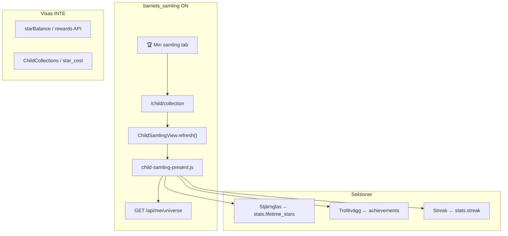

# Fas B — Min samling v1 (plan)

**Status:** **Klar** — B1–B6 mergade (#621–#626) · `test:gate` grön  
**Epic:** GitHub **#584** (manuellt: stäng tickets #615–#620)  
**Issues:** #615 B1 ✓ · #616 B2 ✓ · #617 B3 ✓ · #618 B4 ✓ · #619 B5 ✓ · #620 B6 ✓  
**Spec:** [barnets-samling-vision.md](barnets-samling-vision.md) §2 · [npf-arkitektur-v1.md](npf-arkitektur-v1.md) § Två stjärnsaldon  
**Förutsättning:** Fas A klar (#588–#593 mergade)

---

## Produktmål (v1)

När barnet öppnar **🏆 Min samling** ska känslan vara:

> **"Titta vad jag har klarat."**

Inte en teknisk lista, inte en shop, inte en tom placeholder.

### In scope (smal v1)

| Pillar | Känsla |
|--------|--------|
| **Stjärnglas** | Totalt intjänade stjärnor — minskar aldrig |
| **Trofévägg** | Prestiationer/medaljer som vägg/kort |
| **Streak-kedja** | Dagar i rad — lugnt, positivt |

### Out of scope (Fas B)

- Årsbok (`year_story` / museum)
- Foto-minneskort
- Diplom-system (om det kräver ny modell)
- Skattkammaren-logik (aktivt mål, fem statusar) → **Fas C (#585)**
- Ny valuta, shop, loot, avatar, husdjur
- `ChildCollections` / collectible_catalog köp med `star_cost`
- Robust streak-räddning (pausdag/sjukdag/manuell räddning) om det kräver större backend

### Princip

**Återanvänd befintlig data först.** Bygg inte en ny samlingsmotor i Fas B.

---

## Befintlig kod att återanvända

| Behov | Källa idag | Fas B |
|-------|------------|-------|
| Lifetime stars | `getChildStats()` → `stats.lifetime_stars` i `GET /api/me/universe` | Stjärnglas — **ingen migrering** |
| Spendable saldo | `GET /api/me/rewards` → `starBalance` | **Visas inte** i Min samling |
| Achievements | `achievement_definition` + `child_achievement` (8 seedade) | Trofévägg |
| Streak | `streak.current_streak` i `stats` | Kedja-UI |
| Mount/route | `collectionView` + `ChildSamlingView.refresh()` + `/child/collection` | Ersätt placeholder |
| Placeholder | `public/js/child-samling-view.js` | Byts ut mot riktig vy |

### Viktigt: ta bort från gated Min samling

`child-samling-view.js` mountar idag `ChildCollections` (köp/⭐-kostnad) när data finns. Det bryter mot NPF-regeln *ingen användbar valuta i Min samling*. Fas B ska **inte** rendera `ChildCollections` bakom `barnets_samling`.

### Medaljtrappa (vision vs data)

Visionen beskriver trösklar 1 · 25 · 50 · 100 · 250 · 500 · 1000. DB har idag **8 achievements** med andra regler (`first_star`, `streak_starter`, `star_collector`, …).

**Fas B-beslut (rekommenderat):**

1. **Trofévägg** = befintliga `child_achievement`-rader, ny presentation (vägg/kort).
2. **Stjärnmedaljer** = valfri *visningslager* ovanpå `stats.lifetime_stars` (klienträknade trösklar, ingen ny tabell). Låsta medaljer dämpade — ingen skam.
3. Ingen seed-migration av nya `achievement_definition`-rader i Fas B om det kan undvikas.

---

## Ticket-breakdown

### B0 — Epic: Min samling v1 (#584)

**Labels:** `barnets-samling`, `phase-b`, `ready`

**Body (uppdatera #584):**

```markdown
## Mål

Smal, shippbar Min samling v1 bakom `barnets_samling`:
vägg + glas + streak.

Barnet ska känna: **"Titta vad jag har klarat."**

## Tickets (ordning)

- [ ] B1 Route + shell
- [ ] B2 Stjärnglas
- [ ] B3 Trofévägg
- [ ] B4 Streak-kedja
- [ ] B5 NPF-copy + tomstatus
- [ ] B6 Regression/gate-test

## Spec

- docs/barnets-samling-fas-b-plan.md
- docs/barnets-samling-vision.md §2
- docs/npf-arkitektur-v1.md § Två stjärnsaldon

## Blockerar

Fas C (#585) kan påbörjas parallellt men Min samling v1 ska vara klar före bred rollout.

## Out of scope

Årsbok · minneskort · diplom (ny modell) · Skattkammaren-logik · shop/loot · streak-räddning-backend
```

---

### B1 — Min samling route + shell

**Titel:** `Fas B: Min samling route + shell (ersätt #588 placeholder)`  
**Labels:** `barnets-samling`, `phase-b`  
**Beror på:** Fas A (#588)

**Scope**

- Ersätt safe placeholder i `child-samling-view.js` med en **egen lugn vy** bakom gate ON.
- Behåll befintlig route `/child/collection`, `collectionView`-mount och `ChildSamlingView.refresh()`.
- Ny presentation-modul (förslag: `public/js/child-samling-present.js` + `public/css/child-samling.css`).
- Sektions-layout (glas → vägg → streak) — innehåll kan vara stub i B1, fylls i B2–B4.
- Ta bort `ChildCollections`-mount från gated vy.

**Acceptance**

- [ ] Gate ON: fliken 🏆 Min samling visar egen vy (inte "Mer kommer snart", inte legacy hub).
- [ ] Gate ON: ingen `ChildCollections` / köp-UI.
- [ ] Gate OFF: legacy påverkas inte.
- [ ] Idag + Skattkammaren oförändrade.
- [ ] Mobil portrait, lugn bakgrund, inga nya coach-ytor.

**Filer (troliga)**

- `public/js/child-samling-view.js`
- `public/js/child-samling-present.js` (ny)
- `public/css/child-samling.css` (ny)
- `public/child-dashboard.html` (script/css-länkar)
- `public/sw.js` + `config/cache-version.json`

**POS:** P-02 barn protagonist · C-01 inga barn-formulär · PA-01 ingen fjärde coach

---

### B2 — Stjärnglas / totalt intjänade stjärnor

**Titel:** `Fas B: Stjärnglas — totalt intjänade stjärnor`  
**Beror på:** B1

**Scope**

- Visa `universe.stats.lifetime_stars` från befintlig `GET /api/me/universe`.
- Tydlig copy: *totalt tjänat* — inte saldo att handla med.
- **Visa inte** `starBalance` / inlösningsbar valuta.
- Om `lifetime_stars` saknas: fallback `0` + varm tomstatus (B5).
- Ingen stor datamigrering; ingen ny API i v1 om universe räcker.

**Acceptance**

- [ ] Barn med intjänade stjärnor ser glas/fyllnadsnivå + tal.
- [ ] Efter inlösning i Skattkammaren minskar **inte** glaset (endast spendable saldo).
- [ ] Ingen förvirring med Skattkammarens stjärnburk.
- [ ] `lifetime_stars` = `SUM(completed star_value) + manual_star_grant` (befintlig `getChildStats`).

**Filer**

- `public/js/child-samling-present.js` (glas-sektion)
- `public/css/child-samling.css`
- Ev. liten hjälpare `public/js/child-samling-glass.js` om filen växer

**POS / NPF:** R-06 lifetime stars monotonic · npf-arkitektur § Två stjärnsaldon

---

### B3 — Trofévägg / medaljer

**Titel:** `Fas B: Trofévägg — återanvänd achievements`  
**Beror på:** B1

**Scope**

- Återanvänd `universe.achievements` (befintlig `ChildAchievements`-data).
- Ny presentation: vägg/grid med kort — **inte** `skatt-section` / teknisk lista.
- Ev. stjärnmedaljer som klient-derivat från `lifetime_stars` (vision-trösklar), dämpade när låsta.
- Ingen köp-knapp, ingen `star_cost`.
- Tom vägg → varm tomstatus (B5), inte "du har inga".

**Acceptance**

- [ ] Barn med achievements ser minst ett trofékort med namn + emoji.
- [ ] Barn utan achievements ser inbjudande tomstatus (inte fel/skam).
- [ ] Tryck på medalj (om interaktion i v1): kort, ≤0,6 s, inget blockerande modal.
- [ ] Inga röda varningar eller negativ copy.

**Filer**

- `public/js/child-samling-present.js` eller `child-samling-trophies.js`
- Återanvänd mönster från `child-achievements.js` (data), ny markup/CSS
- **Inte** ändra unlock-logik i `universe-engine.js` om inte bugg

**POS:** G-01 verklighet före firande · 00B premium känsla

---

### B4 — Streak-kedja

**Titel:** `Fas B: Streak-kedja — lugnt och positivt`  
**Beror på:** B1

**Scope**

- Visa `universe.stats.streak` (`current_streak` från `streak`-tabellen).
- Visuell kedja (🔥-segment), guldton vid ≥30 dagar (vision).
- **Ingen** "bruten streak"-skam, inga röda varningar, inget FOMO.
- Ingen ny streak-backend, ingen pausdag/räddning i Fas B.
- Om streak = 0: neutral välkomnande copy ("Här växer din kedja när du är aktiv").

**Acceptance**

- [ ] `current_streak > 0` → kedja syns med positiv ton.
- [ ] `current_streak = 0` → neutral tomstatus, inte misslyckelse.
- [ ] Ingen copy om "streak bruten" / "du förlorade".
- [ ] Idag-vyn påverkas inte.

**Filer**

- `public/js/child-samling-present.js` eller `child-samling-streak.js`
- `public/css/child-samling.css`

**POS:** NPF robusta streaks (presentation only; föräldraräddning = senare)

---

### B5 — NPF-copy + tomstatus

**Titel:** `Fas B: NPF-copy och tomstatus för Min samling`  
**Beror på:** B2, B3, B4 (kan mergas i samma PR som B1–B4 om liten diff)

**Scope**

- Enhetlig svensk ton: stolthet, trygghet, inga imperativ.
- Tomstatus-exempel:
  - *"Här kommer dina medaljer att synas när du samlar fler stjärnor."*
  - *"Fortsätt med det du gör i ☀️ Idag — dina stjärnor fyller glaset här."*
- Förbjudet: "du har inga", röda badges, ⚠️, skuldspråk, syskonjämförelse.
- `prefers-reduced-motion`: inga påtvingade animationer på medalj-snurr.

**Acceptance**

- [ ] Nytt konto / barn utan data ser trygg vy, inte trasig/skamlig.
- [ ] Copy review mot `docs/npf-arkitektur-v1.md` + `00B_PRODUCT_TASTE`.
- [ ] `test/barnets-samling-copy.test.js` utökad för Fas B-strängar.

**Filer**

- `public/js/child-samling-present.js`
- `test/barnets-samling-copy.test.js`

---

### B6 — Regression / gate-test

**Titel:** `Fas B: Regression — Min samling gate on/off`  
**Beror på:** B1–B5

**Scope**

- Utöka `test/barnets-samling-*.test.js` (ny `test/barnets-samling-collection.test.js` eller utökning av nav-test).
- Gate ON: shell, glas, trophies, streak, ingen ChildCollections.
- Gate OFF: legacy oförändrat.
- Idag + Skattkammaren + belöningsflöde (#592) oförändrat.
- Lägg till i `test:gate` om ny fil.
- QA-checklista i `docs/qa/barnets-samling-rewards-regression.md` (valfritt avsnitt Min samling).

**Acceptance**

- [ ] `NODE_ENV=test npm run test:gate` grön.
- [ ] Inga nya paywall/auth-regressioner.

**Filer**

- `test/barnets-samling-collection.test.js` (ny)
- `package.json` (`test:gate:unit`)
- Ev. `docs/qa/barnets-samling-rewards-regression.md`

---

## Rekommenderad implementationsordning

```
B1 (shell, utan ChildCollections)
  → B2 (glas) + B3 (vägg) + B4 (streak)  [kan vara 1–2 PRs]
  → B5 (copy-pass)
  → B6 (regression)
```

**PR-strategi (förslag)**

| PR | Tickets | Risk |
|----|---------|------|
| PR 1 | B1 + B5 grund-copy | Låg — struktur + gate |
| PR 2 | B2 + B3 + B4 | Medel — UI/innehåll |
| PR 3 | B6 | Låg — tester |

Alternativ: en PR om diff hålls < ~400 r netto.

---

## Arkitektur (v1)



---

## Risker och öppna frågor

| Risk | Mitigering |
|------|------------|
| `ChildCollections` känns som shop | Ta bort helt från gated vy (B1) |
| Få achievements hos nya barn | Varm tomstatus + stjärnglas ändå synligt |
| Medaljtrappa vs 8 achievements | Klient-trappa från `lifetime_stars`; achievements som "riktiga trofeer" |
| Streak = 0 ofta | Neutral copy; ingen skam |
| Stor `child-samling-present.js` | Dela i glass/trophies/streak om >250 r |

**Öppen fråga (ej blocker):** Ska stjärnmedaljer (1/25/50/…) ingå i v1 eller bara befintliga achievements? Rekommendation: **inkludera enkel klient-trappa** — billigt, matchar vision, ingen DB.

---

## Definition of Done (Fas B)

- [x] Alla B1–B6 acceptance criteria
- [x] `npm run test:gate` grön
- [x] `npm run check:css` om Tailwind/static ändrats (SW v544)
- [x] SW bump om statiska assets ändrats
- [x] Self-review (180) — särskilt UX + Game + NPF
- [x] POS citerat i PR: vision §2, npf § Två stjärnsaldon, R-06

### Mergade PR:er

| PR | Issue | Innehåll |
|----|-------|----------|
| #621 | #615 | Route + shell |
| #622 | #616 | Stjärnglas + medaljtrappa |
| #623 | #617 | Trofévägg |
| #624 | #618 | Streak-kedja |
| #625 | #619 | NPF-copy + tomstatus |
| #626 | #620 | Regression/gate-test |

---

## Review-checklista (befintliga PRs)

För manuell review mot **scope · gate on/off · regression belöning/barnflöde**:

| PR | Issue | Länk | Fokus |
|----|-------|------|-------|
| **#606** | #591 | https://github.com/pontusburman-papabravo/stjarndag/pull/606 | Skattkammaren route + första Fas C-slice |
| **#608** | #592 | https://github.com/pontusburman-papabravo/stjarndag/pull/608 | Belöningsflöde-regression |
| **#609** | #593 | https://github.com/pontusburman-papabravo/stjarndag/pull/609 | Göm legacy värld (Fas A klar) |
| **#611** | — | https://github.com/pontusburman-papabravo/stjarndag/pull/611 | Onboarding aktivitetsguide |

**Gate ON:** fyra flikar, Skattkammaren egen route, Min samling placeholder, legacy dold.  
**Gate OFF:** tre världar / hub som tidigare.  
**Regression:** inlösning, stjärnsaldo, Idag-bockning ska fungera i båda lägen (#608).

---

## Nästa steg efter godkännande

1. Skapa GitHub-issues B1–B6 (under #584) — kör utökat label-skript eller manuellt.
2. Implementera enligt PR-strategi ovan.
3. Fas C (#585) kan planeras parallellt men bör inte blockera B om resurser finns.
