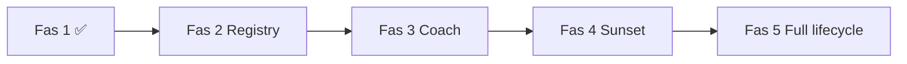

# Family Journey — Fas 2–5 Roadmap (låst spec)

**Appendix till:** [Family Journey Model RFC](./family-journey-model-rfc.md)  
**Bygger på:** [Fas 1 implementation contract](./family-journey-implementation-contract.md)  
**Version:** 1.0-rc  
**Status:** Låst för implementation efter Fas 1 go-live + PO-beslut §Pre-requisites

Syfte: deterministisk roadmap med **Definition of Done per fas** — samma stil som overnight build-prompten.  
Om detta dokument och RFC motsäger varandra: **RFC vinner på domän**, detta dokument vinner på tekniska detaljer per fas.

**Regel:** Ingen fas startar innan föregående fas DoD är uppfylld och feature flags kan aktiveras inkrementellt.

---

# Översikt

| Fas | Tema | Livsfaser (nya) | Huvudutfall |
|-----|------|-----------------|-------------|
| **1** ✅ | Onboarding → first success | `SETTING_UP` → `FIRST_USE` → `BUILDING_ROUTINE` | Domän + API + 3 ytor |
| **2** | Registry + kanaler + parent-ack | — | Samma UX webb/native; handoff 100% Context |
| **3** | Dashboard coach under Context | `BUILDING_ROUTINE` → `ESTABLISHED_ROUTINE` | Ersätter readiness/Engine på Hem |
| **4** | Activation-program sunset | — | En KPI; program-API borta |
| **5** | Hela livscykeln + kanaler | `EXPANDING`, `INDEPENDENCE` | Push/e-post/add-child |



---

# Gemensamma regler (alla faser)

## Arkitektur (oförändrad från Fas 1)

```
Backend hook / route
        ↓
journey/ingest.js      ← enda skrivväg för milstolpar
        ↓
family_milestones + family.journey_phase (via phases.js)
        ↓
journey/evaluator.js   ← ren funktion, ingen DB
        ↓
GET /api/me/journey-context
        ↓
Klient renderar (ingen produktlogik i UI)
```

## Fail-safe (oförändrad)

Vid inkonsistent milestone-data:

- `phase` = `SETTING_UP`
- `blocking_experience` = `null`
- API returnerar alltid giltig JSON (aldrig crash)
- `reason` innehåller `INCONSISTENT_STATE`

## Principer

| Regel | |
|-------|---|
| `onboarding_completed` | Auth/routing only — **DO NOT USE FOR PRODUCT LOGIC** |
| `first_success` | `child_first_completion` ∧ `parent_saw_completion` (derived i ingest) |
| Analytics | Observability — matar inte milestones direkt |
| Registry | Copy per `phase[experienceKey]` — inte i Context JSON |
| Sunset activation | Max **2 release-cykler** efter Fas 1 go-live (låst i contract §5.2) |

## Feature-flag-mönster

Varje fas introducerar egna flags (default **OFF**).  
Rollback = stäng ingest/evaluator utan att stänga API → klienter får legacy fallback.

---

# Pre-requisites (måste beslutas innan Fas 2 start)

| # | Beslut | Rekommendation | Default om ej besvarat |
|---|--------|----------------|------------------------|
| P1 | Handoff per barn eller per familj? | Per barn via `scope_key: 'child:<uuid>'` | Per barn |
| P2 | Product Engine + Journey i Fas 3? | **Parallellt** — Engine deprecated, Journey tar coach | Parallellt (Engine read-only) |
| P3 | Add-child journey-fas? | `EXPANDING` + `child_created` per barn | `EXPANDING` |
| P4 | Pedagog-only familjer? | Journey ingest skip; Context returnerar `priority: none` | Skip journey coach |

---

# Fas 2 — Registry, kanaler, parent-ack

## Mål

Samma journey-upplevelse på **webb + native**; handoff och parent-ack **utan** activation-program-beroende.

## Scope

| Ingår | Ingår inte |
|-------|------------|
| Server-driven Experience Registry (DB eller admin) | Registry CMS med A/B |
| Handoff-banner styrs 100% av Context | Dashboard coach |
| `parent_acknowledgment` modal via Context (ersätter program-krav för `parent_saw_completion`) | Push-schedulers |
| Activation sunset **cykel +1** | Full program-borttagning |
| Admin metrics: `handoff_completion_rate`, `phase_distribution` | ESTABLISHED_ROUTINE-regler |

## Domän

### Nya / utökade milestones

| Milestone | Typ | Trigger |
|-----------|-----|---------|
| `parent_ack_shown` | Engång per completion-event | Server när parent får ack-modal |
| `celebration_dismissed` | Engång | POST events (finns Fas 1 som metadata; formalisera) |

`parent_saw_completion` sätts vid dismiss av **journey ack-modal** — inte enbart via `activation-program/aha-dismiss`.

### Context-regler (tillägg)

| Tillstånd | `blocking_experience` | `celebration` | `priority` |
|-----------|----------------------|---------------|------------|
| `FIRST_USE` ∧ ¬`child_logged_in` | `handoff_to_child` | `null` | `handoff` |
| `child_first_completion` ∧ ¬`parent_saw_completion` | `parent_ack_completion` | `null` | `coach` |
| `first_success` ∧ ¬`celebration_dismissed` | `null` | `celebrate_first_success` | `celebration` |

### Experience Registry (server-driven)

**Tabell:** `journey_experience_registry`

```sql
CREATE TABLE journey_experience_registry (
  id          UUID PRIMARY KEY DEFAULT gen_random_uuid(),
  version     VARCHAR(32) NOT NULL,
  phase       VARCHAR(32) NOT NULL,
  experience_key VARCHAR(64) NOT NULL,
  tone        VARCHAR(32) NOT NULL,
  headline    TEXT NOT NULL,
  body        TEXT,
  cta         TEXT,
  locale      VARCHAR(8) NOT NULL DEFAULT 'sv',
  is_active   BOOLEAN NOT NULL DEFAULT true,
  created_at  TIMESTAMPTZ NOT NULL DEFAULT now(),
  UNIQUE (version, phase, experience_key, locale)
);
```

`GET /api/me/journey-context/registry` läser DB (fallback: `config/journey-experience-registry.json`).

### Handoff UI

`dashboard-child-handoff.js`:

- Visa **endast** om `context.blocking_experience === 'handoff_to_child'`
- Dölj permanent om Context säger annat (ej localStorage-TTL som primär gate)
- `handoff_deferred` → dölj tills nästa session eller Context ändras

## Activation sunset (cykel +1)

| Åtgärd | |
|--------|---|
| `ACTIVATION_PROGRAM_ENABLED=false` för **nya** enrollments | |
| Befintliga program löper ut | |
| Nya familjer: endast Journey handoff + ack | |

## API

| Endpoint | Ändring |
|----------|---------|
| `GET /api/me/journey-context/registry` | DB-backed + version header |
| `GET /api/admin/journey/registry` | CRUD (admin) |
| `GET /api/admin/journey/metrics` | handoff rate, phase distribution |

## Feature flags

| Flag | Default | Effekt |
|------|---------|--------|
| `family_journey_registry_v2` | `false` | DB registry istället för JSON-fil |
| `family_journey_handoff_v2` | `false` | Context-only handoff banner |
| `family_journey_parent_ack_v1` | `false` | Journey ack-modal för parent_saw |
| `activation_program_new_enrollments` | `true` → `false` | Cykel +1: stäng nya enrollments |

## Definition of Done

- [ ] Registry läses från server; JSON-fil är fallback only
- [ ] Handoff-banner på dashboard visas **iff** `blocking_experience === 'handoff_to_child'`
- [ ] `parent_saw_completion` kan nås **utan** aktivt activation-program
- [ ] `handoff_started` → `child_logged_in` mätbart i admin metrics
- [ ] Native app använder samma `/api/me/journey-context` (ingen lokal handoff-logik)
- [ ] Inga nya activation-program enrollments när cykel +1 flag är OFF
- [ ] `npm run test:gate` grön + `test/journey-fas2.test.js`
- [ ] `/api/me/journey-debug` förklarar `parent_ack_completion` blocking

## Testkrav

| Test | Assert |
|------|--------|
| Registry API | DB version returneras; fallback vid tom DB |
| Handoff gate | Context utan blocking → banner hidden |
| Parent ack | dismiss → `parent_saw_completion` → derived `first_success` |
| Idempotens | dubbel ack dismiss → en `parent_saw_completion` |
| Sunset | ny familj + flag OFF → ingen program enrollment |

## Non-goals

- Dashboard coach / readiness
- `ESTABLISHED_ROUTINE` transition
- Push-notiser

---

# Fas 3 — Dashboard coach under Context

## Mål

**En** beslutskälla på Hem: Journey Context ersätter `home-readiness.js` coach-del och `engine-coach.js` som primär “nästa steg”.

## Scope

| Ingår | Ingår inte |
|-------|------------|
| `BUILDING_ROUTINE` → `ESTABLISHED_ROUTINE` transition | Engine full removal |
| Coach experiences i Registry | Push |
| Upprepbara milestones: `streak_week`, `routine_week_stable` | EXPANDING / INDEPENDENCE |
| `home-readiness.js` coach → Context | Barnvy-ändringar |
| Product Engine: **read-only shadow** (log only) | Engine sammanslagning utan separat beslut |

## Domän

### Fasövergång (ny)

```js
// phases.js — Fas 3 tillägg
BUILDING_ROUTINE: ['ESTABLISHED_ROUTINE'],

function derivePhase(milestones) {
  if (milestones.established_routine) return 'ESTABLISHED_ROUTINE';
  if (milestones.first_success) return 'BUILDING_ROUTINE';
  // ... Fas 1 regler
}
```

### Milestone: `established_routine` (engång)

Uppnås när **alla** gäller:

```
first_success occurred_at > 7 days ago
AND streak_days >= 5 (senaste 7 kalenderdagar)
AND child_completions_count_7d >= 10
```

Beräknas av **nattlig scheduler** (`journey-phase-evaluator-scheduler.js`) — inte klient.

### Upprepbara milestones (Fas 3)

| Milestone | Semantik | UNIQUE |
|-----------|----------|--------|
| `streak_day` | Barn complete ≥1 aktivitet den dagen | `(family_id, milestone, scope_key)` per datum |
| `routine_week_stable` | Vecka med ≥5 dagar completion | per vecka |

`scope_key` format: `'child:<uuid>'` eller `'date:2026-06-28'`.

### Context-regler (coach på Hem)

| Phase | Villkor | `recommended_experiences` | `priority` |
|-------|---------|---------------------------|------------|
| `BUILDING_ROUTINE` | ¬`established_routine` | `coach_consistency`, `coach_evening` | `coach` |
| `ESTABLISHED_ROUTINE` | — | `coach_expand` (valfritt) | `coach` eller `none` |

`blocking_experience` = `null` i Fas 3 (coach är rekommendation, inte blockering).

### Legacy-migration

| Fil | Fas 3-beteende |
|-----|----------------|
| `home-readiness.js` | Coach-del bort; ev. tekniska varningar kvar (offline, etc.) |
| `engine-coach.js` | Renderar **endast** om `family_journey_coach_v1` OFF (fallback) |
| `GET /api/family/first-success` | Deprecated header; shadow-log jämför Engine vs Context |
| `GET /api/family/readiness` | Deprecated; returnerar Context-projektion |

## Feature flags

| Flag | Default | Effekt |
|------|---------|--------|
| `family_journey_coach_v1` | `false` | Hem-coach från Context |
| `family_journey_established_phase` | `false` | `ESTABLISHED_ROUTINE` transition aktiv |
| `family_journey_engine_shadow` | `false` | Logga Engine vs Context diff (ingen UI) |

## Definition of Done

- [ ] Familj med stabil rutin → `established_routine` milestone + fas `ESTABLISHED_ROUTINE`
- [ ] `#engineCoachMount` fylls från Context när `family_journey_coach_v1` ON
- [ ] `home-readiness.js` anropar inte `/api/family/readiness` för coach när flag ON
- [ ] Ingen ny produktlogik i `dashboard.js` för “nästa steg”
- [ ] Shadow-log visar <5% divergens i staging innan prod flag ON
- [ ] `npm run test:gate` + `test/journey-fas3.test.js`
- [ ] Debug-endpoint visar `established_routine` derivation

## Testkrav

| Test | Assert |
|------|--------|
| `derivePhase` | `established_routine` → `ESTABLISHED_ROUTINE` |
| Scheduler | mock facts → milestone insert idempotent |
| Coach render | Context `recommended_experiences` → ett kort på Hem |
| Fallback | flag OFF → legacy engine-coach oförändrat |

## Non-goals

- Activation-program borttagning (Fas 4)
- Push
- Add-child wizard journey

---

# Fas 4 — Activation-program sunset

## Mål

**En domänsanning** för aktivering och firande. Ingen parallell program-motor för nya eller aktiva familjer.

## Scope

| Ingår | Ingår inte |
|-------|------------|
| Sunset cykel +2 och +3 (contract §5.2) | `family_activation_state` DROP |
| Alla aha/banner via Context | Product Engine removal |
| `onboarding-activation.js` bort | Admin cohort analytics migration (data behålls) |
| Program-API deprecated → 410 Gone | |

## Sunset-schema (låst)

| Cykel | Efter Fas 1 go-live | Åtgärd |
|-------|---------------------|--------|
| +0 | Fas 1 | Coexist |
| +1 | Fas 2 | Nya enrollments OFF |
| +2 | **Fas 4a** | Banner/aha **enbart** Context; `/api/me/activation-program/*` → 410 |
| +3 | **Fas 4b** | `parent_activation_program` arkiverad; tabell kvar för kohort |

## Kodändringar

| Komponent | Fas 4a | Fas 4b |
|-----------|--------|--------|
| `activation-program-banner.js` | Bort eller stub | Bort |
| `activation-program-aha-card.js` | Ersatt av `journey-celebration.js` + ack-modal | Bort |
| `onboarding-activation.js` | Bort | Bort |
| `src/routes/activation-program.js` | 410 + migration message | Route mount bort |
| `parent_activation_program` DB | Read-only | `archived_at` kolumn |

## KPI (officiell)

| Gammal | Ny |
|--------|-----|
| `activation_program_completed` | `family_milestones.first_success` |
| `parent_first_completion_seen` (analytics) | `parent_saw_completion` (milestone) |
| `family_activation_state.p0_activated_at` | `journey_phase` + milestones |

## Feature flags

| Flag | Default | Effekt |
|------|---------|--------|
| `activation_program_api_deprecated` | `false` | 410 på program-API |
| `activation_program_ui_removed` | `false` | Inga program-JS på dashboard |

## Definition of Done

- [ ] Ingen prod-klient anropar `/api/me/activation-program/*` (verifiera access logs)
- [ ] Firande och parent-ack **endast** via Journey Context
- [ ] Admin retention-rapport använder `family_milestones` — inte program-tabell
- [ ] `onboarding-activation.js` borttagen
- [ ] Befintlig kohort-data exporterbar för analys
- [ ] `npm run test:gate` grön; inga tester kräver live program enrollment
- [ ] README/CLAUDE uppdaterad: activation program arkiverat

## Testkrav

| Test | Assert |
|------|--------|
| API 410 | GET program → 410 med länk till journey-context |
| Celebration | endast `journey-celebration.js` path |
| Metrics | admin funnel från milestones |

## Non-goals

- DROP `parent_activation_program`
- Engine removal
- Push migration

---

# Fas 5 — Full livscykel + kanaler

## Mål

Journey Context styr **push, e-post och add-child** — hela livscykeln från `DISCOVERING` till `INDEPENDENCE`.

## Scope

| Ingår | Ingår inte |
|-------|------------|
| Faser: `EXPANDING`, `INDEPENDENCE` | Ny betalningslogik |
| Add-child journey (egen handoff per syskon) | Pedagog-produkt redesign |
| Push-scheduler läser Context | Win-back scheduler rewrite |
| Veckosammanfattning: milestone-baserad copy | ML-personalisering |
| `family_activation_state` write-stop (endast read för legacy) | |

## Domän

### Fasövergångar (komplett)

```js
const TRANSITIONS = {
  SETTING_UP: ['FIRST_USE'],
  FIRST_USE: ['BUILDING_ROUTINE'],
  BUILDING_ROUTINE: ['ESTABLISHED_ROUTINE'],
  ESTABLISHED_ROUTINE: ['EXPANDING', 'INDEPENDENCE'],
  EXPANDING: ['ESTABLISHED_ROUTINE', 'INDEPENDENCE'],
  INDEPENDENCE: [], // terminal för Fas 5
};
```

### Milestones (tillägg)

| Milestone | Trigger | Fas-effekt |
|-----------|---------|------------|
| `second_child_created` | Onboarding add-child | `EXPANDING` |
| `coparent_joined` | Invite accepted | `EXPANDING` |
| `evening_routine_added` | Schedule section kväll | — |
| `child_self_sufficient_week` | Barn loggar in 7 dagar utan förälder-initierad handoff | `INDEPENDENCE` (candidate) |

### Add-child flow

```
EXPANDING + blocking_experience: handoff_to_child (scope child:<new_uuid>)
→ samma kedja som Fas 1 men per barn
→ onboarding_completed påverkas INTE (add-child mode)
```

### Push / e-post

**Regel:** schedulers frågar `GET /api/me/journey-context` (intern) eller `buildContextForFamily()` — **inga egna trösklar**.

| Context signal | Kanal | Experience key |
|----------------|-------|----------------|
| `blocking_experience: handoff_to_child` | Push dag +2 | `push_handoff_reminder` |
| `priority: coach` | Push max 1/vecka | `push_coach_nudge` |
| `celebration` set | Ingen push | — |

### Pedagog-only (P4)

Om `req.user` är pedagog-only (ingen family parent role):

- `GET /api/me/journey-context` → `{ phase, milestones, priority: 'none', ... }`
- Ingen coach, ingen handoff

## Feature flags

| Flag | Default | Effekt |
|------|---------|--------|
| `family_journey_expanding_phase` | `false` | EXPANDING transitions |
| `family_journey_independence_phase` | `false` | INDEPENDENCE transitions |
| `family_journey_push_v1` | `false` | Push från Context |
| `family_journey_add_child_v1` | `false` | Add-child handoff via Context |

## Definition of Done

- [ ] Syskon tillagt → `EXPANDING` + handoff per barn utan dashboard specialfall
- [ ] Push skickas endast när Context `recommended_experiences` innehåller push-key
- [ ] `INDEPENDENCE` nås deterministiskt enligt dokumenterad regel
- [ ] `family_activation_state` skrivs inte längre från app-kod
- [ ] Admin: full `milestone_funnel` + `phase_transition_latency` dashboard
- [ ] `npm run test:gate` + `test/journey-fas5.test.js`
- [ ] RFC öppna frågor #1–#5 dokumenterade som **beslutade** i contract appendix

## Testkrav

| Test | Assert |
|------|--------|
| Add-child | andra barn → handoff blocking med rätt `scope_key` |
| Push gate | Context `priority: none` → ingen push |
| INDEPENDENCE | mock 7d self-login → phase transition |
| Pedagog skip | pedagog-only → empty recommendations |

## Non-goals

- Product Engine full removal (kan vara Fas 6)
- Registry A/B testing
- Cross-family benchmarking

---

# Implementationsordning (tvärgående)

```
Fas 1 go-live (flags ON)
    ↓
Fas 2: registry + parent-ack + handoff gate + sunset +1
    ↓
Fas 3: ESTABLISHED_ROUTINE + coach på Hem + Engine shadow
    ↓
Fas 4: program API/UI bort + sunset +2/+3
    ↓
Fas 5: EXPANDING/INDEPENDENCE + push + add-child
```

**Parallellt förbjudet:** Fas 3 coach och Fas 4 sunset ska inte aktiveras samma release utan explicit PO-godkännande.

---

# Filreferens per fas

| Fas | Nya filer (exempel) | Befintliga som ändras |
|-----|---------------------|------------------------|
| 2 | `migrations/*_journey_registry.js`, `db/journey-registry.js`, `public/js/journey-parent-ack.js` | `dashboard-child-handoff.js`, `journey-context.js` |
| 3 | `src/lib/journey/established-routine.js`, `src/lib/journey-phase-evaluator-scheduler.js` | `home-readiness.js`, `engine-coach.js` |
| 4 | `docs/ARKIVERAT-ACTIVATION-PROGRAM.md` | `activation-program*.js`, `onboarding-activation.js` |
| 5 | `src/lib/journey/push-projector.js`, `src/lib/journey/add-child.js` | `onboarding.js`, push schedulers |

---

# Success criteria (hela resan)

En utvecklare eller support ska kunna:

1. Förklara varje familjs `journey_phase` via `/api/me/journey-debug`
2. Visa att **inga** dashboard-CTAs har egna if-satser för produktbeslut (grep-verifiering)
3. Rapportera `first_success_within_48h` från `family_milestones` alone
4. Bekräfta activation-program inte används efter Fas 4 (access logs)
5. Reproducera add-child handoff end-to-end med endast API-anrop

---

# Changelog

| Version | Datum | Ändring |
|---------|-------|---------|
| 1.0-rc | 2026-06-28 | Initial låst spec Fas 2–5 |
