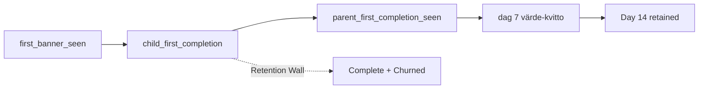

# Föräldaraktivering — 7-dagarsprogram

**Skapad:** 2026-05-30  
**Senast reviderad:** 2026-05-30 (v3.10 — operativ prioritering; launch-kriterier; Polsia Fas 1-task)  
**Status:** Implementation-ready (kausalt retention-experiment)  
**Feature slug:** `foraldaraktivering_7d`  
**Relaterat:** onboarding, push-reminder-scheduler, win-back, retention-dashboard, [Fas 1 task](./foraldaraktivering-fas1-task.md), [Invariants](./activation-program-invariants.md) (får aldrig brytas)

---

## 0. Vad det här är (och inte är)

Det här är **inte** en feature-spec eller ett retention-flöde i win-back-stil.

Det är en **experimentdesign för retention** — byggd för att svara på:

> *Har vi identifierat den kausala mekanismen bakom retention, och kan vi mäta om vi påverkar den?*

| v1-fråga | v3.2-fråga |
|----------|------------|
| "Hur får vi föräldrar att komma tillbaka?" | "Vilken mekanism gör att de stannar — och rör vår intervention den?" |

**Kausal hypotes:**

> Föräldrar som stannar upplever ett tidigt bevis på att de **slipper tjata**.

Hela systemet är byggt för att **skapa**, **förstärka** och **mäta** det ögonblicket — inte för att maximera klick genom ett program.

| Retention-initiativ (typiskt) | Det här experimentet |
|-------------------------------|----------------------|
| Completion rate blir North Star | Day 14 cohort retention är North Star |
| Reagerar på inaktivitet | Förebygger innan vanan saknas |
| Push som primär kanal | Celebratory card + banner som primär kanal |
| Design för implementation | Design för **lärande** (A/B från dag 1) |

Hela specifikationen är organiserad runt att skapa den vanan dag 1–7 — inte att rädda användare vecka 3.

| Retention-initiativ (typiskt) | Det här systemet |
|-------------------------------|------------------|
| Reagerar på inaktivitet | Förebygger innan vanan saknas |
| Mäter logins | Mäter beteendeförändring + aha-ögonblick |
| Optimerar dag 7-completion | Optimerar **Day 14 cohort retention** |
| Push som primär kanal | Banner + celebratory card som primär kanal |

---

## 1. Problembeskrivning

Retention-vyn visar ~93 familjer i "Risk för churn" (>72h inaktivitet eller aldrig). Samtidigt kommer entusiastisk feedback från aktiva familjer — särskilt föräldrar till barn med autistisk utmattning som beskriver omedelbar positiv effekt.

**Hypotes:** Flaskhalsen ligger hos **förälderns vana**, inte barnets förmåga att använda appen.

| Signal | Tolkning |
|--------|----------|
| Status "Aldrig" | Föräldern registrerade sig men loggade aldrig in igen |
| Aktivitetsindex 0 + gammal login | Schema/onboarding klart, men ingen daglig uppföljning |
| Högt aktivitetsindex + färsk login | Barnet (eller medförälder) driver — primärföräldern behöver inte agera |
| Nöjda citat ("vi behövde inte ens påminna") | Föräldern har byggt en intern morgon-/kvällsvana |

Nuvarande onboarding sätter upp barnets schema på ~6 steg och markerar `onboarding_completed`. Därefter finns inget strukturerat stöd för att få **föräldern** att återkomma dag 2–7.

### Designprincip: stödjande, inte dömande

Programmet **fortsätter vid miss** — en missad dag markeras internt men påverkar aldrig copy, progress eller tillgång till nästa dag. I en vardag med NPF-utmaningar är flexibilitet inte en feature, det är en **förutsättning**.

### Produktprincip: samma beteende ≠ samma problem

Två familjer kan båda vara inaktiva idag — men orsaken kan vara helt olika:

| Typ | Verkligt problem | v1-program |
|-----|------------------|------------|
| **Ny familj** (Grupp A) | Vanan hann aldrig bildas | `onboarding_7d` |
| **Churnad familj** (Grupp C) | Vanan bildades aldrig eller dog ut | `reactivation_3d` (v1.2) |
| **Aktiv familj** (Grupp B) | Behöver kanske inget stöd | Inget program |

Behandlar man alla tre likadant blir resultatet ofta mediokert för alla.

### 1.1 Tre användargrupper — strategisk avgränsning (v3.3)

Majoriteten av churn-risk-familjerna (~93 i retention-vyn) är **inte** nya registreringar. De har redan:

```
Onboardade → barn → schema → använder inte appen
```

Det är en **annan psykologi** än nya familjer:

| | Grupp A (nya) | Grupp C (befintliga risk) |
|--|---------------|----------------------------|
| Kontext | Hopp — "här är en karta" | Besvikelse — "jag misslyckades redan" |
| Problem | Ingen vana ännu | Vanan dog ut |
| Program | Vanebildning (7 dagar) | Återaktivering (nystart) |

**Att blanda ihop dem förorenar experimentet** — Day 14 North Star blir omöjlig att tolka.

#### Grupp A — Nya familjer *(v1.0 — huvudexperimentet)*

```
Onboarding complete → auto-enroll → onboarding_7d (7 dagar)
```

Endast familjer som **just slutfört onboarding** i denna session. Ingen retroaktiv enroll.

#### Grupp B — Befintliga aktiva familjer *(gör ingenting)*

Har redan byggt vanan. Behöver inte aktiveringsprogram. Celebratory card kan fortfarande visas (aha-moment är universellt) — men **inget dagsprogram**.

#### Grupp C — Befintliga riskfamiljer *(v1.2 — separat program)*

**Inte** auto-enrolla i experimentet. **Inte** trycka in i 7-dagarsprogrammet.

**Men inte "slå dövörat till":** Grupp C är fortfarande värdefull — bara **utanför effektmätningen**:

| Gör | Gör inte |
|-----|----------|
| Visa i retention-dashboard | Inkludera i onboarding_7d-kohort |
| Följ utveckling över tid | Retroaktiv auto-enroll |
| Manuell outreach (export, win-back) | Blanda in i Day 14 A/B-analys |
| Supportintervjuer, kvalitativ analys | Påverka utvärdering av nya familjer |

Analogi: medicinskt test — Grupp A = nya patienter, B = kontroll, C = redan lämnat behandling. Man lär sig av C, men blanda inte in dem i första effektmätningen.

Senare: **`reactivation_3d`** — eget program, egen copy, samma motor. **Mål (v1.2):** inte bara *"få tillbaka föräldern"* utan *"få föräldern att uppleva ett nytt aha-moment"* — om data visar att `parent_first_completion_seen` är starkaste retention-prediktorn.

| Dag | Fokus |
|-----|--------|
| 1 | "Stämmer tiderna fortfarande? Justera en sak." |
| 2 | "Visa barnet att appen är vaken igen." |
| 3 | "Har appen hjälpt?" (värde-reflektion) |

**Trigger (v1.2):** `last_login > 14 dagar` AND `has_schema = true` → banner vid nästa login: *"Vill ni prova en 3-dagars nystart?"*

#### v1.0-beslut (låst)

| | Beslut |
|--|--------|
| Nya familjer | ✅ Auto-enroll `onboarding_7d` vid onboarding complete |
| Befintliga aktiva | ✅ Ingen enroll |
| Befintliga risk (~93) | ❌ **Ej i experimentet** — retention-vy, export, intervjuer; `reactivation_3d` v1.2 |
| Experimentdata | ✅ Endast post-launch nyregistreringar i kohort-analys |

#### Roadmap (prioriterad)

```
Nu (v1.0)
  ├── Fas 1–4: onboarding_7d, endast Grupp A
  ├── A/B-test (cohort_arm)
  └── Mät Day 14 retention vs control

Efter 4–6 veckor — forskningsfas (v1.1)
  ├── Korrelerar parent_first_completion_seen med Day 14?
  ├── Analysera "Retention Wall" (se nedan)
  └── Räkna Grupp C-segment (barn + schema + 0 aktivitet 14d)

Därefter (v1.2)
  └── Designa reactivation_3d — optimerat för nytt aha-moment om datan stödjer
```

#### Forskningsfas: "Retention Wall" (v1.1, vecka 4–6)

**Officiell forskningsfråga:** Var bryts kedjan — och är completion ens relevant för retention?

Fyrfältsschema bland **Grupp A** (post-launch, `onboarding_7d`):

| | **Retained dag 14** | **Churned dag 14** |
|--|---------------------|---------------------|
| **Program completed** | ✅ Ideal — mekanismen fungerade | ❌ **Retention Wall** — viktigaste insiktskällan |
| **Program incomplete** | ✅ Programmet var inte nödvändigt | ❌ Programmet hjälpte inte |

De flesta tittar bara på *completed vs not completed*. **Completed + churned** är ofta där de stora produktproblemen bor:

- De förstod onboarding
- De såg programmet
- De använde produkten
- **De lämnade ändå** → kärnprodukten saknar långsiktigt värde

**Kvalitativ prioritet v1.1:** intervjua *Complete + Churned* före alla andra segment.

Möjliga strukturella orsaker (hypoteser):
- Belöningssystemet enformigt efter vecka 1
- Schemat för statiskt
- Barnet engageras inte långsiktigt
- Förälder får otillräckligt värde efter dag 7

> Fixa läckan i hinken (onboarding) innan du hämtar tillbaka vattnet som runnit ut (churn).

---

## 2. Mål och KPI-hierarki

### North Star-hypotes (en mening)

> **Föräldrar som upplever ett tidigt "jag behövde inte tjata"-ögonblick har högre sannolikhet att vara kvar dag 14.**

Det är *inte* hypotesen att "7-dagarsprogrammet ökar retention". Programmet är interventionen; aha-ögonblicket är den mekanism vi testar.

### North Star (låst metric — ändras aldrig efter experimentstart)

**Family Day 14 cohort retention** — treatment vs control. (Parent-only variant: diagnostisk, §2.)

**Definition (v3.6 — FROZEN efter launch):**

En familj räknas som **Retained Day 14** om minst ett av följande inträffar under **dag 13, 14 eller 15** (kalenderdagar från `started_at`, familj timezone):

1. `login_event` med `role = 'parent'` för primär förälder i kohorten, **eller**
2. `daily_log_item.completed = true` för något barn i familjen

```sql
-- Pseudologi — lås denna query vid launch, ändra inte efteråt
WHERE event_at::date BETWEEN enroll_date + 12 AND enroll_date + 14
  AND (event_type IN ('parent_login', 'child_completion'))
```

**Varför dag 13–15:** fångar föräldrar som loggar in varannan dag utan att glida definitionen efterhand (p-hacking).

**Varför parent ELLER child:** retention = familjen använder produkten, inte bara förälderns dashboard-besök.

Jämförs via **treatment vs control** (§13). Utan kontrollgrupp riskerar teamet optimera completion utan retention-effekt.

### Experiment success threshold — minsta effektstorlek (v3.9, FROZEN)

North Star-metricen är låst; **gränsen för "lovande resultat"** måste också frysa **före** data — annars riskerar teamet om 6 veckor debattera Control 24 % vs Treatment 26 % utan beslutskriterium.

**Experiment anses lovande** om **minst ett** av följande uppfylls (Family Day 14 retention, treatment vs control):

| Tröskel | Definition | Exempel (control = 24 %) |
|---------|------------|--------------------------|
| **Absolut** | Treatment ≥ control **+ 10 procentenheter** | Treatment ≥ **34 %** |
| **Relativ** | Treatment ≥ control × **1,20** (+20 % relativ) | Treatment ≥ **29 %** |

```js
function isExperimentPromising(controlRate, treatmentRate) {
  const absoluteLift = treatmentRate - controlRate;
  const relativeLift = controlRate > 0 ? treatmentRate / controlRate : 0;
  return absoluteLift >= 0.10 || relativeLift >= 1.20;
}
```

| Utfall | Tolkning | Nästa steg |
|--------|----------|------------|
| Lovande (tröskel uppfylld) | Intervention påverkar sannolikt retention | Fortsätt; analysera aha-kedjan + Retention Wall |
| Ej lovande (under tröskel) | Ingen tydlig retention-effekt i denna kohort | Fortfarande värdefullt — granska opportunity/conversion; intervjua Complete+Churned |
| Signifikans | Separat — beräkna konfidensintervall i Fas 6 när N tillåter | Tröskeln är **produktbeslut**, inte ersättning för statistik |

**⚠️ FROZEN efter experimentstart** — ändra inte tröskeln när första siffror kommer (p-hacking / målförflyttning).

**Statistisk power:** tröskeln definierar *vad som räknas som framgång*; sample size för att *detektera* +10 pp beräknas separat när enroll-takt är känd. Dokumentera faktisk N i admin vid första utvärdering.

### Sekundära KPI:er — diagnostiska (v3.7, ej North Star)

North Star förblir **Family Day 14 retention** ovan. Logga och visa i admin **parallellt** för att skilja mekanismer:

| KPI | Definition | Användning |
|-----|------------|------------|
| **Family Day 14 retention** | North Star — parent_login **eller** child completion dag 13–15 | Primär utvärdering treatment vs control |
| **Parent Day 14 retention** | Endast `login_event` med `role = 'parent'` dag 13–15 | Diagnostik: driver föräldervanan retention? |

```sql
-- Parent Day 14 (diagnostisk)
WHERE event_at::date BETWEEN enroll_date + 12 AND enroll_date + 14
  AND event_type = 'parent_login'

-- Family Day 14 (North Star)
WHERE event_at::date BETWEEN enroll_date + 12 AND enroll_date + 14
  AND event_type IN ('parent_login', 'child_completion')
```

**Tolkning:** Om treatment slår control på Family men inte Parent → barnet driver; om Parent men inte Family → föräldern loggar in utan att vanan landar hos barnet. **Ändra inte North Star** baserat på dessa — de är hypotes-stöd, inte mål.

### Aha opportunity rate — diagnostisk (v3.8, låst)

Innan man tolkar `parent_first_completion_seen`-gap måste man veta **hur många familjer som ens kunde få aha**.

| Metric | Definition | Tolkning |
|--------|------------|----------|
| **Aha opportunity rate** | Andel enrolled med minst ett `child_first_completion` | Barnet aktiverades — mekanismen *kunde* testas |
| **Aha conversion rate** | Andel med `parent_first_completion_seen` / andel med `child_first_completion` | Celebratory card / exponering — givet att barnet agerade |
| **Aha-to-retention** | Day 14 grouped by `parent_first_completion_seen` | Kärnhypotesen — prioriterad admin-vy post-launch |

```sql
-- Aha opportunity (per kohort, treatment + control)
SELECT COUNT(DISTINCT family_id) FILTER (WHERE has_child_first_completion)
     / COUNT(DISTINCT family_id)::float
FROM cohort_enrolled;

-- Aha conversion (bland de med opportunity)
SELECT COUNT(DISTINCT family_id) FILTER (WHERE has_parent_first_completion_seen)
     / NULLIF(COUNT(DISTINCT family_id) FILTER (WHERE has_child_first_completion), 0)::float
FROM cohort_enrolled;
```

**Varför det behövs:** utan opportunity rate kan svagt aha-resultat bero på *barnet gjorde aldrig något* (aktiveringsproblem) — inte på att *celebratory card fungerade dåligt* (exponeringsproblem). Dag 3 `supportive_fallback` håller programmet levande men testar inte mekanismen.

### Långsiktig retention — Day 30/60 (v3.8, lagras tidigt)

Day 14 är rätt för **experimentets primära utvärdering**. Day 30/60 behövs för att skilja:

| Mönster | Day 14 | Day 30 | Tolkning |
|---------|--------|--------|----------|
| Onboarding-friktion minskade | ↑ | flat | Tidig push, inte etablerad vana |
| Vana etablerades | ↑ | ↑ | Mekanismen håller |

**Definition (samma logik som Day 14, annat fönster):**

| KPI | Retained-fönster (från `started_at`, familj timezone) |
|-----|------------------------------------------------------|
| Family Day 30 | parent_login **eller** child completion dag **29–31** |
| Parent Day 30 | endast parent_login dag 29–31 |
| Family Day 60 | parent_login **eller** child completion dag **59–61** |
| Parent Day 60 | endast parent_login dag 59–61 |

**Implementation (Fas 6):** ingen ny datamodell eller event krävs — samma query-motor som Day 14 med konfigurerbart fönster (`retentionWindowDays: 14 | 30 | 60`). Beräkna och **lagra** resultat (API + ev. nightly snapshot); **visa inte** Day 30/60 i admin förrän första kohorten nått mognad (≥30 resp. ≥60 dagar post-enroll).

**North Star förblir Day 14** — Day 30/60 är uppföljning, inte experimentprimär.

### Leading indicators (diagnostiska, inte mål i sig)

```
North Star
  └── Day 14 retention (treatment vs control)

Leading indicators
  ├── aha_opportunity_rate (child_first_completion någonsin)
  ├── aha_conversion_rate (aha-sett / opportunity)
  ├── child_first_completion (barnet lyckas)
  ├── parent_first_completion_seen (förälder upptäcker — aha)
  ├── hours_since_completion (tid barn → förälder)
  ├── enrollment → first_banner_seen gap
  ├── Day 7 value score
  └── Program completion rate (diagnostisk — troligen svagare prediktor än aha)
```

**Hypotes (v3.5):** `parent_first_completion_seen` predikterar Day 14 bättre än `activation_program_completed`. Completion = kognitiv börda; aha = emotionell lättnad. Admin ska kunna gruppera Day 14 retention by aha-sett så fort data finns.

Många team optimerar **completion rate** som North Star och får folk att klicka igenom utan retention-effekt. Den fällan är undvikbar via hierarkin ovan.

### Kausal kedja (hypotes)

```
1. Exponering     → first_banner_seen
2. Barn agerar    → child_first_completion        ← NY (v3.5)
3. Förälder ser   → parent_first_completion_seen  ← aha
4. Värde-kvitto   → dag 7-reflektion
5. Retention      → aktiv dag 14 (North Star)
```

**Två distinkta fel:** utan `child_first_completion` kan vi inte skilja:
- *Aktiveringsproblem* — barnet gjorde aldrig något
- *Exponeringsproblem* — barnet gjorde något, föräldern såg det aldrig

Tid mellan steg 2 och 3 (`hours_since_completion`) driver push-strategi (Fas 5).



Om kedjan bryts visar Retention Wall 2×2 var.

### Icke-mål (v1)
- Trappa upp barnets schema gradvis
- Ersätta onboarding-wizard
- Win-back-ersättning
- Co-parent-specifik progression

---

## 3. Produktidé

Ett **7-dagars vaneprogram för föräldrar** som startar vid slutförd onboarding.

| Kanal | Prioritet | Roll |
|-------|-----------|------|
| **Celebratory card** (aha-ögonblick) | Högst | Emotionellt värde — viktigare än push |
| **Dashboard-banner** | Hög | Daglig coach; förvandlar tom dashboard till guide |
| **Push** (Fas 5) | Låg | Påminnelse, inte drivkraft |
| **Dag 7-reflektion** | Mätning | Value proposition-kvitto |

Barnets schema förblir oförändrat efter onboarding. Fokus: **förälderns beteende**.

---

## 4. Sju dagars innehåll

| Dag | Rubrik | Push (Fas 5) | Uppdrag | Mätning |
|-----|--------|--------------|---------|---------|
| **1** | Dag 1 — kika tillsammans | *(ingen)* | Se barnupplevelsen via **inline preview** (§4.1) | `child_view_opened` (source: `day1_preview`) |
| **2** | Dag 2 — morgonkollen | "God morgon! Kolla [barn]s schema — tar 30 sek 🌅" | Öppna dashboarden någon gång under dygnet | `parent_login` dygn 2 |
| **3** | Dag 3 — fira en stjärna *(eller stödjande fallback)* | "Har [barn] fått en stjärna idag? Fira tillsammans ⭐" | Fira avklarad aktivitet **eller** stödjande copy om ingen completion | `parent_first_completion_seen` eller banner-view |

### Dag 3 — celebratory card vs stödjande fallback (v3.6)

Hypotesen vilar på aha — men vissa familjer får ingen `child_first_completion` första veckan. Programmet får inte kännas trasigt.

| Villkor | UI |
|---------|-----|
| `child_first_completion` finns (osedd av förälder) | **Celebratory card** (§5.3) |
| `effective_day >= 3` och ingen completion hittills | **Stödjande banner:** *"Första veckan handlar om att komma igång — det räcker att du kikar in och ser att schemat ligger redo."* |

Dag 3 markeras `done` vid: aha-sett, **eller** banner visad (stödjande variant räknas).

**Analytics (v3.7 — låst):** vid stödjande fallback (ingen `child_first_completion`) loggas separat:

```json
{
  "event_type": "activation_program_day_done",
  "metadata": { "day": 3, "auto": true, "trigger": "supportive_fallback" }
}
```

Banner-visning räknas fortfarande som `done` i `day_status` — `trigger` är endast för analys (skilj aha-driven vs fallback-driven completion).

| **4** | Dag 4 — er app | "Något som känns fel? Byt ut en aktivitet ✏️" | Justera en aktivitet vid behov | `schedule_edit` eller `parent_login` |
| **5** | Dag 5 — belöning | "Kolla Skattkammaren — vad drömmer [barn] om? 🎁" | Öppna belöningsvy | `parent_login` + skattkammaren |
| **6** | Dag 6 — dela ansvaret | "Vill du dela ansvaret med någon? 👥" | Bjud in **eller** "Jag kör solo!" | `family_invite_created` / solo-dismiss |
| **7** | En vecka! 🎉 | "Grattis! Hur har veckan varit?" | Värde-reflektion (§5.2) | `activation_program_completed` |

### Dag 1 — kika tillsammans (v3.9: inline preview, låst)

**Varför ändrat:** "Visa PIN-inloggningen" ger föräldern inget direkt värde. Dag 1 ska optimera för:

> **Föräldern ser barnupplevelsen.**

Copy: *"Så här ser [barn] sitt schema — kika tillsammans."*

**CTA (låst v3.9):** **Inline barnvy-preview** i bannern eller modal — *inte* redirect till `/child-login` som primär path.

| Alternativ | v1.0 |
|------------|------|
| **Inline preview** (första aktivitet + schema-snutt) | **Ja — primär** |
| Länk till `/child-login` | Fallback endast om preview ej implementerbar i Fas 3 |

**Varför preview > child-login:** målet är att föräldern *ser* barnupplevelsen — inte att genomföra ännu ett flöde. Färre steg → högre sannolikhet att dag 1 blir `done`.

Mätning: `child_view_opened` med `{ source: 'day1_preview' }`. `child_login` räknas som alternativ fallback, inte primär signal.

### Dag 2 — närvaro, inte tidspress

Push kl 08:00 = påminnelse. Mätning: `parent_login` någon gång under dygn 2.

### Dag 6 — dela ansvaret

| Action | Resultat |
|--------|----------|
| "Bjud in någon" | → invite-flöde |
| **"Jag kör solo!"** | → dag `done` omedelbart (positiv handling) |

### Dag 7 — värdepress

*"Har appen gjort vardagen enklare?"* (skala 1–5)

| Score | Tolkning |
|-------|----------|
| 4–5 | Value proposition landar |
| 3 | Delvis — förbättra copy/onboarding |
| 1–2 + genomfört program | Pedagogisk/teknisk tröskel, inte brist på vilja |

---

## 5. Användarupplevelse

### 5.1 Dashboard-banner

- Placering: överst på `/dashboard`
- Målgrupp: primär förälder med `status = 'active' AND cohort_arm = 'treatment'`
- Progress: `Dag 3 av 7`
- Actions: dag-CTA (track `activation_program_cta_clicked`), "Hoppa över idag", dag 6 "Jag kör solo!", opt-out
- **Dags-byte-animation:** triggas när `effective_day > last_seen_day` vid banner-load (§7.2)

### 5.2 Dag 7 — värde-reflektion (v3.6: flexibelt fönster)

**Visas när:** `calendar_day >= 7` — tills besvarad **eller** `status = 'expired'`.

Föräldrar som missar exakt dag 7 ska inte tappa feedback. Reflektionen ligger kvar i bannern dag 7–21 tills submit eller expiry.

Modal/inline: skala 1–5, valfri fritext (500 tecken), → `status = 'completed'`.

### 5.2.1 Expired — exakt regel (v3.7, låst)

Två dagbegrepp (undvik förvirring):

| Begrepp | Beräkning | Användning |
|---------|-----------|------------|
| **`effective_day`** | `min(calendar_day, program_duration)` — cap 7 för `onboarding_7d` | Banner-innehåll, dag-CTA, push |
| **`calendar_day`** | Hela dygn från `started_at` + 1, **utan cap** | Reflektion, expiry, Day 14-retention |

**När `status = 'expired'` sätts** (`ACTIVATION_PROGRAM_EXPIRY_DAY`, default 21):

```
calendar_day > ACTIVATION_PROGRAM_EXPIRY_DAY  // default 21
  AND status = 'active'
  AND reflection inte inskickad
→ status = 'expired', banner döljs, reflektion stängs
```

| Fas | calendar_day | status | UI |
|-----|--------------|--------|-----|
| Program | 1–7 | `active` | Daglig banner (dag 1–7-innehåll) |
| Reflektionsfönster | 7–21 | `active` | Dag 7-innehåll + reflektion (effective_day = 7) |
| Efter fönster | ≥ 22 | `expired` | Ingen banner; rad kvar för kohort-analys |

**Varför dag 21:** 7 dagars program + **14 dagars grace** för reflektion = 21 kalenderdagar totalt. Grace räknas från `started_at`, inte från dag 7 — enkel midnight-check utan separat `reflection_deadline_at`.

**Trigger:** lazy vid `GET /api/me/activation-program` (samma path som midnight rollover). Valfri nightly sweep i Fas 6 — inte krav för MVP.

**Undantag:** `completed` och `opted_out` ändras aldrig av expiry-logiken.

### 5.3 Celebratory card — parent aha-ögonblick (v3)

**Viktigaste emotionella skärmen i vecka 1.** Viktigare än push-notiser.

När `parent_first_completion_seen` triggas — visa **dedikerad celebratory card** (inte bara banner-text):

```
┌─────────────────────────────────────────┐
│  🎉                                     │
│  Estelle klarade "Borsta tänderna"      │
│                                         │
│  Utan att du behövde påminna.          │
│                                         │
│  [ Toppen! ]                            │
└─────────────────────────────────────────┘
```

- Placering: **modal** (v3.9, låst) — hela hypotesen vilar på `parent_first_completion_seen`; missad exponering = missad mekanism
- Dismiss → sparad i `parent_seen_completion`
- Kan triggas dag 1+ om barnet hinner checka av före dag 3
- Design: varm, stor emoji, barnets namn + aktivitet — **fira stunden**

Internt produktkoncept: **`parent_aha_moment`**.  
DB/analytics-eventnamn: `parent_first_completion_seen` (behålls för konsistens).

> Användare köper inte appen. De köper: *"Jag slipper tjata."*  
> Det här UI:t är det ögonblicket.

### 5.4 Onboarding-val (v1.1)

Default auto-enroll i treatment. Control via A/B (§13).

---

## 6. Affärsregler

| Regel | Värde |
|-------|-------|
| Programlängd | 7 kalenderdagar från `started_at` (innehåll dag 1–7) |
| Reflektion | Visas från `calendar_day >= 7` tills besvarad eller `expired` |
| **Expired** | `calendar_day > 21` och `status = 'active'` → `expired` (låst v3.7) |
| Daggräns | Midnatt i `family.timezone` |
| **Innehållsdag** | `getEffectiveProgramDay()` — cap vid programlängd |
| **Kalenderdag** | `getCalendarDay()` — expiry, reflektion, Day 14 |
| Missad dag | `missed` internt — programmet fortsätter |
| Push | Max 1/dag, dag 2–7, Fas 5 |
| A/B | `cohort_arm` sätts vid enroll — se §13 |

### Dag-avklarning

Dag `done` om: login, manuell complete, dag-specifikt event, solo-dismiss (dag 6), eller aha (dag 3+).  
Annars `missed` vid midnatt — **ingen UI-konsekvens**.

---

## 7. Datamodell

### 7.1 Tabell: `parent_activation_program`

```sql
CREATE TABLE parent_activation_program (
  id               UUID PRIMARY KEY DEFAULT gen_random_uuid(),
  family_id        UUID NOT NULL REFERENCES family(id) ON DELETE CASCADE,
  parent_id        UUID NOT NULL REFERENCES parent(id) ON DELETE CASCADE,
  status           TEXT NOT NULL DEFAULT 'active'
                     CHECK (status IN (
                       'active',      -- program pågår (treatment + control)
                       'completed', 'opted_out', 'expired'
                     )),
  cohort_arm       TEXT NOT NULL DEFAULT 'treatment'
                     CHECK (cohort_arm IN ('treatment', 'control')),
  program_type     TEXT NOT NULL DEFAULT 'onboarding_7d'
                     CHECK (program_type IN ('onboarding_7d', 'reactivation_3d')),
  started_at       TIMESTAMPTZ NOT NULL DEFAULT NOW(),
  first_banner_seen_at TIMESTAMPTZ,  -- NULL tills treatment-förälder ser banner första gången
  last_seen_day    SMALLINT NOT NULL DEFAULT 0 CHECK (last_seen_day >= 0),
  completed_at     TIMESTAMPTZ,
  opted_out_at     TIMESTAMPTZ,
  day_status       JSONB NOT NULL DEFAULT '{}',
  reflection_score SMALLINT CHECK (reflection_score BETWEEN 1 AND 5),
  reflection_text  TEXT,
  created_at       TIMESTAMPTZ NOT NULL DEFAULT NOW(),
  updated_at       TIMESTAMPTZ NOT NULL DEFAULT NOW()
);

CREATE UNIQUE INDEX parent_activation_program_active_family
  ON parent_activation_program (family_id)
  WHERE status = 'active';
CREATE INDEX parent_activation_program_type_status
  ON parent_activation_program (program_type, status);
CREATE INDEX parent_activation_program_cohort
  ON parent_activation_program (cohort_arm, status);
```

**Två separata axlar (v3.5 — håll domänen ren):**

| Axel | Värden | Betydelse |
|------|--------|-----------|
| **`cohort_arm`** | `treatment` \| `control` | Experimentarm — *får de behandling?* |
| **`status`** | `active` \| `completed` \| `opted_out` \| `expired` | Programmets livscykel |

`control_holdout` som status **tas bort** — leaky abstraction. Control = `cohort_arm = 'control'`, `status = 'active'`.

**Queries:**

```sql
-- Banner (behandling)
WHERE status = 'active' AND cohort_arm = 'treatment'

-- Alla aktiva i experimentet
WHERE status = 'active'

-- Day 14 kohort
WHERE cohort_arm IN ('treatment', 'control')
```

**`program_type`** — samma tabell och motor, olika innehåll:

| program_type | Längd | Enroll-trigger (v1) | Målgrupp |
|--------------|-------|---------------------|----------|
| `onboarding_7d` | 7 dagar | `POST /api/onboarding/complete` | Grupp A — nya familjer |
| `reactivation_3d` | 3 dagar | Login efter 14d inaktivitet *(v1.2)* | Grupp C — riskfamiljer |

`getEffectiveProgramDay()` tar `program_type` och cap:ar vid programlängd (7 resp. 3).  
Content hämtas från `activation-program-content.js` per typ.

**Status × cohort (v3.5):**

| status | cohort_arm | Banner | Betydelse |
|--------|------------|--------|-----------|
| `active` | `treatment` | Ja | Pågående behandling |
| `active` | `control` | Nej | Kontroll — med i experiment, ingen intervention |
| `completed` | `treatment` | Nej | Dag 7 klar |
| `opted_out` | `treatment` | Nej | Frivillig exit |
| `expired` | * | Nej | `calendar_day > 21` utan inskickad reflektion |

**Ingen `current_day`-kolumn.** v3 eliminerar dubbel sanning.

### 7.2 En sanning: `effective_day` + `last_seen_day`

```js
/**
 * Kalenderdag från programstart (utan cap). Använd för expiry och Day 14.
 */
function getCalendarDay(program, timezone) { /* ... */ }

/**
 * Programdag för innehåll (cap vid programlängd).
 * @returns {number} 1–7 för onboarding_7d; 1–3 för reactivation_3d
 */
function getEffectiveProgramDay(program, timezone) { /* ... */ }
```

**`last_seen_day`** — endast UI-state:
- Uppdateras vid GET `/api/me/activation-program` (banner visad)
- Syfte: trigga dags-byte-animation när `effective_day > last_seen_day`
- Scheduler, admin och affärslogik använder **aldrig** `last_seen_day`

**Midnight rollover (lazy, vid GET):**
1. `effectiveDay = getEffectiveProgramDay(...)`
2. Föregående dag → `missed` om `pending`
3. Om `effectiveDay > last_seen_day` → response flag `day_advanced: true` (animation)
4. Efter banner render → POST eller GET uppdaterar `last_seen_day = effectiveDay`

#### Implementation: timezone-safe dagberäkning

Använd etablerat bibliotek (**luxon** eller **date-fns-tz**) — undvik manuell DST-offset som i win-back-schedulern.

```js
// src/lib/activation-program.js
const { DateTime } = require('luxon');

function getCalendarDay(program, timezone = 'Europe/Stockholm') {
  const startLocal = DateTime.fromJSDate(program.started_at, { zone: 'utc' })
    .setZone(timezone)
    .startOf('day');
  const nowLocal = DateTime.now().setZone(timezone).startOf('day');
  const diffDays = Math.floor(nowLocal.diff(startLocal, 'days').days);
  return Math.max(diffDays + 1, 1);
}

function getEffectiveProgramDay(program, timezone = 'Europe/Stockholm') {
  const duration = program.program_type === 'reactivation_3d' ? 3 : 7;
  return Math.min(getCalendarDay(program, timezone), duration);
}

function maybeExpireProgram(program, timezone) {
  const expiryDay = parseInt(process.env.ACTIVATION_PROGRAM_EXPIRY_DAY ?? '21', 10);
  const calendarDay = getCalendarDay(program, timezone);
  if (program.status === 'active' && calendarDay > expiryDay) {
    return { ...program, status: 'expired' };
  }
  return program;
}
// Expiry körs i GET /api/me/activation-program före response
```

**Logik i klartext:**
1. Ta `started_at` (UTC) → konvertera till `family.timezone` start-of-day
2. Ta `now()` → samma timezone start-of-day
3. Diff i hela dygn + 1 = `effective_day`

**Tester (obligatoriska i Fas 1):**
- Enroll kl 23:30 → fortfarande dag 1
- Rollover vid midnatt lokal tid (inte UTC)
- DST-skifte (mars/oktober) — luxon hanterar; skriv ett test per skifte

### 7.3 Tabell: `parent_seen_completion`

```sql
CREATE TABLE parent_seen_completion (
  parent_id         UUID NOT NULL REFERENCES parent(id) ON DELETE CASCADE,
  daily_log_item_id UUID NOT NULL REFERENCES daily_log_item(id) ON DELETE CASCADE,
  seen_at           TIMESTAMPTZ NOT NULL DEFAULT NOW(),
  PRIMARY KEY (parent_id, daily_log_item_id)
);
```

---

## 8. Completion-kedjan: barn → förälder → retention

### 8.1 `child_first_completion` (v3.5)

**Analytics-only** — triggas när ett barn checkar av en aktivitet **första gången** under programperioden (per familj, per programkörning).

```json
{
  "child_id": "...",
  "daily_log_item_id": "...",
  "activity_name": "Borsta tänderna",
  "effective_day": 2,
  "program_type": "onboarding_7d"
}
```

**Trigger:** vid `daily_log_item` completion (befintlig check-off path) — emit om familj har aktivt program och eventet inte redan loggats för denna körning.

**Varför:** skiljer *aktiveringsproblem* (barnet gör aldrig) från *exponeringsproblem* (barnet gör, förälder ser aldrig).

### 8.2 `parent_first_completion_seen` (aha)

**Internt koncept:** `parent_aha_moment`  
**DB/analytics:** `parent_first_completion_seen`

### Trigger

Vid dashboard-load (`GET /api/me/daily-log` eller `/new-completions`):

1. Hämta nya `daily_log_item` med `completed = true`
2. Exkludera redan sedda ( `parent_seen_completion`)
3. För varje ny:
   - Emit analytics (inkl. `hours_since_completion`)
   - Visa **celebratory card** (§5.3)
   - Insert `parent_seen_completion`

### Metadata

```json
{
  "child_id": "...",
  "daily_log_item_id": "...",
  "activity_name": "Borsta tänderna",
  "effective_day": 3,
  "hours_since_completion": 4.2
}
```

`hours_since_completion` = `(now - daily_log_item.completed_at)` i timmar, avrundat 1 decimal.

**Analytiskt värde:** Om retention korrelerar med snabb exponering (t.ex. 60% inom 2h vs 25% nästa dag) vet vi att Fas 5-push ska optimeras för:

> *"Estelle blev precis klar! Gå in och se hennes stjärna."*

— inte generisk "kom ihåg att öppna appen". Tid är kritisk faktor i dopamin-loopen.

### 8.3 Fullständig kedja

```
child_first_completion
        ↓  (hours_since_completion)
parent_first_completion_seen
        ↓
day_14_retention
```

Hypotes: aha-prediktion > completion-prediktion. Se §12 admin-vy.

---

## 9. API

| Method | Path | Beskrivning |
|--------|------|-------------|
| `GET` | `/api/me/activation-program` | Returns program if `status='active' AND cohort_arm='treatment'`; else `active: false` |
| `POST` | `/api/me/activation-program/skip-day` | `skipped` |
| `POST` | `/api/me/activation-program/complete-day` | `done` |
| `POST` | `/api/me/activation-program/solo-day` | Dag 6 solo |
| `POST` | `/api/me/activation-program/opt-out` | `opted_out` |
| `POST` | `/api/me/activation-program/reflection` | Dag 7 → `completed` |
| `GET` | `/api/me/activation-program/new-completions` | Aha-kandidater |
| `GET` | `/api/admin/activation-program/stats` | Funnel + day 14 cohort |

### Response (förenklad)

```json
{
  "active": true,
  "cohort_arm": "treatment",
  "effective_day": 3,
  "last_seen_day": 2,
  "day_advanced": true,
  "day_status": { "1": "done", "2": "done", "3": "pending" },
  "content": { "title": "Dag 3 — fira en stjärna", "body": "...", "cta_label": "...", "cta_url": "..." },
  "aha_moments": [
    { "child_name": "Estelle", "activity_name": "Borsta tänderna", "daily_log_item_id": "..." }
  ]
}
```

Control-arm: `active: false`, `cohort_arm: "control"`, `status: "active"` — ingen banner, rad finns för kohort-analys.

### Enrollment (Fas 4) — endast Grupp A i v1.0

**Eligibility (allt måste vara sant):**

```js
function canEnrollOnboardingProgram(parent, family) {
  return (
    ACTIVATION_PROGRAM_ENABLED === true &&
    parent.onboarding_completed === true &&  // just satt i samma request
    !familyHasActiveProgram(family.id) &&
    isNewEnrollmentSession() &&  // endast vid POST /api/onboarding/complete — aldrig retroaktivt
    isPostLaunchEnrollment()  // §13.1 — kohort ren (NOW >= LAUNCH_AT vid enroll)
  );
}

function isPostLaunchEnrollment() {
  const launchAt = DateTime.fromISO(process.env.ACTIVATION_PROGRAM_LAUNCH_AT, { zone: 'utc' });
  return DateTime.utc() >= launchAt;
}
```

Vid `POST /api/onboarding/complete`:
1. Om **inte** eligible → inget program (befintliga familjer som redan onboardat: skip tyst)
2. A/B-assign `cohort_arm` (§13)
3. Skapa rad: `program_type = 'onboarding_7d'`
4. Om **treatment:** `status = 'active'`, `cohort_arm = 'treatment'` → track `activation_program_started`
5. Om **control:** `status = 'active'`, `cohort_arm = 'control'` → track `activation_program_started`

**Explicit exkludering v1.0:**
- Enroll före `ACTIVATION_PROGRAM_LAUNCH_AT` (server-tid vid `POST /api/onboarding/complete`)
- Familjer som redan har `onboarding_completed = true` vid annan login (ingen re-enroll)
- Admin bulk-enroll av retention-listan — **inte i v1.0** (ev. manuell research-cohort i v1.1)

**`activation_program_started`** = enroll i experimentet (dag 0). Metadata: `{ cohort_arm, program_type }`.
**`activation_program_first_banner_seen`** = första gång treatment-förälder exponeras för banner (sätts `first_banner_seen_at`, separat event).

Gapet *started → first_banner_seen* isolerar om problemet är:
- att de aldrig hittar tillbaka till dashboarden efter onboarding, eller
- att de kommer tillbaka men ignorerar bannern.

Många av de 93 "Väntar"-familjerna är **Grupp C** — de får **inte** onboarding_7d. De adresseras via retention-export / win-back nu, och `reactivation_3d` efter att Grupp A-data bevisat mekaniken.

### Reactivation (v1.2 — spec-skiss, ej v1.0)

```
Trigger: last_parent_login > 14d AND has_weekly_schedule AND NOT active program
Action:  Val-banner "Vill ni prova en 3-dagars nystart?"
Enroll:  program_type = 'reactivation_3d', opt-in (inte auto)
```

Copy-fokus: *"Vi såg att ni redan har ett schema"* — nystart, inte skuld.  
Återanvänder: banner, celebratory card, aha-tracking, cohort_arm, scheduler — ny content-fil.

---

## 10. Scheduler / push (Fas 5)

Sekundär kanal. Använder endast `getEffectiveProgramDay()` — aldrig `last_seen_day`.

Risk: medel (spam, timing). Byggs efter banner + aha bevisats.

---

## 11. Analytics

### Experiment-events (dag 0 / exponering)

| event_type | metadata | När |
|------------|----------|-----|
| **`activation_program_started`** | `{ cohort_arm, program_type }` | Enroll (treatment + control) |
| **`activation_program_first_banner_seen`** | `{ effective_day, hours_since_enroll }` | Första banner-render (treatment only) |
| **`activation_program_cta_clicked`** | `{ day, cta_type, destination }` | Klick på dag-CTA i banner |

`cta_type`-exempel: `open_child_view`, `open_schedule`, `open_rewards`, `invite_coparent`, `submit_reflection`.

**Varför CTA-click:** skiljer *såg banner men ignorerade* från *såg aldrig banner* (jfr `first_banner_seen`).

### Program-events (dag 1–7)

| event_type | metadata |
|------------|----------|
| `activation_program_day_done` | `{ day, auto, trigger }` | Se trigger-tabell nedan |
| `activation_program_day_skipped` | `{ day }` |
| `activation_program_day_solo` | `{ day }` |
| `activation_program_opted_out` | `{ day }` |
| `activation_program_completed` | `{ reflection_score }` |
| `child_view_opened` | `{ child_id, source: 'day1_cta' }` |
| **`child_first_completion`** | `{ child_id, activity_name, effective_day, program_type }` |
| **`parent_first_completion_seen`** | `{ child_id, activity_name, effective_day, hours_since_completion }` |
| `parent_aha_moment_dismissed` | `{ daily_log_item_id }` |
| `activation_program_push_sent` | `{ day }` |
| `activation_program_push_clicked` | `{ day }` |

**`activation_program_day_done` — `trigger`-värden (v3.7, låst):**

| trigger | När | Exempel dag |
|---------|-----|-------------|
| `aha` | `parent_first_completion_seen` markerar dag done | 3+ |
| **`supportive_fallback`** | Stödjande banner visad utan `child_first_completion` | 3 |
| `login` | Förälder login uppfyller dagkrav | 2 |
| `child_view` | Barnvy öppnad (dag 1) | 1 |
| `schedule_edit` | Schema redigerat | 4 |
| `rewards_view` | Skattkammaren öppnad | 5 |
| `solo_dismiss` | "Jag kör solo!" (dag 6) | 6 |
| `manual` | Förälder trycker "Markera klar" | * |
| `reflection` | Reflektion inskickad → `completed`, inte bara day_done | 7 |

`auto: true` när systemet markerar done utan explicit knapptryck (fallback, login-detektion).

### Admin-funnel (diagnostik)

```
activation_program_started
  → activation_program_first_banner_seen   ← enrollment gap
  → activation_program_cta_clicked         ← såg men ignorerade?
  → child_first_completion
  → parent_first_completion_seen         ← aha (tid sedan child_first_completion)
  → activation_program_completed
  → day_14_active                        ← North Star
```

Segmentera på `cohort_arm`. **Prioritera aha-sett framför completion** i admin.

### Day 14 cohort (North Star) — låst definition

```
Kohort:     familjer enrolled post-launch (§13.1)
Filter:     program_type = 'onboarding_7d'
            AND parent_activation_program.created_at >= ACTIVATION_PROGRAM_LAUNCH_AT
Treatment:  cohort_arm = 'treatment'
Control:    cohort_arm = 'control'

Family Retained (North Star) = minst en parent_login ELLER child completion
                               på dag 13, 14 eller 15 (familj timezone, från started_at)

Parent Retained (diagnostisk) = endast parent_login dag 13–15

⚠️ FROZEN — ändra inte efter experimentstart
```

Befintliga pre-launch familjer ingår **inte** i kohort — varken via retroaktiv enroll eller analysfilter utan launch-cutoff.

Om 6 månader: *Fungerade programmet? Hur mycket? Påverkades olika familjetyper olika?* — utan att bygga om analysmodellen.

### Day 30/60 cohort — lagras, visas senare (v3.8)

Samma kohort-filter som Day 14 (§ ovan). Query-motor:

```js
// src/lib/activation-program-retention.js
function isFamilyRetained(program, events, windowDays) {
  // windowDays: 14 → dag 13–15; 30 → dag 29–31; 60 → dag 59–61
  const start = enrollLocalDate(program.started_at, program.timezone);
  const from = start.plus({ days: windowDays - 2 });
  const to = start.plus({ days: windowDays });
  return events.some(e =>
    e.date >= from && e.date <= to &&
    (e.type === 'parent_login' || e.type === 'child_completion')
  );
}
```

Fas 6: exponera `GET /api/admin/activation-program/retention?window=14|30|60`. Admin UI visar endast `window=14` vid launch; 30/60 aktiveras när kohortmognad tillåter.

---

## 12. Admin

**Post-launch prioritet #1:** Day 14 retention grouped by `parent_first_completion_seen`. Om gapet mellan aha-sett / aha-ej-sett är tydligt → kärnhypotesen bekräftad. Om inte → mekanismen ifrågasatt — lika värdefullt lärande.

- Funnel dag 0–7 (treatment: `status = 'active' AND cohort_arm = 'treatment'`)
- **Enrollment gap:** started vs first_banner_seen
- **Aha opportunity rate (v3.8):** andel enrolled med `child_first_completion` — visa före aha-gap-tolkning
- **Aha conversion rate (v3.8):** `parent_first_completion_seen` / opportunity — isolerar exponeringsproblem
- **Aha-timing:** `child_first_completion` → `parent_first_completion_seen` (hours_since_completion)
- **Day 14 retention grouped by `parent_first_completion_seen`** *(prioriterad vy — v3.5, post-launch #1)*
  - Hypotes: aha-sett >> program-completed som prediktor
  - Bygg in Fas 6 så fort första kohort har dag-14-data
  - Kräver opportunity rate i samma vy — annars missvisande
- **Sekundära KPI:er (v3.7):** Family vs Parent Day 14 retention side-by-side (diagnostisk — ej North Star)
- **Day 30/60 retention (v3.8):** beräknas och lagras i Fas 6; dold i UI tills kohortmognad ≥30/60 dagar
- **Experiment success threshold (v3.9):** visa `isExperimentPromising()` mot fryst tröskel (+10 pp / +20 % relativ)
- **Dag 3 fallback-analys:** andel `activation_program_day_done` med `trigger = 'supportive_fallback'` vs `trigger = 'aha'`
- **Retention Wall 2×2** (§1.1): complete/incomplete × retained/churned
- **Deep Dive Interview-flagga** (v3.6): treatment-familjer som
  - `activation_program_completed` + score 1–2 på dag 7-reflektion, **eller**
  - `activation_program_completed` + **not** Retained Day 14  
  → markera i admin för kvalitativ uppföljning (5–10 intervjuer > 1000 datapunkter)
- Dag 7 score-distribution
- Export reflektioner + completion-kedja-events

---

## 13. Feature flag och A/B (v3 — definieras före launch)

### Feature slug

`foraldaraktivering_7d` i `family_features` + `ACTIVATION_PROGRAM_ENABLED`.

### A/B vid enrollment (bygg in från dag 1, även om 100% treatment initialt)

```js
// src/lib/activation-program-enroll.js
function assignCohortArm(familyId) {
  const pct = parseInt(process.env.ACTIVATION_PROGRAM_TREATMENT_PCT ?? '100', 10);
  // Deterministisk hash på family_id → reproducerbar arm
  return hashToPercent(familyId) < pct ? 'treatment' : 'control';
}
```

| Env | Betydelse |
|-----|-----------|
| `ACTIVATION_PROGRAM_ENABLED=true` | Master switch |
| **`ACTIVATION_PROGRAM_LAUNCH_AT`** | ISO 8601 UTC — kohort-cutoff (§13.1) |
| `ACTIVATION_PROGRAM_TREATMENT_PCT=100` | Smoke test: alla treatment (default dag 0–3) |
| `ACTIVATION_PROGRAM_TREATMENT_PCT=50` | Experiment: 50/50 permanent efter smoke (§13.2) |
| `ACTIVATION_PROGRAM_EXPIRY_DAY=21` | Kalenderdag efter `started_at` när `active` → `expired` (default 21) |
| `ACTIVATION_PROGRAM_SMOKE_TEST_DAYS=3` | Dagar med 100 % treatment innan 50/50 (default 3; max 5) |

### 13.2 A/B-rollout — smoke test → 50/50 (v3.9, låst)

**Mål:** Verifiera tracking + banner + analytics **innan** kontrollgrupp aktiveras — men **inte** vänta veckor. Varje dag utan control är data som aldrig återvinns.

| Fas | Duration | `ACTIVATION_PROGRAM_TREATMENT_PCT` | Syfte |
|-----|----------|-------------------------------------|--------|
| **Smoke test** | 3–5 dagar (default 3) | `100` | Verifiera: enroll, banner, events, celebratory card |
| **Experiment** | Permanent efter smoke | `50` | Ren A/B — treatment vs control från dag 4–6 |

```js
// Alternativ: automatisk växling vid deploy efter smoke
function assignCohortArm(familyId) {
  const smokeDays = parseInt(process.env.ACTIVATION_PROGRAM_SMOKE_TEST_DAYS ?? '3', 10);
  const launchAt = DateTime.fromISO(process.env.ACTIVATION_PROGRAM_LAUNCH_AT, { zone: 'utc' });
  const inSmoke = DateTime.utc().diff(launchAt, 'days').days < smokeDays;
  const pct = inSmoke
    ? 100
    : parseInt(process.env.ACTIVATION_PROGRAM_TREATMENT_PCT ?? '50', 10);
  return hashToPercent(familyId) < pct ? 'treatment' : 'control';
}
```

**Operational checklist vid smoke-slut:**
1. Bekräfta: `activation_program_started`, `first_banner_seen`, `child_first_completion` loggas
2. Sätt `ACTIVATION_PROGRAM_TREATMENT_PCT=50` (eller lita på automatisk växling ovan)
3. **Ändra inte** `ACTIVATION_PROGRAM_LAUNCH_AT` — samma kohort fortsätter

**Varför inte 2 veckor 100 % treatment:** förlorad kontrollgrupp-data; experimentet blir underpowered för Day 14.

**Varför inte 50/50 dag 1:** risk att deploya trasig tracking utan möjlighet att felsöka på 100 % treatment först.

### 13.1 Launch cutoff — `ACTIVATION_PROGRAM_LAUNCH_AT` (v3.7, låst)

**Syfte:** Säkerställ att kohorten **aldrig** förorenas av familjer som onboardade före experimentet.

| Aspekt | Regel |
|--------|-------|
| **Format** | ISO 8601 UTC, t.ex. `2026-06-02T06:00:00Z` |
| **Sätts** | En gång vid deploy av Fas 4 — **ändras aldrig** efter första enroll |
| **Enrollment** | `isPostLaunchEnrollment()` — `NOW() >= LAUNCH_AT` vid enroll |
| **Kohort-analys** | Admin Day 14-filter: `parent_activation_program.created_at >= LAUNCH_AT` |
| **Retroaktiv enroll** | Förbjuden — även om feature flag slås på senare |

```js
// Exempel — sätt vid launch i Render env
ACTIVATION_PROGRAM_LAUNCH_AT=2026-06-02T06:00:00Z  // 08:00 svensk sommartid
```

**Varför UTC + explicit timestamp:** undvik "midnatt i vilken timezone?" och gör reproducerbar kohort i SQL.

**Grupp C (~93 riskfamiljer):** onboardade före launch → exkluderas automatiskt. De hanteras via retention-dashboard och win-back, inte via experiment-kohort.

**Control-familjer:** `status = 'active'`, `cohort_arm = 'control'`. Ingen banner, ingen push. Inkluderas i retention-joins.

**Viktigt:** Sätt `cohort_arm` **vid enroll**, inte vid first banner view — annars blir kontrollgruppen biased.

---

## 14. Build order

| Fas | Innehåll | Risk |
|-----|----------|------|
| **1** | Migration + `getCalendarDay()` / `getEffectiveProgramDay()` + A/B helper | Låg |
| **2** | Aha-tracking + celebratory card | Låg |
| **3** | Dashboard-banner | Låg |
| **4** | Auto-enrollment + cohort_arm | Låg |
| **5** | Push-scheduler | Medel |
| **6** | Admin + Day 14-analys | Medel |

**Effekt på retention:** hög potential — hårt kopplat till observerat beteende (vanor vs churn före vana).

### Checklistor

**Fas 1 (~3h)**
- [ ] Migration (`program_type`, `last_seen_day`, `cohort_arm`, `first_banner_seen_at`)
- [ ] `getCalendarDay()` + `maybeExpireProgram()` (expiry dag 21)
- [ ] `getEffectiveProgramDay()` + tester (DST)
- [ ] `assignCohortArm()`

**Fas 2 (~5h)**
- [ ] `child_first_completion` event (check-off hook)
- [ ] `parent_seen_completion` + `parent_first_completion_seen` (med `hours_since_completion`)
- [ ] Celebratory card UI — **modal** (`activation-program-aha-card.js`)
- [ ] `activation_program_first_banner_seen` vid banner-mount

**Fas 3 (~4h)**
- [ ] Banner + dag 1 **inline barnvy-preview** (fallback: `/child-login`)
- [ ] Dags-byte-animation via `day_advanced`
- [ ] Dag 3 fallback-copy + `trigger: 'supportive_fallback'` vid day_done
- [ ] `activation_program_cta_clicked` i banner
- [ ] Reflektion: `effective_day >= 7` tills submit/expired

**Fas 4 (~2h)**
- [ ] Enroll hook i onboarding complete
- [ ] Feature seed + env vars (`ACTIVATION_PROGRAM_LAUNCH_AT`, `ACTIVATION_PROGRAM_EXPIRY_DAY`)

**Fas 5 (~4h)** — Push

**Fas 6 (~4h)** — Admin cohort dashboard
- [ ] `activation-program-retention.js` — fönster 14/30/60
- [ ] Aha opportunity rate + conversion rate
- [ ] **Day 14 grouped by `parent_first_completion_seen`** (post-launch prioritet #1)
- [ ] **Experiment success threshold** i admin (+10 pp / +20 % relativ)

---

## 15. Acceptanskriterier (MVP = Fas 1–4)

1. `getCalendarDay()` + `getEffectiveProgramDay()` — inget `current_day` i DB
2. `last_seen_day` enbart UI; två axlar: `status` + `cohort_arm` (ej `control_holdout`)
3. Control: `status = 'active'`, `cohort_arm = 'control'` — ingen banner
4. `child_first_completion` + `parent_first_completion_seen` — separata events
5. Banner-query: `status = 'active' AND cohort_arm = 'treatment'`
6. Celebratory card vid första unseen completion
7. Dag 1 → inline preview (`child_view_opened` source `day1_preview`); dag 2 login anytime; dag 6 solo; dag 7 värde-fråga
8. Miss → program fortsätter, ingen negativ copy
9. Befintliga pre-launch familjer enrollas **inte** retroaktivt (`ACTIVATION_PROGRAM_LAUNCH_AT`)
10. Endast `program_type = onboarding_7d` skapas i v1.0
11. Day 14 metric enligt låst definition (dag 13–15); Family = North Star, Parent = diagnostisk
12. Dag 3 stödjande fallback loggar `trigger: 'supportive_fallback'`
13. `activation_program_cta_clicked` loggas vid banner-CTA
14. `status = 'expired'` sätts lazy vid `calendar_day > 21` (konfigurerbar via env)
15. Aha opportunity rate + conversion rate beräknas i admin (Fas 6)
16. Day 30/60 retention lagras via samma query-motor; UI dold tills kohortmognad
17. Celebratory card = **modal** (ej inline card i v1)
18. A/B: 3–5 dag smoke @ 100 % treatment, därefter 50/50 permanent

---

## 16. Success metrics

### North Star + success threshold (v3.9, FROZEN)

| Metric | Typ | Mål |
|--------|-----|-----|
| **Family Day 14 retention (treatment vs control)** | North Star | Se tröskel §2 — **+10 pp absolut ELLER +20 % relativ** |
| **Experiment lovande?** | Beslutskriterium | `isExperimentPromising()` — fryst före data |
| **Parent Day 14 retention (treatment vs control)** | Diagnostisk | Jämför med Family — tolkning, inte mål |
| **Aha opportunity rate** | Diagnostisk | Baslinje före aha-gap-tolkning |
| **Aha conversion rate** | Diagnostisk | Celebratory card / exponering givet barn-aktivering |
| **Day 14 grouped by aha-sett** | Post-launch #1 | Tydligt gap → hypotes bekräftad |
| **Family Day 30/60 retention** | Uppföljning (lagras) | Day 14 ↑ men Day 30 flat → friktion, inte vana |
| `parent_first_completion_seen` rate | Leading | >30% enrolled |
| **`hours_since_completion` median** | Leading | TBD — driver push-strategi Fas 5 |
| **Enrollment → banner gap** | Leading | Minimera andel started-never-seen |
| Dag 7 score ≥4 | Value | >50% responders |
| Dag 2 parent login | Leading | +20% vs control |
| Opt-out | Guardrail | <25% |

---

## 17. Riskbedömning (produktägare)

| Del | Risk |
|-----|------|
| Datamodell | Låg |
| Banner | Låg |
| Enrollment + A/B | Låg |
| Aha-tracking + celebratory card | Låg |
| Push | Medel |
| Day 14-analys | Medel |
| **Effekt på retention** | **Hög potential** |

---

## 18. Arkitektur-check (v3.9)

**Invariants (låsta):** [activation-program-invariants.md](./activation-program-invariants.md) — 15 regler som aldrig får brytas vid implementation.

| Komponent | Beslut |
|-----------|--------|
| Success threshold | +10 pp absolut eller +20 % relativ — FROZEN (§2) |
| A/B-rollout | 3–5 dag smoke @ 100 % → 50/50 permanent (§13.2) |
| Dag 1 CTA | Inline preview primär; child-login fallback |
| Celebratory card | Modal i v1 — optimera upptäckt |
| Dataaxlar | `cohort_arm` (experiment) separerad från `status` (livscykel) |
| Dagbegrepp | `calendar_day` (expiry, Day 14) vs `effective_day` (innehåll, cap 7) |
| Expiry | Lazy vid GET; `calendar_day > 21` → `expired` |
| Launch | `ACTIVATION_PROGRAM_LAUNCH_AT` — enrollment + kohort-filter |
| Retention KPI | Family Day 14 = North Star; Parent Day 14 = diagnostisk |
| Aha-funnel | opportunity → conversion → Day 14 grouped by aha-sett |
| Långsikt | Day 30/60 — samma query-motor, lagras tidigt, UI senare |
| Dag 3 analytics | `trigger: 'supportive_fallback'` separat från `aha` |
| Barn-event | `child_first_completion` (analytics) före parent aha |
| Tracking | `hours_since_completion` = tid barn → förälder |
| Analys-fokus | Day 14 grouped by aha-sett > completion |
| Forskning | Retention Wall 2×2; intervjua Complete+Churned |
| Hjärta | Celebratory card vid första osedda logg-item |
| Dag-logik | Runtime via Luxon |
| Modulärhet | Parent Program Engine — content utbytbart per `program_type` |

---

## 19. Parent Program Engine (plattform, inte feature)

`program_type` avslöjar framtida produktarkitektur — datamodellen behöver inte målas om:

```
Parent Program Engine
├── onboarding_7d      ← v1.0 (vanebildning)
├── reactivation_3d    ← v1.2 (nystart, nytt aha)
├── summer_break_5d    ← framtida (sommaromställning)
├── school_restart_7d  ← framtida (skolstartsångest)
└── custom_admin_program ← framtida (admin-initierade kampanjer)
```

Samma motor per program:
- `getEffectiveProgramDay()` + luxon
- Banner + celebratory card
- `cohort_arm` / experiment-ramverk
- `day_status`, analytics, scheduler
- Content per typ i `activation-program-content.js`

**Bygg inte allt nu.** Bygg motorn + första programmet. Nya livscykel-moment = ny content-fil + ny `program_type`, inte ny infrastruktur.

### Modulär blueprint (implementation)

Bygg modulärt så innehåll kan bytas utan att röra infrastruktur:

```
src/lib/activation-program.js          ← dag-logik, rollover, status
src/lib/activation-program-enroll.js   ← A/B, cohort_arm
src/lib/activation-program-content.js  ← per program_type (onboarding_7d | reactivation_3d)
src/lib/activation-program-scheduler.js← push (Fas 5)
src/lib/activation-program-retention.js← Day 14/30/60 + aha opportunity (Fas 6)
```

Framtida program återanvänder samma motor — ny content-fil + `program_type`, samma experiment-ramverk.

---

## 20. Filer

| Fil | Fas |
|-----|-----|
| `migrations/*_parent_activation_program.js` | 1 |
| `src/lib/activation-program.js` | 1 |
| `src/lib/activation-program-enroll.js` | 1 |
| `src/lib/activation-program-content.js` | 3 |
| `db/parent-activation-program.js` | 1 |
| `db/parent-seen-completion.js` | 2 |
| `src/routes/activation-program.js` | 2–3 |
| `public/js/activation-program-banner.js` | 3 |
| `public/js/activation-program-aha-card.js` | 2 |
| `src/routes/onboarding.js` | 4 |
| `src/lib/activation-program-scheduler.js` | 5 |
| `src/lib/activation-program-retention.js` | 6 |
| `src/routes/admin/activation-program.js` | 6 |
| `docs/foraldaraktivering-fas1-task.md` | 1 (Polsia) |

---

## 21. Öppna frågor (implementation, ej arkitektur)

*Inga öppna arkitektur- eller experimentfrågor kvar efter v3.10.*

**Besvarade (v3.3–v3.10 — ej öppna):**
- ~~Daglig logg vs 7-dagarsprogram?~~ → **Daglig logg först**; Fas 1 efter stabil completion (§22)
- ~~Pilotfamiljer 1–5?~~ → **Nej**; intern smoke + 3–5 dag prod smoke (§22)
- ~~Launch-datum?~~ → **Tekniskt kriterium**; sätt `LAUNCH_AT` vid MVP go-live (§22)
- ~~Grupp C parallellt?~~ → **Research/win-back ja**; `reactivation_3d` nej tills hypotes utvärderad (§22)
- ~~Dag 1 preview eller child-login?~~ → **Inline preview primär**; `/child-login` fallback (§4.1)
- ~~Modal eller inline celebratory card?~~ → **Modal i v1** — hypotesen kräver synlig exponering (§5.3)
- ~~När starta 50/50 A/B?~~ → **3–5 dag smoke @ 100 %**, därefter **50/50 permanent** (§13.2)
- ~~Retroaktiv enroll för churn-risk~~ → **Nej i v1.0**; `reactivation_3d` i v1.2
- ~~Befintliga familjer i samma program~~ → **Nej**; tre grupper, separata program
- ~~Launch-datum cutoff~~ → **`ACTIVATION_PROGRAM_LAUNCH_AT`** ISO 8601 UTC (§13.1)
- ~~Expired-logik~~ → **`calendar_day > 21`** lazy expiry (§5.2.1)
- ~~Parent vs Family Day 14~~ → Family = North Star; Parent = diagnostisk (§2)
- ~~Dag 3 fallback analytics~~ → `trigger: 'supportive_fallback'` (§4, §11)
- ~~Aha opportunity vs conversion~~ → opportunity rate före gap-tolkning (§2, §12)
- ~~Day 30/60 retention~~ → lagras Fas 6, samma query-motor; UI dold tills mognad (§2, §11)

---

## 22. Operativ prioritering & launch (v3.10, låst)

Beslut efter Polsia-sync 2026-05-30. Implementation task: [foraldaraktivering-fas1-task.md](./foraldaraktivering-fas1-task.md).

### Prioriteringsordning (produktägare)

```
1. Daglig logg / supporteskalering     ← blockerar experimentet
2. Bryt ned Fas 1–4 i tickets          ← parallellt
3. Bygg Fas 1–4
4. Intern smoke (staging + testkonton)
5. Prod: 3–5 dag smoke @ 100 % treatment
6. 50/50 experiment
7. Day 14-kohort → analys
8. Ev. reactivation_3d (Grupp C)       ← först efter hypotes utvärderad
```

**Princip:** Bygg inte retentionlager ovanpå en läckande kärnloop (`daily_log` → completion).

### Daglig logg vs 7-dagarsprogram

| | Beslut |
|--|--------|
| **Först** | Stabil daglig logg / completion-flöde |
| **Parallellt** | Planera och ticket Fas 1–4 |
| **Implementation** | Starta Fas 1 när completion kedjan är verifierad stabil |

Annars kan misslyckat experiment bero på loggproblem — inte att hypotesen var fel.

### Pilot — ingen extern 1–5-familj-pilot

| Steg | Scope |
|------|--------|
| **Intern smoke** | Egna konton, staging — verifiera hela kedjan |
| **Prod smoke** | 3–5 dagar @ 100 % treatment (§13.2) — *detta är piloten* |
| **Experiment** | 50/50 permanent |

1–5 "pilotfamiljer" ger koordinationskostnad utan extra lärande vs smoke-test.

### Launch — tekniskt kriterium, inte kalenderdatum

**Sätt `ACTIVATION_PROGRAM_LAUNCH_AT` först när Fas 1–4 MVP är live och verifierad:**

- Migrationer körda
- Enrollment, banner, celebratory modal fungerar
- Analytics kedja observerad i prod (minst ett komplett testflöde)
- **Sedan** fryser kohorten — **ändra aldrig LAUNCH_AT efter första riktiga enroll**

### Grupp C (~93 riskfamiljer) — research parallellt, inte experiment

| Gör | Gör inte |
|-----|----------|
| Export + manuell analys | `reactivation_3d` i v1.0 |
| Ev. enkelt win-back-mail | Auto-enroll i onboarding_7d |
| Intervjuer (kvalitativ) | Blanda in i Day 14 A/B |

Två frågor, två system:

- **Fråga A (nya familjer):** `onboarding_7d` — huvudexperiment
- **Fråga B (churnade):** `reactivation_3d` — v1.2 efter hypotes utvärderad

---

## 23. Revisionslogg

| Version | Datum | Ändring |
|---------|-------|---------|
| v1 | 2026-05-30 | Initial spec |
| v2 | 2026-05-30 | Värdepress; solo dag 6; aha-event; build order; day 14 |
| v3 | 2026-05-30 | Vanebildning; `last_seen_day`; dag 1 barnvy; celebratory card; A/B |
| v3.1 | 2026-05-30 | Luxon `getEffectiveProgramDay()` + DST-tester |
| v3.2 | 2026-05-30 | Experimentdesign; `control_holdout`; analytics enrichment |
| v3.3 | 2026-05-30 | Tre grupper; `program_type`; enrollment endast nya |
| v3.4 | 2026-05-30 | Tre grupper; Program Engine; Retention Wall; kausal kedja |
| v3.5 | 2026-05-30 | Rena axlar; `child_first_completion`; Retention Wall 2×2 |
| v3.6 | 2026-05-30 | Låst Day 14 (dag 13–15); Dag 3 fallback; CTA-click; reflektion dag 7+; Deep Dive flag |
| v3.7 | 2026-05-30 | Låst `ACTIVATION_PROGRAM_LAUNCH_AT`; expired dag 21; `calendar_day`; Parent/Family Day 14 KPI; `supportive_fallback` trigger |
| v3.8 | 2026-05-30 | Aha opportunity + conversion rate; Day 30/60 retention (lagras); post-launch admin-prioritet; `activation-program-retention.js` |
| v3.9 | 2026-05-30 | Minsta effektstorlek (+10 pp / +20 % relativ); dag 1 preview; modal aha-card; smoke→50/50 A/B |
| v3.10 | 2026-05-30 | Operativ prioritering; launch-kriterier; Grupp C research; Fas 1 Polsia-task |

---

*Implementation-ready v3.10. Fas 1-task klar — start efter daglig logg stabil.*
