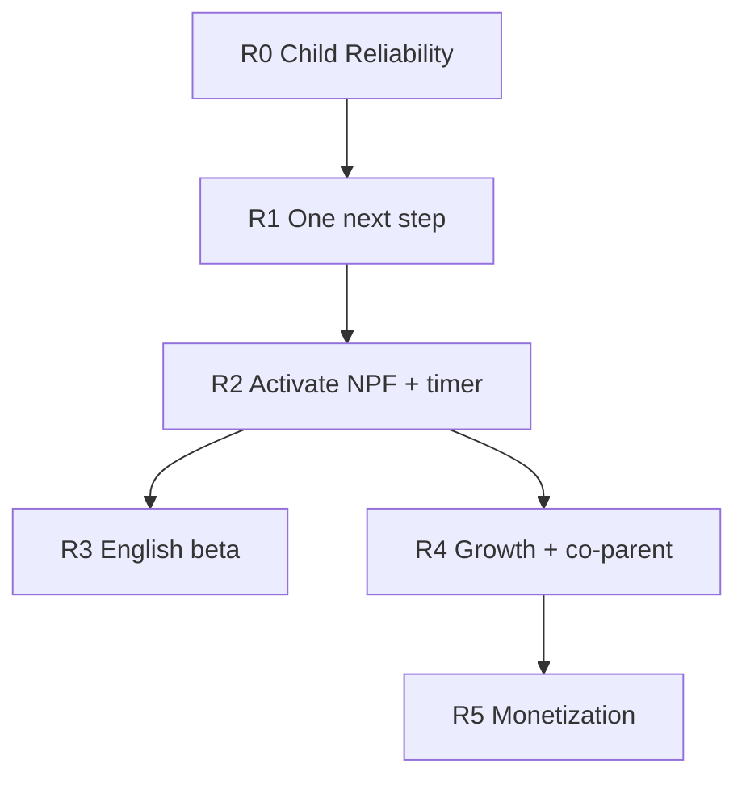

# Produktroadmap — augusti 2026

| | |
|--|--|
| **Typ** | Övergripande produkt- och leveransplan (ingen implementation i detta dokument) |
| **Status** | **Aktiv** — styr prioritering tills ersatt eller reviderad |
| **Skapad** | 2026-08-05 |
| **Ägare** | Produkt + engineering (founder godkänner fasövergångar) |
| **Authority** | POS (`product-operating-system/`) vinner vid konflikt; detta dokument **refererar** POS, duplicerar det inte |
| **Relaterat** | [`PRODUCT-PROGRAM-EXECUTION-PLAN-2026-08.md`](./PRODUCT-PROGRAM-EXECUTION-PLAN-2026-08.md) · [`POST-MERGE-PRODUCT-BASELINE-2026-08.md`](./POST-MERGE-PRODUCT-BASELINE-2026-08.md) · [`GROWTH-FEEDBACK-DARK-LAUNCH-PLAN.md`](./GROWTH-FEEDBACK-DARK-LAUNCH-PLAN.md) · [`aktivitetstimer-spec.md`](./aktivitetstimer-spec.md) · [`adr/ADR-019-trusted-child-device.md`](./adr/ADR-019-trusted-child-device.md) |

---

## 1. Executive summary

Produkten har **många system som är 75–95 % färdiga i kod** men ännu inte sammanslagna till **en enkel, pålitlig vardagsupplevelse**. Den största hävstången är därför inte att bygga tio nya ytor, utan att:

1. göra **barnvyn och första rutinen** snabba, förutsägbara och tillgängliga;
2. ge föräldern **ett tydligt nästa steg** på Hem (en auktoritet, inte flera coacher);
3. **aktivera** det som redan finns (flaggor, ops, founder-smoke) med kontrollerad rollout;
4. först därefter skala **engelska beta**, **tillväxt** och **betalning**.

**North Star (oförändrad):** verklig vardagsnytta — schema som barnet förstår, completion som ger stjärnor, förälder som litar på ordning och synk. Mätbara proxies: P0 / First Success, `activation_rate_48h`, Family Day 14-retention (se [`aktivering-exekveringsplan.md`](./aktivering-exekveringsplan.md)).

---

## 2. Principer (låsta)

| Princip | Innebörd |
|---------|----------|
| **Reality wins** | Celebration efter completion; inga login-bonusar (POS G-01). |
| **Ett nästa steg** | Hem visar högst en prioriterad handling (POS Constitution). |
| **Barn protagonist** | Barnet agerar; föräldern konfigurerar och stöttar (P-02). |
| **Ingen staging** | Prod: kod med flaggor OFF → intern QA → begränsad pilot → bredare ON (se growth- och journey-runbooks). |
| **Sverige först** | Svensk kärna stabil innan store-engelska och IAP köp-live. |
| **Ingen ny fjärde coach** | Journey Context är avsedd long-term comms-authority; Engine/readiness är legacy/adapters tills sunset. |

**Non-goals (denna roadmap):**

- Ny global paywall, star-IAP, syskon-leaderboards (POS forbidden utan ADR).
- Full implementation av alla 13 Min värld-rum (se [`world/README.md`](./world/README.md)).
- AI starter plan / fjärde onboarding-hjärna utan ADR.
- Stora refactors “för skönhets skull” utan koppling till P0 ovan.

---

## 3. Nuläge — vad som redan är byggt

Följande är **shippat eller merge-klart på `main`** (representativ lista — detaljer i respektive spec):

| Område | Kodläge | Kundsynlighet idag | Referens |
|--------|---------|-------------------|----------|
| Kärnloop schema → barn → stjärnor → Skattkammaren | Live | Ja | POS 04–05 |
| Boendeschema (FEAT-1, custom/overrides post-v1) | Live | Ja (flaggad där relevant) | `boendeschema-spec.md` |
| Bildstöd app (panel 1–6) + resursbibliotek R0–R3 | Live | Ja | `bildstod-app-plan.md` |
| Barnets samling (nav A–E, Min samling, Skattkammaren, årsbok) | Live | Ja (`barnets_samling`) | `barnets-samling-vision.md` |
| För dig (mål, utforska, **Aktivera**-API) | Live | Ja (`for_dig`) | `for-dig-spec.md` |
| Känslostöd (`emotion_tracking`) | Live | Ja (basic) | `seed-features.js` |
| Family Journey Fas 1–5 (API, ingest, registry, coach-flaggor) | Implementerad | Delvis (flaggor) | `family-journey-fas2-5-roadmap.md` |
| Growth feedback + referral capture (#841) | Implementerad | Nej (flaggor OFF) | `GROWTH-FEEDBACK-DARK-LAUNCH-PLAN.md` |
| Paket v1.2 foundation + Extra stöd-fält (`seven_questions`, `transition_support`) | Implementerad | Nej (`PACKAGES_ROLLOUT_MODE=off`) | `paket-v1.2-spec.md` |
| RevenueCat / IAP backend + native client logic | Implementerad | Köp avstängt / review-läge | `app-store-iap.md` |
| Aktivitetstimer v0.4 + `activity_timer_v2` | Implementerad | Per-barn master (`activity_timers_enabled`) + `duration_seconds` (R2.1) | `aktivitetstimer-spec.md` |
| Engelska i18n + RC1 harness + global parent English (ADR-021) | Implementerad | Beta-gated | `GLOBAL-ENGLISH-AVAILABILITY-RELEASE.md` |
| Child Core (#840): offline-kö, `child_sort_order`, delsteg-hårdning | Mergad | Ja | `POST-MERGE-PRODUCT-BASELINE-2026-08.md` |
| `minimal_ui` (distraktionsfri barnvy) | Implementerad | Feature `dev` | `seed-features.js` |
| Medförälder-CTA, dela appen | Implementerad | Feature `dev` | `dashboard-cta.js` |
| Parent ↔ child session handoff | Live | Ja | `parent-session-handoff.md` |

**Mönster:** repot är rikt på **implementerad kapacitet med låg exponering** (feature flags, `PACKAGES_ROLLOUT_MODE`, env kill switches).

---

## 4. Roadmap — faser och Definition of Done

**Epic R0 (körbar):** [`product-roadmap-r0-epic.md`](./product-roadmap-r0-epic.md) — issues R0-01 … R0-07, gate [`docs/qa/r0-child-reliability-gate.md`](./qa/r0-child-reliability-gate.md).  
**Founder-beslut D1–D6:** [`product-roadmap-founder-decisions.md`](./product-roadmap-founder-decisions.md) (agent-stoppregler).

Ingen fas startar innan föregående fas **DoD** är uppfylld och dokumenterad (founder + QA). Teknisk verifiering: `npm run test:gate` grön; user-facing: self-review (`.cursor/rules/180-self-review.mdc`).

---

### R0 — Child Reliability Release

**Status: COMPLETE** (R0-01…R0-07 merged, 2026-08-05). Gate: `npm run test:r0-mobile-gate` + [`docs/qa/r0-child-reliability-gate.md`](./qa/r0-child-reliability-gate.md).

**Mål:** Barnet och föräldern ser **samma rutin**, barnet kan **genomföra delsteg tryggt**, och vägen från login till användbar Idag känns **snabb och stabil**.

| Leverans | Beskrivning |
|----------|-------------|
| R0.1 Schemaordning E2E | Canonical ordning: förälder DnD / schema → `daily_log` → barnvy samma dag; regression för `child_sort_order` + parent `sort_order`. |
| R0.2 Delsteg UX | Hel rad klickbar, tydlig progress, omedelbar feedback, `prefers-reduced-motion`, touch ≥44pt (POS 04, 15). |
| R0.3 Barnlogin → Idag | Mät och förbättra kritisk kedja (mål: begripligt inom ~500 ms, användbar cached vy inom ~1–1,5 s — se harness/metrics). |
| R0.4 Offline-rutin | Bekräfta offline-kö för completion; tydlig fallback vid nätverksfel (ingen evig “Laddar…”). |
| R0.5 Support & repro | Kort “skicka teknisk info” (version, SW, device mode, correlation) — produktbeslut + minimal yta. |

**DoD R0:**

- [x] Automatiserade tester täcker ordnings-paritet förälder/barn (R0-01…07 smokes + befintliga child-order/delsteg-tester).
- [x] Mobil smoke (portrait 390×844 + 412×915): `npm run test:r0-mobile-gate` (syntetiska konton, Cursor agent).
- [ ] Kort founder-signering i `docs/qa/r0-child-reliability-gate.md` (ingen ny lång manuell omgång om agentgate grön).
- [x] Inga öppna P0-buggar märkta “schemaordning” eller “delsteg registreras inte”.
- [x] Smoke-checklista i `docs/qa/r0-child-reliability-gate.md` (utökad med R0-07-kedja).

**Värde:** Extremt högt — förtroende för hela produkten.

**POS:** 00A morning stress test, 04 C-02, 15 Section B.

---

### R1 — En hjärna på Hem (Journey + sunset)

**Mål:** Föräldern får **en** prioriterad rekommendation; retentionssystem konkurrerar inte.

| Leverans | Beskrivning |
|----------|-------------|
| R1.1 Journey rollout | Våg 1→3 enligt Journey ops-runbook i `docs/` + [`family-journey-fas2-5-roadmap.md`](./family-journey-fas2-5-roadmap.md) (max en våg per deploy-fönster). |
| R1.2 Coach-prioritet | Journey coach ersätter eller tydligt rankas före Product Engine + readiness på Hem (Prompt 1A — orchestration eller server-consolidation; ADR om ny authority). |
| R1.3 Activation sunset | Fas 4: `activation_program_new_enrollments` OFF, program-UI bort, API 410 där spec säger det. |
| R1.4 Metrics | `handoff_completion_rate`, phase distribution, First Success per kohort — admin/journey metrics. |

**DoD R1:**

- [ ] `family_journey_coach_v1` ON för pilotfamiljer utan ökade 5xx eller supportärenden.
- [ ] Hem visar högst en primär coach-yta (growth feedback fortfarande flagg-gated).
- [ ] Activation program inte längre krävs för `parent_saw_completion` (parent-ack via Journey).
- [ ] test:gate + journey integration suites gröna.

**Värde:** Mycket högt — “vad ska vi göra nu?” utan dashboard-brus.

**POS:** PA-01, P-04 (inga nya coach-ytor), Constitution §1.

**Detalj-spec:** [`family-journey-fas2-5-roadmap.md`](./family-journey-fas2-5-roadmap.md) (implementationsdjup — ändra inte domän här).

**R1 engineering (2026-08-05):** **COMPLETE** — Hem-orkestrering (#889), founderpilot **GO** founder-only (#891), Activation enrollment + runtime sunset (#893, #895). Multi-family Journey Wave 1 **deferred** until an explicitly eligible cohort exists; **no product defect** blocks R2. Founderpilot unchanged.

---

### R2 — Aktivera differentiering (NPF + timer)

**Mål:** Slå på funktioner som redan finns och som matchar målgruppen — utan bred paket-paywall.

| Leverans | Beskrivning |
|----------|-------------|
| R2.1 Aktivitetstimer | **ENGINEERING COMPLETE** · Live acceptansgate: **PASS** (2026-08-05, founder QA, snapshot/restore). Rollout: `activity_timers_enabled` + allowlist. |
| R2.2 Minimal UI live | `minimal_ui` från `dev` → pilot → `live` för familjer som behöver det. |
| R2.3 Extra stöd-pilot | **R2 Extra stöd: ENGINEERING COMPLETE** · Live acceptance: **PASS** (2026-08-06, VPS strict prod gate, deploy SHA `25f1aa3d`, snapshot/restore). **Customer pilot: DEFERRED** until explicitly approved families exist. |
| R2.4 För dig × Journey | En rekommendation kopplad till `journey_phase` / readiness — inte generisk tips-sida. |

**DoD R2:**

- [x] Timer: inga blockerande buggar i founder-smoke; rollback = flag OFF. Live acceptansgate PASS 2026-08-05.
- [ ] Minimal UI: dokumenterad i child-settings; inga regressioner i completion-flöde.
- [ ] Pilot: skriftlig go/no-go för `PACKAGES_ROLLOUT_MODE=interest` (inte köp).

**Värde:** Hög differentiering vs “statiskt bildschema”.

**POS:** 04 Extra stöd som kapabilitet, inte diagnos-label i UI.

---

### R3 — Engelsk kontrollerad beta

**Mål:** Parent English och begränsad kohort — **inte** full App Store-internationalisering.

| Leverans | Beskrivning |
|----------|-------------|
| R3.1 Founder prod-smoke | [`runbooks/ENGLISH-RC1-RELEASE-GATE.md`](./runbooks/ENGLISH-RC1-RELEASE-GATE.md) — pinned SHA, secrets, BLOCKED exit codes. |
| R3.2 Parent beta | `english_app` / global gate enligt ADR-021; grandfathered families verifierade. |
| R3.3 Child English | `english_child_experience` endast efter separat device-smoke (barnpaket). |
| R3.4 Legal/support | Privacy/terms på engelska innan store — utanför ren kod, men gate för “full release”. |

**DoD R3 (beta):**

- [x] RC-1 known risks R1–R3: engineering fixes + automated gates (2026-08-06; deploy follows #916 / daily-log RC PR).
- [ ] RC1 smoke PASS eller dokumenterad waiver med riskägare.
- [ ] Rollback: flag OFF inom minuter.
- [ ] Inga child-surface regressions i `test:e2e:i18n` / child-core harness.

**DoD R3 (full store release):** separat beslut — se `ENGLISH-RC1-GATE-READINESS-REPORT.md` (NO-GO tills dess).

**Värde:** Strategiskt högt; kortsiktigt lägre än svensk R0–R1.

---

### R4 — Tillväxt efter tillit

**Mål:** Mätbar loop när First Success är stabil.

| Leverans | Beskrivning |
|----------|-------------|
| R4.1 Growth dark launch | Fas 0–3 i [`GROWTH-FEEDBACK-DARK-LAUNCH-PLAN.md`](./GROWTH-FEEDBACK-DARK-LAUNCH-PLAN.md). |
| R4.2 Medförälder | `medforalder_cta` ON efter First Success-värde; mät `cta_invite_co_parent_*`. |
| R4.3 Referral v0 | `referral_program` + `growth_referral_cta_v1` — spårning only (ingen belöning v0, se [`referral-program.md`](./referral-program.md)). |
| R4.4 Kvällsanpassad onboarding | Produktcopy/flow: rutin klar ikväll → barnvy imorgon (ny UX — kräver spec/ADR om stor). |

**DoD R4:**

- [ ] Inga growth-prompter vid first login eller under blocking journey experiences.
- [ ] Referral self-abuse tester gröna; ingen reward-löfte i copy.
- [ ] Medförälder: invite → accept → aktiv medförälder mäts 7d.

**Värde:** Hög organisk tillväxt när kärnan håller.

---

### R5 — Monetarisering (medvetet sist)

**Mål:** IAP + paketköp när aktivering och tillit motiverar intäkt.

| Förutsättning | Gate |
|---------------|------|
| Stabil First Success | R0 + R1 DoD |
| Sandbox IAP | iOS + Android restore, entitlement offline |
| `PACKAGES_ROLLOUT_MODE=purchase` | Produktbeslut + App Review story |
| Paywall UX + legal | POS R-02 (stjärnor ej köpbara) oförändrad |

**Leverans:** RevenueCat produkter live, `nativePurchasesEnabled`, supportverktyg, regression `test/iap-*`.

**DoD R5:** Sandbox-köp end-to-end; grace/refund dokumenterat; ingen paywall på barnyta.

**Värde:** Kommersiellt högt; **pausad** tills R0–R2 levererat.

---

## 5. Parallellt spår — Trusted child device (ADR-019)

**Status:** Proposed — implementation **stopped** tills accept.

Detta är den största **produkt**-luckan under R0: “familjeenhet” som begriplig inställning (barnets tablet öppnar barnvy utan PIN varje gång, förälder via gate).

| Steg | Action |
|------|--------|
| 1 | Founder accepterar ADR-019 Option A (device-bound child refresh) eller avvisar scope. |
| 2 | Minimal MVP-spec: enable/disable, revoke, audit, child JWT scope oförändrad. |
| 3 | Implementeras som **egen release** under R0, inte smyg i handoff-fixar. |

**Värde:** Extremt högt för målgruppen (Emma-use case).

---

## 6. Inventering — “nästan klart” (aktiveringslista)

Använd vid sprintplanering. **%** = leveransbedömning (kod + ops), inte rad-räkning.

| Initiativ | Kod | Kvar (typiskt) | Värde | Fas |
|-----------|-----|----------------|-------|-----|
| Child Reliability (ordning, delsteg, perf) | 70–85 % | E2E, QA, metrics | Extremt | R0 |
| ADR-019 familjeenhet | 10–20 % | ADR accept + MVP | Extremt | R0 |
| Aktivitetstimer v2 | **100 %** (engineering + live acceptans PASS) | — | Mycket högt | R2 |
| Family Journey | 85–90 % | Rollout + Hem-prioritet | Mycket högt | R1 |
| `minimal_ui` | 85 % | Flag live + copy | Mycket högt | R2 |
| För dig personalisering | 75 % | Journey-koppling | Högt | R2 |
| Growth + referral | 90 % | Dark launch | Högt | R4 |
| Extra stöd / teacch | **100 %** (engineering complete + live acceptance PASS) | Customer pilot (approved families only) | Högt | R2 → R5 |
| Engelsk beta | 88–93 % | Prod smoke | Högt (strategiskt) | R3 |
| IAP / paket köp | 65–75 % | Store + sandbox | Högt (senare) | R5 |
| Min värld (playable) | 35 % | Art + `scenes.json` | Medel lång sikt | Efter R2 |
| Full engelsk store | 65–75 % | Legal, child pack, metadata | Strategiskt | Efter R3 beta |

---

## 7. Teknisk skuld som påverkar roadmapen

| Skuld | Påverkan | Åtgärd i roadmap |
|-------|----------|------------------|
| Parallella Hem-coacher | Motstridiga CTAs | R1 |
| Stora JS-monoliter (`child-dashboard.js`, `schedule.js`, …) | Regression vid R0/R2 | Små extraktioner vid beröring; ingen big-bang |
| Duplicerad schemalogik (förälder vs barn) | Ordning-risk | R0.1 + server canonical |
| Ingen staging-miljö | Rollout-risk | Flag-disciplin, en våg/deploy |
| CSP report-only | Säkerhet | Separat ops-ADR; blockerar inte R0 |
| CI `npm ci` utan `--legacy-peer-deps` | Agent/CI friktion | Ops-fix parallellt |
| Dokumentation vs kod (äldre “spec only”) | Fel prioritering | Detta dokument + peka på baseline |

---

## 8. Öppna produktbeslut (kräver founder)

**Fullständig tabell (default, alternativ, risk, blockerar):** [`product-roadmap-founder-decisions.md`](./product-roadmap-founder-decisions.md).

| ID | Fråga | Default om tystnad |
|----|--------|---------------------|
| D1 | ADR-019 — ship Option A? | Nej; behåll PIN-login |
| D2 | När `PACKAGES_ROLLOUT_MODE=interest`? | Efter R2.3 pilot positiv |
| D3 | Journey Wave 1 redan ON i prod? | Verifiera VPS flaggar före Wave 2 |
| D4 | Engelsk beta-start före eller efter R0 DoD? | **Efter** R0 (rekommenderat) |
| D5 | Referral belöning v1 | Ej förrän v0-data visar delning |
| D6 | Kvällsanpassad onboarding (R4.4) | Spec först; inte i R0 |

---

## 9. Relation till andra dokument

| Dokument | Roll |
|----------|------|
| `product-roadmap-r0-epic.md` | **R0** issues R0-01–R0-07 |
| `product-roadmap-founder-decisions.md` | D1–D6 agent-stoppregler |
| `family-journey-fas2-5-roadmap.md` | Teknisk fas 2–5 för Journey — **under** R1 |
| `barnets-samling-github-roadmap.md` | Largely complete — underhåll |
| `bildstod-app-plan.md` | SEO + app — löpande content, inte P0 |
| `for-dig-spec.md` | Sprint 4 defer ADR — nav inte i R1 utan metrics |
| `vuxenmeny-v2.md` | Inkrementell IA — inga nya bottenflikar utan ADR |
| `PRODUCT-PROGRAM-EXECUTION-PLAN-2026-08.md` | Augusti audit — input till detta dokument |

**Vid konflikt:** POS > ADR > detta dokument > äldre chat-/agent-sammanfattningar.

---

## 10. Revisionshistorik

| Datum | Version | Ändring |
|-------|---------|---------|
| 2026-08-05 | 1.1 | R0 epic + founder decisions + gate checklist |
| 2026-08-05 | 1.0 | Initial roadmap (repo-inventering + founder/ChatGPT-alignment, ingen kod) |

---

## Bilaga A — Checklista för fasövergång (kort)

Innan **R(n) → R(n+1)**:

1. Föregående fas DoD kryssad av i PR eller release note.
2. `npm run test:gate` grön på release-SHA.
3. Founder smoke enligt fas (R0: barn; R3: engelsk runbook).
4. Flaggar dokumenterade i admin/ops-notis.
5. Rollback testad (flag OFF / revert-forward plan).
6. POS-sektioner citerade i merge-commit om user-facing.
