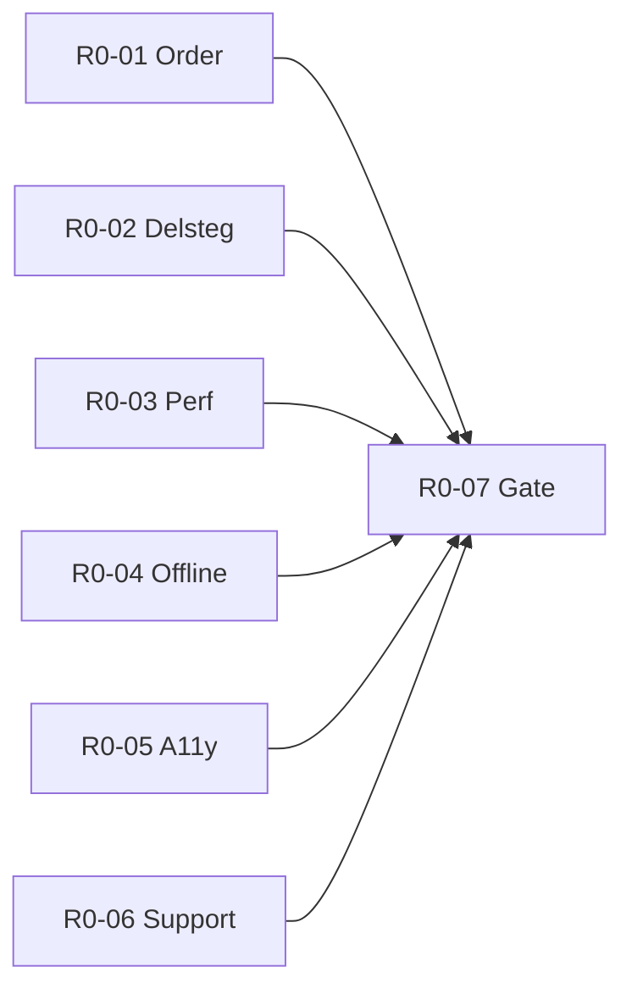

# Epic R0 — Child Reliability Release

| | |
|--|--|
| **Roadmap** | [`product-roadmap-2026-08.md`](./product-roadmap-2026-08.md) — fas **R0** |
| **Status** | R0-01–R0-06 **merged**; R0-07 = `npm run test:r0-mobile-gate` (återanvänder R0-01…06 smokes) |
| **Regel** | **Inget enda stort “Child Reliability”-PR.** En logisk leverans per issue (R0-01 … R0-07). |
| **Aktivitetstimer** | **Utanför** R0-01–R0-06 (hör hemma i **R2**). R0-07 verifierar att timerfält/kod inte försämrar dagens barnrutin. |
| **ADR-019** | Parallellt founder-spår — se [`product-roadmap-founder-decisions.md`](./product-roadmap-founder-decisions.md) D1. **Blockerar inte** R0-01–R0-06. |
| **GitHub** | Kör `./scripts/setup-r0-github-issues.sh` (valfritt) för labels + issues |

---

## Epic-mål

Barnet och föräldern upplever **samma rutin**, barnet kan **genomföra delsteg tryggt**, och vägen från login till användbar Idag är **snabb och stabil** — innan Journey-rollout, growth eller IAP prioriteras.

### Epic Definition of Done

- [ ] Alla issues R0-01 … R0-07 **merged** med `npm run test:gate` grön.
- [ ] [`docs/qa/r0-child-reliability-gate.md`](./qa/r0-child-reliability-gate.md) checklista signerad (founder smoke).
- [ ] Inga öppna P0 märkta “schemaordning” / “delsteg” / “offline completion”.
- [ ] Roadmap R0 DoD i huvuddokumentet uppdaterad i samma release-PR som R0-07.

---

## Issue-mall (obligatorisk för varje PR)

Varje R0-issue-PR ska i beskrivningen innehålla:

1. **Observerat problem** — kundrapport, harness-mätning eller reproducerat steg (inte “känns fel”).
2. **Canonical datakälla** — vilken tabell/API-fält som är sanning.
3. **Flöden** — exakta routes/skärmar (förälder vs barn).
4. **Acceptanskriterier** — testbara, med aktivitets-ID där ordning gäller.
5. **Befintliga tester** — filer som redan täcker (ska förbli gröna).
6. **Nya regressionstester** — vad som läggs till.
7. **Feature flags** — påverkan (ofta “ingen”; timer undantag noteras i R0-07).
8. **Mobilmatris** — minst iPhone Safari portrait + en Android Chrome/WebView-rad.
9. **Avgränsning** — explicit *inte* i scope (särskilt aktivitetstimer, ADR-019, Journey).

**POS (R0):** 04 C-02, 00A morning stress, 15 Section B (touch, reduced motion).

---

## Beroenden mellan issues

R0-01 och R0-02 kan köras parallellt. R0-03–R0-06 kan köras parallellt efter att problem är verifierade. **R0-07 sist** (samlar gate).

---

# R0-01 — Canonical schema order

## Leverans

Förälder DnD / schemaändring → API → `daily_log` / `daily_log_item` → barnets Idag-vy behåller **samma aktivitets-ID i samma sekvens** inom sektion (morgon/em/kväll).

## Observerat / verifierat problem

- Historisk P1: barnets ordning ≠ förälderns sparade ordning (delvis åtgärdat #819, `child_sort_order` NULL-semantik `181012…`).
- Kundfeedback kan fortfarande rapportera divergens — behandlas som **P0 tills E2E-bevis finns**.
- Risk: duplicerad sorteringslogik mellan `schedule.js` / `dashboard.js` och server (`CHILD-CORE-STABILITY-REPORT` spår B).

## Canonical datakälla

| Lager | Sanning |
|-------|---------|
| Dagens logg | `daily_log_item.sort_order`, `daily_log_item.child_sort_order` (NULL = använd parent `sort_order`) |
| Barn-API | `GET /api/me/daily-log` (child-self) — ORDER BY sektion + sort |
| Jämförelse | `src/lib/daily-log-child-order.js` (`compareChildDailyLogItems`) |
| Veckoschema | `weekly_schedule_item.sort_order` + sektion CASE (se `schedule-section-order-contract.test.js`) |

## Flöden som berörs

1. Förälder: `schedule.html` / `dashboard.js` DnD → sparar vecko-/dagschema.
2. Server: materialisering till `daily_log_item` för dagens datum.
3. Barn: `child-dashboard` / `loadDay` → renderar Idag.
4. Barn: valfritt `allow_child_reorder` → `PUT` reorder → uppdaterar `child_sort_order` **och** `sort_order` (hushåll).

## Acceptanskriterier

> Efter att föräldern ändrat ordningen ska samma aktivitets-**ID:n** visas i samma sekvens i sparat schema, skapad/uppdaterad `daily_log` och barnets Idag-vy — efter **refresh**, **logout/login** och **ny sidladdning**.

Ytterligare:

- [ ] Barn-initierad reorder synkas till förälderns vy samma dag (om produktregeln fortfarande gäller).
- [ ] Ledig/pausad aktivitet ändrar inte ordning för övriga.
- [ ] `compareChildDailyLogItems` returnerar `ok: true` i integration A–I (utöka om lucka finns).

## Befintliga tester

- `test/child-daily-log-order.integration.test.js` (A–H+)
- `test/schedule-section-order-contract.test.js`
- `scripts/child-core-journey-harness.mjs` — `orderOk` hard-fail

## Nya regressionstester (förväntat)

- Utöka integration: förälder DnD → API → child GET (hela kedjan, inte bara DB-seed).
- Ev. contract test: en ORDER BY-sträng / helper delad dokumenterat mellan parent child-log endpoints.

## Feature flags

- Ingen ny flagg. `allow_child_reorder` på `child` är befintlig inställning — dokumentera beteende i PR.

## Mobilmatris

| Miljö | Test |
|-------|------|
| iPhone Safari portrait | Förälder ändrar ordning → barn uppdaterar Idag |
| Android Chrome | Samma |
| Svag nät | Ordning efter retry (ingen permuterad cache) |

## Avgränsning

- **Inte:** custody/boendeschema veckoväxling (egen motor).
- **Inte:** aktivitetstimer UI.
- **Inte:** ADR-019.

## Primära filer (referens, inte exklusiv lista)

`src/routes/daily-logs/child-self.js`, `src/lib/daily-log-child-order.js`, `public/js/schedule.js`, `public/js/dashboard-dnd.js`, `test/child-daily-log-order.integration.test.js`

---

# R0-02 — Delsteg interaction contract

## Leverans

Delsteg ska fungera som **riktig barninteraktion**: hel rad tryckbar, omedelbar feedback, säker persistence, reduced motion.

## Observerat / verifierat problem

- Historisk: expand krasch (const assignment, #820); complete race, offline gap (`CHILD-CORE-STABILITY-REPORT` spår A).
- Barn ska förstå: nästa delsteg, att tryck registrerades, när aktiviteten är klar.

## Canonical datakälla

- `activity_template.sub_steps` / `activity_sub_step` (per mall)
- `daily_log_item` completion + delsteg-state via child API (`child-substep-*` routes)
- Klient: `public/js/child-dashboard-substeps.js`, `public/js/child-support-layer.js`

## Flöden

1. Barn expanderar delsteg på NU-kort.
2. Barn togglar delsteg complete.
3. Alla delsteg klara → aktivitet complete (befintlig regel).
4. Offline: `offline-queue.js` `COMPLETE_SUBSTEP` / `UNCOMPLETE_SUBSTEP`.

## Acceptanskriterier

- [ ] Hela delstegsraden är touch target ≥44px (check inkluderad).
- [ ] Optimistisk UI med rollback vid API-fel (synlig `.error` state).
- [ ] `prefers-reduced-motion`: ingen obligatorisk celebration på delsteg.
- [ ] VoiceOver/TalkBack: rad har tillgängligt namn + state (busy/selected).
- [ ] Double-tap ger inte dubbel completion (in-flight guard).

## Befintliga tester

- `test/child-substep-toggle-contract.test.js`
- `test/child-substep-order.integration.test.js`
- `test/offline-queue-rating.test.js` (substep entity keys)
- `test/meny-v21.test.js` (support layer)

## Nya regressionstester

- E2E eller integration: expand → complete delsteg → parent ser completion (om API finns).
- Reduced-motion contract (statisk assert på CSS/klass).

## Feature flags

- Ingen.

## Mobilmatris

- iPhone + Android: motorisk precision (barnhänder), landscape **not required**.

## Avgränsning

- **Inte:** nya delsteg-typer eller admin-CRUD.
- **Inte:** aktivitetstimer helskärm (R2).

---

# R0-03 — Child login performance

## Leverans

Mätpunkter och **budget** från barnlogin (eller session resume) till **användbar** Idag-vy; förbättringar utan att offra säkerhet.

## Observerat / verifierat problem

- Mobilsmoke har rapporterat flera sekunder till användbar Idag (founder/RC-miljöer) — behandla som mätvärde, inte gissning.
- `test:child-core-harness` mäter flöde men är inte full prod-RTT.

## Canonical datakälla

- Mätpunkter: navigation timing i harness + valfri `performance.mark` i `child-login.js` / `child-dashboard` `loadDay` (implementation i issue).
- Budget (mål i roadmap): begripligt UI ~500ms; användbar cached rutin ~1–1,5s (produktmål — justera med founder efter baseline).

## Flöden

1. `/child-login` → PIN → `/child/today` (eller resume → redirect).
2. `loadDay` → första render med minst ett NU-kort eller tom-state med copy.

## Acceptanskriterier

- [ ] Baseline dokumenterad i PR (före/efter på samma fixture).
- [ ] Ingen tom “Laddar…” utan timeout-copy >3s.
- [ ] SW/cache: bump endast om statiska assets ändras (regel 150).
- [ ] Ingen extra sekventiell API-kedja utan motivering i PR.

## Befintliga tester

- `npm run test:child-core-harness`
- `test/child-login-session-resume.test.js`
- `test/native-child-cold-launch-harness.test.js`

## Nya regressionstester

- Harness eller unit: assert max tid i CI-miljö (generös threshold för flake) **eller** dokumenterad manuell founder-tabell.
- Ev. `performance` mark presence test (contract only).

## Feature flags

- Ingen.

## Mobilmatris

- Mid-range Android + iPhone (enhetlighet viktigare än desktop).

## Avgränsning

- **Inte:** ADR-019 PIN-less (D1).
- **Inte:** bundler/hela frontend-arkitektur (separat skuld).

---

# R0-04 — Offline daily routine

## Leverans

Barnets dagens rutin fungerar **utan uppkoppling**: visa senaste kända schema, completion köas säkert, **4xx köas inte**.

## Observerat / verifierat problem

- #840 etablerade offline-kö och logout clear — gap: tom spinner, stale empty state, timer offline (timer = R2).

## Canonical datakälla

- `public/js/offline-queue.js`
- `public/js/auth.js` — `OfflineQueue.clear()` on logout
- Server: daily-log completion endpoints (idempotent 409)

## Flöden

1. Barn offline → ser cache/senaste `loadDay` payload.
2. Complete aktivitet/delsteg → kö → flush online.
3. 401/403/404/422 → **inte** i kö (befintlig policy — verifiera).

## Acceptanskriterier

- [ ] Efter offline complete + online: exakt en server completion (idempotens).
- [ ] Logout tömmer kö (ingen cross-child leak).
- [ ] Användare ser begriplig offline-banner (i18n keys finns för parent home — barn parity).

## Befintliga tester

- `test/offline-queue-rating.test.js`
- Gate: child-core / platform-runtime offline replay
- `docs/CHILD-CORE-STABILITY-REPORT-2026-08.md`

## Nya regressionstester

- Integration: simulate offline flush med 409/200.
- Ev. harness steg med `page.setOfflineMode`.

## Feature flags

- Ingen.

## Mobilmatris

- Flygpläge på fysisk telefon efter R0-07 gate.

## Avgränsning

- **Inte:** full offline schema-redigering förälder.
- **Inte:** aktivitetstimer countdown offline (R2 verifierar separat).

---

# R0-05 — Child accessibility pass

## Leverans

Systematisk pass på barnvy: PIN, kontrast, textskalning, tryckytor, VoiceOver/TalkBack, reduced motion.

## Observerat / verifierat problem

- PIN pastell kontrast fixad #840 — verifiera kvarstår.
- Ingen dokumenterad full barn-a11y audit (roadmap gap).

## Canonical datakälla

- `public/child-login.html`, `public/js/child-login.js`
- `public/css/` child tokens, `platform-native.css`
- `child_view_config` (minimal_ui är **R2** flag — R0 kan fixa baseline utan att slå på feature)

## Flöden

- Child login PIN → Idag → complete → ev. Skattkammaren navigering.

## Acceptanskriterier

- [ ] PIN: kontrast WCAG AA för siffror (befintlig `#1B2340` pattern).
- [ ] 200% textzoom: inget kritiskt avklippt på Idag (iOS dynamic type där möjligt).
- [ ] Fokus synligt (`:focus-visible`) på interaktiva barnkontroller.
- [ ] Reduced motion: celebration ≤2s, skippable (POS G-08 / 15).

## Befintliga tester

- Child-core harness viewports
- Ev. lint/a11y i gate för child HTML (utöka vid behov)

## Nya regressionstester

- Statiska kontrast-/klass-tester (mönster som PIN #840).
- Checklista i `docs/qa/r0-child-reliability-gate.md` (manuell VoiceOver).

## Feature flags

- `minimal_ui` — **ändras inte** i R0-05 (endast baseline a11y).

## Mobilmatris

- VoiceOver (iOS) + TalkBack (Android) — manuell i R0-07.

## Avgränsning

- **Inte:** ny “Enkel vy”-produkt (R2 `minimal_ui` rollout).

---

# R0-06 — Support diagnostics

## Leverans

Förälder (eller support) kan skicka **teknisk information utan PII/secrets**: appversion, SW/cache, enhet, språk, device mode, correlation id.

## Observerat / verifierat problem

- Support reproducerar ordning/login-buggar långsamt utan strukturerad diagnostik.

## Canonical datakälla

- `GET /health` (`cache_version`)
- Befintliga correlation patterns i handoff (`rc1-handoff-*` — återanvänd mönster, inte kopiera secrets)
- Ny endpoint eller settings-sida — **produktbeslut i issue-PR** (minimal)

## Flöden

1. Inställningar eller hjälp → “Skicka teknisk info” → kopiera eller e-post till support.

## Acceptanskriterier

- [ ] Ingen JWT, PIN, barnnamn, e-post i payload.
- [ ] Ingen `DATABASE_URL` / API-nycklar.
- [ ] Opt-in (knapptryck).
- [ ] GDPR: endast teknisk metadata.

## Befintliga tester

- Inga dedikerade — ny test för payload allowlist.

## Nya regressionstester

- Unit: snapshot av tillåtna nycklar; neka kända secret-nycklar.

## Feature flags

- Valfri `support_diagnostics_v1` om gradvis rollout önskas.

## Mobilmatris

- Web + native WebView (Capacitor).

## Avgränsning

- **Inte:** automatisk crash reporting (Sentry separat).
- **Inte:** admin impersonation data.

---

# R0-07 — R0 end-to-end gate

## Leverans

Samlad **mobilmatris**, founder smoke-checklista, harness hard-fail regler — inkl. **regression: aktivitetstimer påverkar inte** bas-rutin när timer av eller ej konfigurerad.

## Observerat / verifierat problem

- Enskilda fixes kan passera gate men samlad morgonscenario faller.

## Canonical datakälla

- `docs/qa/r0-child-reliability-gate.md` (denna epic skapar filen)
- `npm run test:child-core-harness`
- `npm run test:gate`

## Flöden (smoke)

1. Förälder ordnar → barn login → Idag → delsteg → complete → stjärna.
2. Refresh + logout/login + ordning kvar (R0-01).
3. Optional: med `activity_timers_enabled` false — samma smoke grön.

## Acceptanskriterier

- [ ] Gate-checklista 100% för founder-signoff.
- [ ] Harness `orderOk !== false`, inga uncaught errors.
- [ ] Med timer-flag på familj **endast** om R2 redan mergat — annars explicit SKIP i checklista.
- [ ] Roadmap R0 DoD kryssad i release note.

## Befintliga tester

- Hela `test:gate` + child-core harness contract tests

## Nya regressionstester

- Ev. tagga `test:gate:db` scenario “R0 golden” om inte redan täckt.

## Feature flags

- Dokumentera vilka flaggor var ON under smoke.

## Mobilmatris

| # | Enhet | OS | Browser |
|---|-------|-----|---------|
| 1 | iPhone | iOS 17+ | Safari |
| 2 | Android | 13+ | Chrome |
| 3 | Android | 13+ | WebView (om native build finns) |

## Avgränsning

- **Inte:** prod load test.
- **Inte:** engelsk RC1 (R3).

---

## Revisionshistorik

| Datum | Version | Ändring |
|-------|---------|---------|
| 2026-08-05 | 1.0 | Epic + R0-01–R0-07 enligt founder-struktur |
