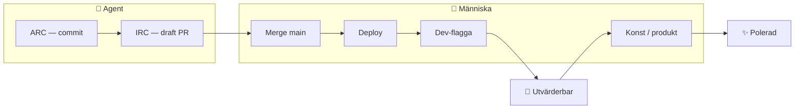
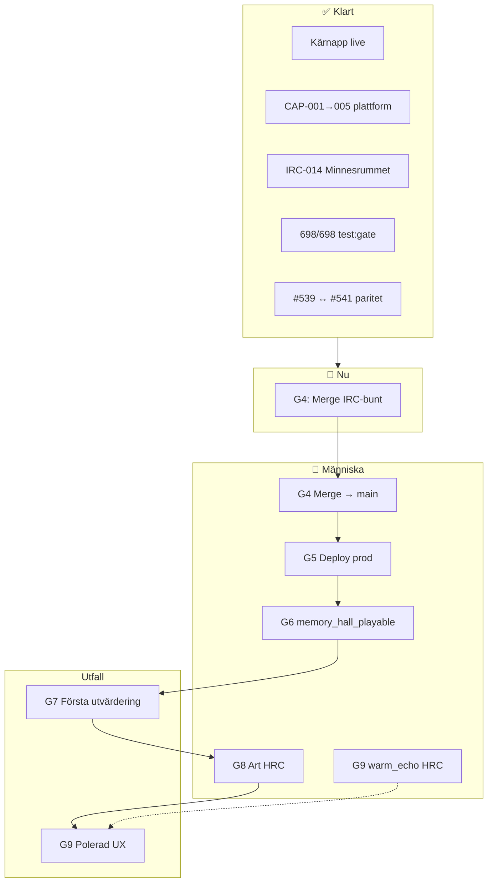

# Roadmap — Min Värld → Minnesrummet

**Uppdaterad:** 2026-07-03 (efter CAP-006-R1)  
**Syfte:** Gates, mänskliga grindar, och var vi är i kedjan mot första utvärdering.

---

## Var vi är nu

```text
✅ G0  Kärnapp live (prod-miljö)
✅ G1  test:gate 698/698
✅ G2  Plattform + Minnesrum i kod (CAP-003 → CAP-005)
✅ G3  Branch-paritet #539 ↔ #541 (CAP-006-R1, ed435f1a)
📍 G4  Merge IRC-bunt till main          ← MÄNNISKA (HRC-DEPLOY-IRC)
⏳ G5  Deploy prod                        ← MÄNNISKA
⏳ G6  Dev-flagga testfamilj              ← MÄNNISKA (HRC-FLAG-MH)
🎯 G7  Första utvärdering i prod
⏳ G8  Konst godkänd (HRC-ART-041)       ← valfritt för G7, krävs för polerad UX
⏳ G9  Parent warm_echo (HRC-PARENT-042)  ← separat spår
```

**Agentarbete för branch-paritet är klart.** Nästa steg kräver mänskliga grindar (merge → deploy → flagga).

---

## Leveranstier (agent vs människa)



| Tier | Gate | Vem | Pausar agent? |
|------|------|-----|---------------|
| **ARC** | Commit, refaktor, tester | Agent | Nej |
| **IRC** | Draft PR + `test:gate` | Agent | Nej |
| **HRC** | Merge, deploy, flaggor, konst | **Människa** | Agent fortsätter annat prep |

Källa: `.ai/company/HUMAN_APPROVAL_GATE.md`

---

## Produktspår (gates i detalj)



| Gate | Beskrivning | Typ | Status |
|------|-------------|-----|--------|
| G0 | Kärnprodukt live | — | ✅ |
| G1 | `test:gate` grön | Agent | ✅ 698/698 |
| G2 | CAP-003 + IRC-014-R1 + CAP-005 i kod | Agent | ✅ |
| G3 | Branch-paritet #539 ↔ #541 | Agent | ✅ CAP-006-R1 |
| G4 | Merge IRC-007→016 till `main` | 👤 HRC-DEPLOY-IRC | ⏳ |
| G5 | Deploy till prod-miljö | 👤 HRC | ⏳ |
| G6 | `memory_hall_playable` på testfamilj | 👤 HRC-FLAG-MH | ⏳ |
| G7 | **Första utvärdering** (flöde, copy, känsla) | 👤 Du | 🔒 efter G4–G6 |
| G8 | Scen-WebP enligt art-spec | 👤 HRC-ART-041 | ⏳ |
| G9 | Parent `warm_echo` | 👤 HRC-PARENT-042 | ⏳ valfritt |

---

## Branch-paritet (#539 ↔ #541)

Verifierat 2026-07-03: produktkod-diff `public/`, `config/`, `test/` = **0 rader**.

| Feature | #539 `memory-hall-bl012-5e52` | #541 `autonomous-relay-resume-b105` |
|---------|-------------------------------|-------------------------------------|
| CAP-003 `enterWorld`/`exitWorld` | ✅ | ✅ |
| IRC-014-R1 `memory_hall` registry | ✅ | ✅ |
| CAP-005 asset-pipeline wiring | ✅ | ✅ |
| Senaste SHA (prod-kod) | `ed435f1a` | `3059ddf7` |

Handoff-docs kan skilja sig mellan grenarna; produktkod är synkad.

---

## Senast genomfört — CAP-006-R1 (2026-07-03)

Cherry-pick av CAP-005-commit `3059ddf7` från `cursor/autonomous-relay-resume-b105` till `cursor/memory-hall-bl012-5e52` (#539).

**Produktkod (rent cherry-pick):**

- `public/child-dashboard.html` — laddar `memory-hall-asset-pipeline.js`
- `public/js/child-memory-hall.js` — pipeline, preload, `bindAssetWatch`
- `public/css/child-memory-hall.css` — illustrated scene layout
- `public/sw.js` — v496 + precache
- Tester: `memory-hall-playable`, `memory-hall-asset-pipeline`, `living-world-transition`

**Handoff-doc-konflikter** lösta för #539-branchkontext.

**Verifiering:**

- `test:gate` — 698/698 grön
- Paritet mot relay-branch bekräftad
- Push: `ed435f1a` på `cursor/memory-hall-bl012-5e52`
- PR #539 uppdaterad

---

## IRC-bunt — föreslagen merge-ordning (människa)

Se även `docs/reports/irc-bundle-2026-07-03.md`.

```text
IRC-007 (#527)  governance + a11y
    ↓
IRC-008 (#528)  CI lint
    ↓
IRC-009 (#529)  morgonhus a11y
    ↓
IRC-010–012     pack guards, LOE-tester, garden aria
    ↓
IRC-014 (#539)  Minnesrummet  ← huvudslicen (paritet klar)
    ↓
IRC-015 (#540)  art-spec (inga binärer)
    ↓
IRC-016 (#541)  relay-plattform
    ↓
👤 Merge → 👤 Deploy → 👤 Flagga → 🎯 Utvärdera
```

---

## Mänskliga grindar (HRC) — öppna

| ID | Beslut | Blockerar |
|----|--------|-----------|
| HRC-DEPLOY-IRC | Merge IRC-bunt till `main` | G4 |
| HRC-DEPLOY | Deploy live | G5 |
| HRC-FLAG-MH | Allowlista testfamilj för `memory_hall_playable` | G6, G7 |
| HRC-ART-041 | Godkänn + committa scen-WebP | G8 (polerad UX) |
| HRC-PARENT-042 | Godkänn `warm_echo` copy/flow | G9 |

Källa: `.ai/knowledge/OPEN_BLOCKERS.md`

---

## Agent — vad som återstår (ej blockerande)

All **oblockerad** capability- och feature-kö är tom. Agent kan under HRC-väntan:

- Uppdatera merge-guider och morning-report-paket
- Reversibel prep (schema-draft, docs) — **inte** merge/deploy/flaggor/konst

---

## Relaterade dokument

- `.ai/knowledge/OPEN_PRS.md` — IRC-tabell
- `.ai/knowledge/OPEN_BLOCKERS.md` — HRC-lista
- `docs/art-specs/memory-hall-bl041.md` — konst (väntar HRC)
- `docs/decisions/adr-memory-hall-bl012.md` — kreativ riktning (godkänd)
