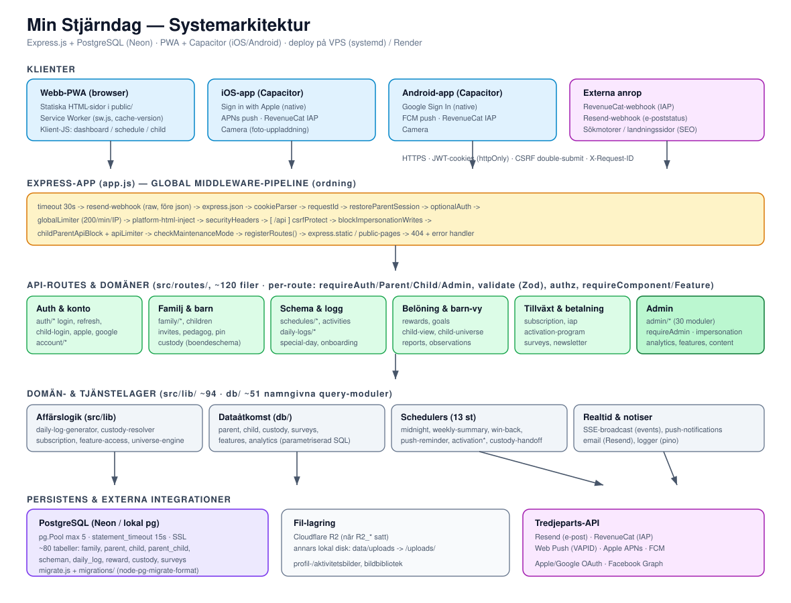
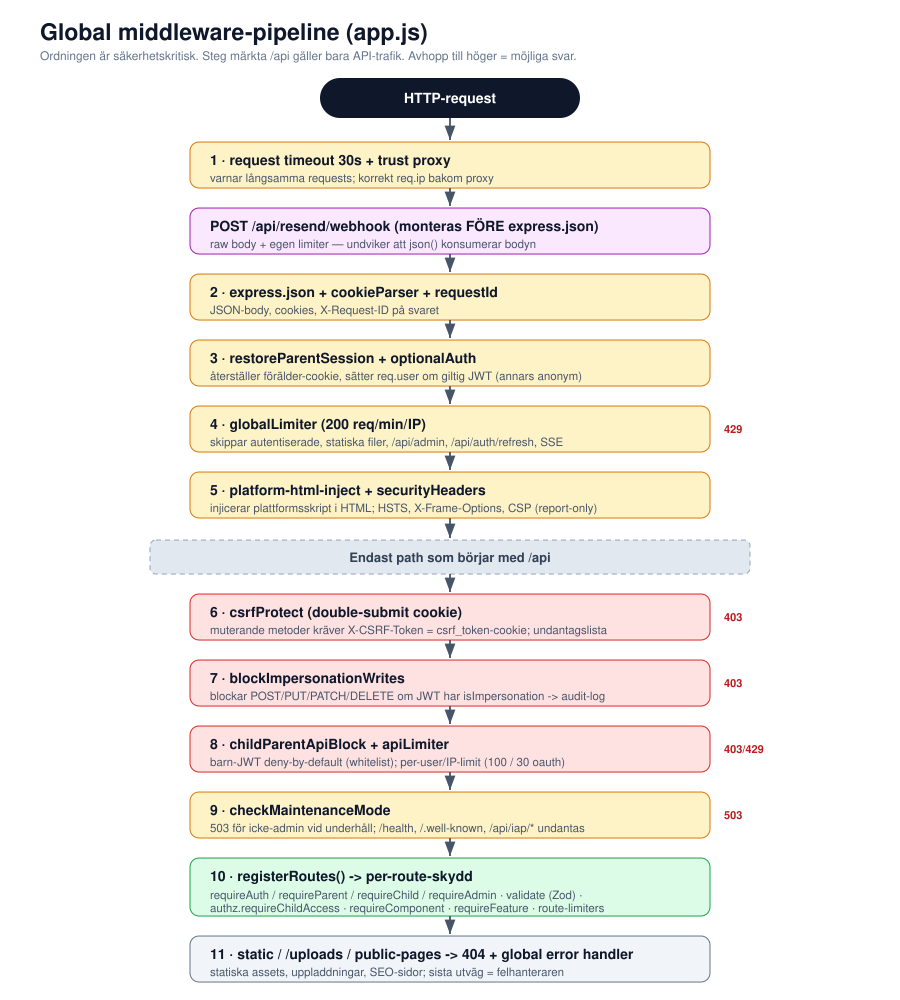
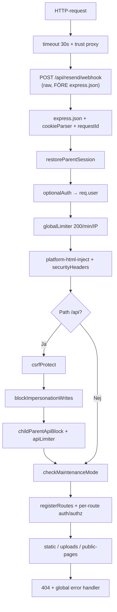

# 01 · Arkitektur

## 1. Teknisk stack

| Lager | Teknik |
|-------|--------|
| Webbserver | Express.js 4 (`server.js` → `app.js`) |
| Databas | PostgreSQL (Neon i prod, lokal `pg` i dev), `pg.Pool` max 5, `statement_timeout` 15 s |
| Frontend | Statiska HTML-sidor i `public/`, vanilla JS-moduler, Tailwind (byggd CSS `public/css/tailwind.build.css`), Service Worker (`public/sw.js`) |
| Native | Capacitor 7 (iOS + Android): Apple/Google Sign In, Camera, Push |
| Auth | JWT (jsonwebtoken) i httpOnly-cookies, scrypt-hashning (`src/lib/hash.js`) |
| Validering | Zod (`src/middleware/validate.js`, `src/lib/schemas.js`) |
| E-post | Resend (`src/lib/email.js`) |
| Betalning | RevenueCat IAP (`src/routes/iap.js`) — ingen webb-checkout, Stripe borttaget |
| Push | Web Push (VAPID), Apple APNs (rå HTTP/2 + ES256), FCM |
| Fil-lagring | Cloudflare R2 (när `R2_*` satt), annars lokal disk `data/uploads` → `/uploads/…` |
| Loggning | Pino (`src/lib/logger.js`) |
| Deploy | VPS (`systemd`-tjänst `mystarday`) via GitHub Actions; även Render |

## 2. Bootstrap

`server.js` laddar env, bygger appen via `createApp()` (`app.js`) och startar **13 schedulers** efter `app.listen()`. Alla stoppas vid `SIGTERM`/`SIGINT` följt av `pool.end()`.

`createApp()` används av både produktion och integrationstester (binder ingen port, startar inga schedulers) — bra för testbarhet.

## 3. Global middleware-pipeline

Ordningen är säkerhetskritisk. Den definieras i `app.js`:

| # | Middleware | Roll |
|---|------------|------|
| 0 | request timeout 30 s, `trust proxy` | korrekt `req.ip` bakom proxy |
| 1 | `POST /api/resend/webhook` (raw) | monteras **före** `express.json` så bodyn inte konsumeras |
| 2 | `express.json`, `cookieParser`, `requestId` | body, cookies, `X-Request-ID` |
| 3 | `restoreParentSession` → `optionalAuth` | sätter `req.user` om giltig JWT |
| 4 | `globalLimiter` (200/min/IP) | skippar autentiserade, statiska filer, `/api/admin`, `/api/auth/refresh`, SSE |
| 5 | `platform-html-inject`, `securityHeaders` | injicerar plattformsskript; HSTS, X-Frame-Options, CSP (report-only) |
| 6 | `csrfProtect` (`/api`) | double-submit cookie |
| 7 | `blockImpersonationWrites` (`/api`) | blockar skriv under impersonation |
| 8 | `childParentApiBlock` + `apiLimiter` (`/api`) | barn-JWT deny-by-default + per-user/IP-limit |
| 9 | `checkMaintenanceMode` | 503 vid underhåll (admin + `/api/iap/*` undantas) |
| 10 | `registerRoutes()` | per-route: `requireAuth/Parent/Child/Admin`, `validate`, `authz`, `requireComponent/Feature` |
| 11 | static / uploads / public-pages → 404 + error handler | |

## 4. Autentisering

### Tokens

| Användartyp | Access-JWT TTL | Cookie maxAge | Refresh |
|-------------|----------------|---------------|---------|
| Vuxen / admin | 15 min | 30 dagar | 30 dagar (SHA-256-hash i DB) |
| Barn | 8 timmar | 30 dagar | 30 dagar |

- JWT-payload: `{ id, type, familyId, email/username, isAdmin? }`. Dual-secret stöds (`JWT_SECRET` + `JWT_SECRET_PREVIOUS`) för rotation.
- Token-källa (prioritet): `Authorization: Bearer` → `access_token`-cookie → legacy `token`-cookie → `?token=` (endast SSE).
- Refresh-cookie har `path: /api/auth` (skickas bara till auth-endpoints) och **roteras** vid varje refresh.

### Inloggningsvägar

- **Vuxen:** e-post + lösenord (scrypt), `loginLimiter` 5 misslyckade/15 min, e-postverifiering med 24 h grace.
- **Barn:** namn/username + 4-siffrig PIN (scrypt), DB-baserad lockout (`pin_lockout`) med exponentiell backoff. Förälder-session sparas i `stjarndag_parent_session`.
- **Apple:** verifierar `idToken` mot Apple JWKS (RS256). Skapar konto eller loggar in.
- **Google:** verifierar `idToken`, **endast inloggning** av befintligt konto.

### CSRF

Double-submit cookie: läsbar `csrf_token`-cookie + `X-CSRF-Token`-header jämförs med `timingSafeEqual`. Auth-bootstrap, publika formulär och anonyma survey-endpoints är undantagna (`src/middleware/csrf.js`).

> ⚠️ **IAP-webhooken saknas i CSRF-undantagslistan** trots att den är extern och inte kan skicka CSRF-token. Se [06-kodanalys.md](06-kodanalys.md) §K1.

## 5. Rate limiting

| Limiter | Budget | Nyckel |
|---------|--------|--------|
| `globalLimiter` | 200/min | IP (`CF-Connecting-IP`) |
| `apiLimiter` | 100/min (auth) / 30/min (oauth) | `user:{id}` eller IP |
| `loginLimiter` | 5 misslyckade/15 min | IP |
| `childLoginLimiter` | 5 misslyckade/15 min | IP |
| `registrationLimiter` | 3/timme | IP |
| `appleLoginLimiter` | 10/timme | IP (delas av Apple+Google) |
| `parentPinLimiter` | 5/15 min | parent/family/IP |
| `iapWebhookLimiter` | 100/min | IP |
| PIN-lockout (DB) | 5 → backoff | per `child_id` |

> In-memory store — delas inte mellan instanser och nollställs vid omstart.

## 6. Schedulers (13 st)

Startas i `server.js`. De flesta försöker ta ett PostgreSQL advisory lock för single-instance-skydd.

| Scheduler | Syfte |
|-----------|-------|
| `midnight-scheduler` | Nattjobb: analytics-snapshot, pruning (referensimplementation för korrekt lock) |
| `deletion-scheduler` | GDPR-kontoradering |
| `weekly-summary-scheduler` | Veckosammanfattning till föräldrar |
| `library-notifications` | Biblioteksnotiser |
| `nyhet-scheduler` | Publicering av Dagens nyhet |
| `push-reminder-scheduler` | Schemapåminnelser + inaktivitetsnudge |
| `win-back-scheduler` | Win-back-mejl (godkännande/auto-send) |
| `activation-program-email-scheduler` | Aktiveringsmejl |
| `activation-program-scheduler` | Aktiverings-push |
| `activation-nudge-scheduler` | Aktiverings-nudges |
| `child-handoff-reminder-scheduler` | Barn-byte-påminnelser |
| `custody-handoff-scheduler` | Vårdnadsschema-handoff |
| `retention-reengagement-scheduler` | Retention dag 3/7/14 |

> ⚠️ Flera schedulers tar advisory lock på `pool.query()` (connection-scoped lock funkar inte över poolen) och **fail-open** vid lock-fel. Se [06-kodanalys.md](06-kodanalys.md) §K2–K3.

## 7. Realtid

Server-Sent Events (`src/lib/sse-broadcast.js`, `src/routes/events.js`) pushar t.ex. `DAILY_LOG_ITEM_COMPLETED` till föräldrar när ett barn bockar av. SSE-token kan skickas via query-param (`?token=`).

## 8. Externa integrationer

| Integration | Användning | Konfiguration |
|-------------|-----------|---------------|
| Resend | All utgående e-post | `RESEND_API_KEY`, kill switch `EMAIL_ENABLED=false` |
| RevenueCat | IAP (enda betalväg på native) | `REVENUECAT_API_KEY`, `REVENUECAT_WEBHOOK_SECRET` |
| Web Push | Webbnotiser | `VAPID_PUBLIC_KEY` / `VAPID_PRIVATE_KEY` |
| Apple APNs | iOS-push | `APNS_KEY_ID`, `APNS_TEAM_ID`, `APNS_KEY_PATH`, `APNS_BUNDLE_ID` |
| Facebook Graph | Korsposta Dagens nyhet | `FACEBOOK_PAGE_ACCESS_TOKEN`, `FACEBOOK_PAGE_ID` |
| Cloudflare R2 | Bilduppladdning | `R2_*` (annars lokal disk) |

Alla integrationer degraderar elegant utan nycklar (bra för dev/test).
