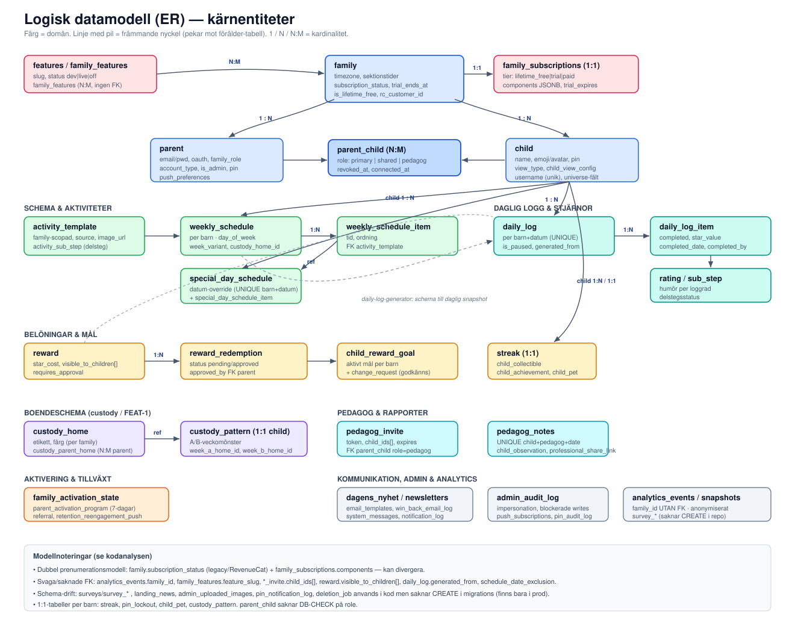
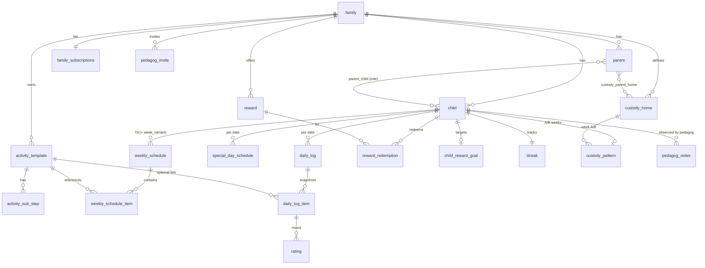

# 02 · Datamodell

Modellen har ~80 tabeller. Källor: `db/baseline-schema.sql` (kärnschema via migration `1780000000000`), 58 migrationer i `migrations/`, `migrate.js`, samt 51 query-moduler i `db/`.

## 1. Kärnnav (förenklat ER)

## 2. Domängruppering

### Identitet & familj
`family`, `parent`, `child`, `parent_child` (N:M, `role` primary/shared/pedagog, soft revoke), `family_invite`, `user_consent`, `refresh_token`, `email_verification`, `password_reset`, `email_change_token`, `login_attempt`, `login_event`, `deletion_job`.

### Schema & aktiviteter
`category`, `activity_template` (+ `activity_sub_step`), `weekly_schedule` (+ `weekly_schedule_item`), `special_day_schedule` (+ items, UNIQUE per barn+datum), `schedule_date_exclusion`, globalt bibliotek `default_activity_template` / `default_schedule` / `default_schedule_item`, `family_image`.

### Daglig logg & stjärnor
`daily_log` (UNIQUE child+date, `is_paused`), `daily_log_item` (`completed_date`, `star_value`, `completed_by`), `daily_log_item_sub_step`, `rating`, `streak` (1:1), `manual_star_grant`, `parent_seen_completion`, `parent_note`.

### Belöningar & barn-universum
`reward` (`visible_to_children UUID[]`), `reward_redemption`, `child_reward_goal` (+ `change_request`), `default_reward`, `collectible_catalog` / `child_collectible`, `achievement_definition` / `child_achievement`, `child_pet` (1:1).

### Boendeschema (custody / FEAT-1)
`custody_home`, `custody_parent_home` (N:M parent), `custody_pattern` (1:1 child, A/B-veckomönster).

### Pedagog & professionell delning
`pedagog_invite`, `pedagog_notes` (UNIQUE child+pedagog+date), `pedagog_day_comment`, `pedagog_day_absence`, `pedagog_school_activity`, `pedagog_audit_log`, `child_observation`, `general_observations`, `professional_share_link`.

### Prenumeration & paket
`family_subscriptions` (1:1, `tier` + `components` JSONB), `subscription_addons` (legacy), `package_interest`, `app_settings`. Parallellt på `family`: `subscription_status`, `trial_ends_at`, `is_lifetime_free`, `rc_customer_id`.

### Feature flags
`features` (slug, status dev/live/off), `family_features` (N:M, **ingen FK** till `features.slug`), `feature_flag` (operativa on/off-toggles).

### Aktivering, retention & referral
`family_activation_state` (1:1), `parent_activation_program`, `activation_program_email_invite`, `retention_reengagement_push`, `referral_code`, `referral`.

### Family Hall (social)
`family_project`, `family_event` (event-sourced), `family_chest` (1:1).

### Enkäter
`surveys`, `survey_questions`, `survey_options`, `survey_responses`, `survey_response_answers`, `survey_participants`, `survey_popup_interactions`, `survey_contest_entries`.

### Admin, kommunikation & analytics
`admin_audit_log`, `system_messages`, `dagens_nyhet`, `newsletters`, `newsletter_email_send`, `email_subscriptions`, `public_newsletter_subscriber`, `email_templates`, `welcome_email_template`, `win_back_email_log`, `weekly_summary_send_log`, `library_update_log`, `landing_news`, `admin_uploaded_images`, `contact_message`, `app_config`, `analytics_events`, `analytics_daily_snapshots`, `waitlist`, `professional_interest`.

### Push, notiser & PIN
`push_subscriptions` (web + native), `notification_log`, `notification_preference` (1:1), `pin_lockout` (1:1), `pin_notification_log`, `pin_audit_log`, `reminder_settings` (1:1).

## 3. Centrala dataflöden

1. **Schema → daglig logg:** `daily-log-generator.js` läser `weekly_schedule`/`special_day_schedule` och genererar on-demand en **denormaliserad snapshot** i `daily_log` + `daily_log_item` för ett givet datum. `daily_log_item` behåller aktivitetsnamn även om mallen raderas (FK `SET NULL`).
2. **Stjärnor är beräknade, inte lagrade:** saldo = `Σ completed daily_log_item.star_value + manual_star_grant − inlösta redemptions` (`src/routes/rewards.js`).
3. **Boendeschema:** `custody_home` + `custody_pattern` lägger en A/B-veckodimension (`week_variant`) ovanpå `weekly_schedule`.

## 4. Modellbrister (sammanfattning)

| Problem | Detalj |
|---------|--------|
| **Dubbel prenumerationsmodell** | `family.subscription_status` (legacy/RevenueCat) **och** `family_subscriptions.components` — kan divergera om bara en uppdateras |
| **Schema-drift** | `surveys`/`survey_*`, `landing_news`, `admin_uploaded_images`, `pin_notification_log`, `deletion_job` används i kod men saknar `CREATE` i `migrations/` — finns bara i prod. En färsk VPS får trasiga enkät-/admin-flöden |
| **Svaga/saknade FK** | `analytics_events.family_id`, `family_features.feature_slug`, `*_invite.child_ids[]`, `reward.visible_to_children[]`, `daily_log.generated_from`, `schedule_date_exclusion`, `refresh_token` (ingen CHECK att exakt en av parent_id/child_id är satt) |
| **Mjuka constraints i appen** | `parent_child.role` saknar DB-CHECK; ingen DB-garanti att `pedagog_id` faktiskt har `role='pedagog'`; invite-`child_ids` kan peka på barn i annan familj |
| **Redundans / legacy** | `weekly_schedule.family_id` duplicerar `child.family_id`; `parent_note` vs `child_observation`; `subscription_addons.stripe_price_id` (Stripe borttaget) |
| **1:1-tabeller per barn** | `streak`, `pin_lockout`, `child_pet`, `custody_pattern` |

Se [06-kodanalys.md](06-kodanalys.md) för åtgärdsförslag.
