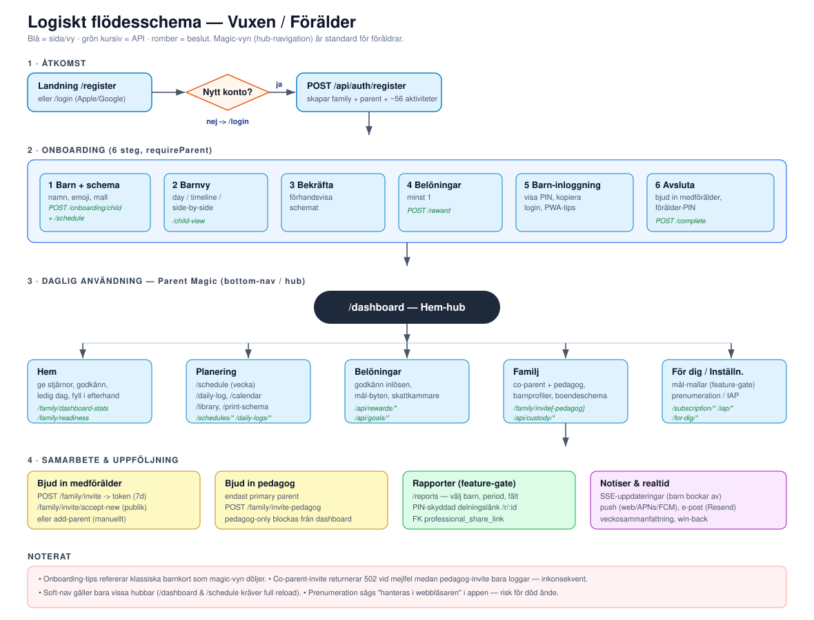
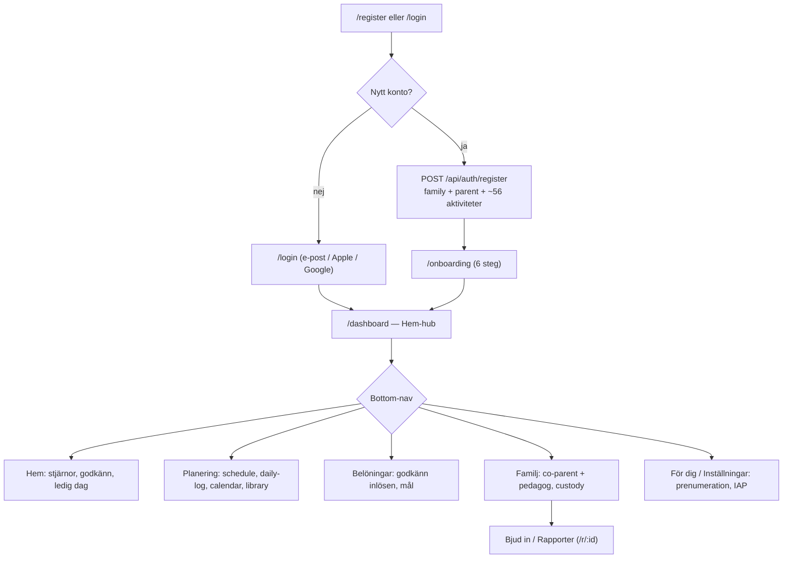

# 03 · Logiskt schema — Vuxen / Förälder

Föräldern är systemets primära "redaktör": skapar barn och scheman, ger/godkänner stjärnor, bjuder in medförälder och pedagog, samt följer upp via rapporter. **Parent Magic** (hub-baserad bottom-nav) är standardvyn.

## Flödesöversikt

## 1. Registrering

`POST /api/auth/register` (`src/routes/auth/register.js`) skapar i en transaktion:
- `family` (14 dagars `trial_ends_at`, `subscription_status='none'`, ev. `is_lifetime_free` för founders),
- `parent` (`onboarding_completed=false`, `verified=false`),
- ~56 aktiviteter i 6 kategorier (från `default_activity_template` eller hårdkodad fallback),
- `family_subscriptions` tier `trial` + komponent `basic_app`,
- verifieringstoken + välkomstmejl.

Klienten auto-loggar in och `public/js/auth.js` skickar nya föräldrar till `/onboarding`. Alternativ: Apple/Google OAuth via `/login`.

## 2. Onboarding (6 steg)

Routes i `src/routes/onboarding.js` (alla `requireParent`).

| Steg | Innehåll | API |
|------|----------|-----|
| 1 | Barn + schema (namn, emoji, mall, auto-PIN/username) | `POST /onboarding/child` → `/schedule` (+ ev. `/weekend-schedule`) |
| 2 | Barnvy: `day` / `timeline` / `side-by-side` | `POST /child-view` |
| 3 | Bekräfta schema (förhandsvisning) | — |
| 4 | Belöningar (minst 1) | `POST /reward` |
| 5 | Barn-inloggning: visa PIN, kopiera/maila login, PWA-tips | ev. `POST /update-pin` |
| 6 | Avsluta: bjud in medförälder, sätt förälder-PIN | `POST /complete` |

`add-child`-läge (`?flow=add-child`) hoppar över steg 6 och går till `/child-login`.

## 3. Daglig användning (Parent Magic)

Navigationen styrs av `public/js/nav-config.js` (single source of truth) + `parent-magic-shell.js` (bottom-nav) + `parent-magic-router.js` (soft navigation).

| Hub | Funktion | Viktiga API |
|-----|----------|-------------|
| **Hem** (`/dashboard`) | Ge extra stjärnor, godkänn begäran, ledig dag, fyll i efterhand, barn-handoff | `GET /api/family/dashboard-stats`, `/readiness` |
| **Planering** (`/planning`) | `/schedule` (veckoredigering + DnD), `/daily-log`, `/calendar`, `/library`, `/print-schema` | `/api/schedules/*`, `/api/daily-logs/*` |
| **Belöningar** (`/rewards`) | Godkänn inlösen, mål-byten, skattkammare per barn | `/api/rewards/*`, `/api/goals/*` |
| **Familj** (`/family`) | Co-parent + pedagog, barnprofiler, boendeschema | `/api/family/*`, `/api/custody/*` |
| **För dig / Inställningar** | Mål-mallar (feature-gate), prenumeration/IAP | `/api/for-dig/*`, `/api/subscription/*` |

> Soft-nav (ingen full reload) gäller `/planning`, `/rewards`, `/for-dig`, `/family`. `/dashboard` och `/schedule` kräver full reload (många satellitskript).

## 4. Samarbete — inbjudningar

### Medförälder (co-parent)
`POST /api/family/invite` → 7-dagars token. Publik validering `GET /api/family/invite/:token`, accept via `/invite/accept-new` (nytt konto) eller `/accept-invite` (befintligt). Alternativt `/add-parent` (manuellt).

### Pedagog
`POST /api/family/invite-pedagog` — **endast primary parent**. Publik accept via `/pedagog-invite`. Pedagog-only-föräldrar blockas från familjedashboard (`requireNotPedagogOnly`).

## 5. Rapporter

`/reports` (feature-gate `klinisk_rapportering`). Föräldern väljer barn, period och fält (aktiviteter, humör, pedagoganteckningar) och skapar en **PIN-skyddad delningslänk** `/r/:publicId` (→ `professional_share_link`) med QR-kod.

## 6. Prenumeration / IAP

`GET /api/subscription/status` → `lifetime_free` / `trial` / `paid`. Native köp via RevenueCat (`/api/iap/config` + webhook). I appen visas att prenumeration "hanteras via webbläsaren".

## Noterade UX-brister

1. Onboarding-tips refererar klassiska barnkort som magic-vyn döljer (`parent-magic-legacy-hide`).
2. Dubbel navigationsmodell (magic bottom-nav + legacy sidebar i HTML på desktop).
3. Co-parent-invite returnerar 502 vid mejlfel, medan pedagog-invite bara loggar — inkonsekvent felhantering.
4. Tomt globalt bibliotek i dev → onboarding fastnar på "Laddar scheman…".
5. Prenumeration är en "död ände" i appen (hänvisar till webben).
6. Rapporter-länkar döljs tyst om feature-flaggan är av (slug `klinisk_rapportering` ≠ UI-namn "Rapporter").
