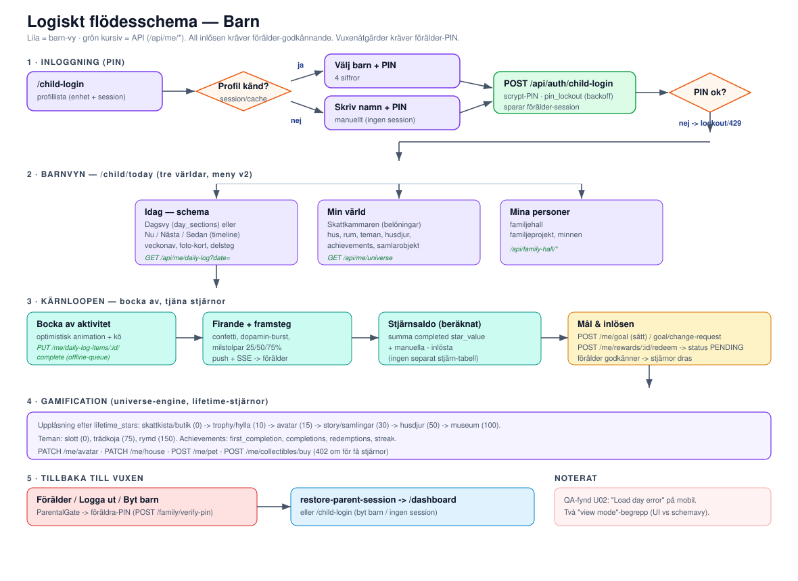
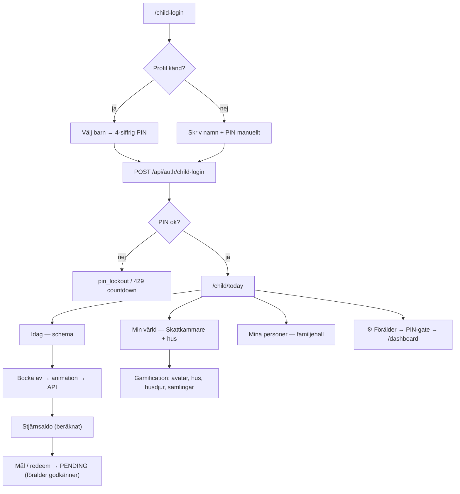

# 04 · Logiskt schema — Barn



Barnet loggar in med PIN och möter en lekfull vy uppdelad i tre "världar". Kärnloopen är: **se schema → bocka av → tjäna stjärnor → lösa in belöningar → låsa upp gamification**. Alla inlösen kräver förälder-godkännande och alla vuxenåtgärder kräver förälder-PIN.

## Flödesöversikt



## 1. Inloggning (PIN)

Filer: `public/child-login.html`, `public/js/child-login.js`, `src/routes/auth/child-login.js`.

- **Profilval:** slår ihop `localStorage` (`known_children`) med barn från föräldersession (`/api/auth/login-picker-children`). Ett enda barn → auto-select direkt till PIN.
- **Utan session:** visar cachade profiler, annars manuellt namn+PIN-formulär.
- **PIN:** 4 siffror, scrypt-hashad i `child.pin`. Vid flera barn med samma visningsnamn disambiguerar PIN.
- **Lockout** (`db/pin-lockout.js`): 5 försök → 1 min, +3 → 5 min, +6 → 15 min. Vid 3:e felet notifieras föräldern (in-app + e-post med cooldown).
- Vid lyckad inloggning sparas föräldersession i `stjarndag_parent_session`; klienten verifierar via `GET /api/auth/me` att barn-cookien vann.

## 2. Barnvyn — tre världar

`/child/today` (`public/child-dashboard.html`), meny v2 (`public/js/child-worlds.js`):

| Värld | URL | Innehåll |
|-------|-----|----------|
| **Idag** | `/child/today` | Schema, bocka av |
| **Min värld** | `/child/world` | Skattkammaren + gamification-hub |
| **Mina personer** | `/child/family` | Familjehall |

### Två schemavyer (`child.view_type`)
- `day_sections` — Dagsvy, grupperat per dagdel (standard).
- `now_next_later` — Nu / Nästa / Sedan (tidslinje).

Växling via `PUT /api/me/view-type`. Aktiviteter visas som emoji-rader eller **foto-kort** (`child-dashboard-photo-cards.js`). Delsteg kan expanderas; alla klara auto-completear huvudaktiviteten. Offline stöds (`OfflineStore`/`OfflineQueue`).

> OBS: två olika "view mode"-begrepp — `child_view_config.view_mode` (classic vs ny UI, A/B i `child-view.js`) vs `view_type` (dagsvy vs timeline). Lätt att blanda ihop.

## 3. Kärnloopen — bocka av & tjäna stjärnor

1. `toggleItem(id)` → optimistisk animation (`launchDopaminBurst`) → kö → `PUT /api/me/daily-log-items/:id/complete` (`src/routes/daily-logs/child-self.js`).
2. Sidoeffekter: push till föräldrar, SSE `DAILY_LOG_ITEM_COMPLETED`, aktiveringsprogram, family-event-engine.
3. Firande: confetti, dopamin-burst, milstolpar 25/50/75 % (`child-dashboard-celebrations.js`).
4. **Stjärnsaldo är beräknat:** `Σ completed star_value + manuella − inlösta`. Ingen separat stjärn-transaktionstabell.
5. Pausad dag (`daily_log.is_paused`) → 400 "Dagen är pausad".

## 4. Skattkammaren & belöningar

`public/js/child-dashboard-rewards.js` + `src/routes/rewards.js` / `goals.js`:

| Action | Endpoint | Resultat |
|--------|----------|----------|
| Lista belöningar | `GET /api/me/rewards` | rewards + starBalance + redemptions |
| Sätt mål (första) | `POST /api/me/goal` | direkt |
| Byt mål | `POST /api/me/goal/change-request` | väntar på förälder |
| Lös in | `POST /api/me/rewards/:id/redeem` | **alltid `status: pending`** — förälder måste godkänna; stjärnor dras först då |

## 5. Gamification (universe-engine)

`src/routes/child-universe.js` + `src/lib/universe-engine.js`. Upplåsning efter `lifetime_stars`:

```
skattkista/butik (0) → trophy/hylla (10) → avatar (15) → story/samlingar (30) → husdjur (50) → museum (100)
teman: slott (0), trädkoja (75), rymd (150)
```

Interaktioner: `PATCH /me/avatar`, `PATCH /me/house`, `POST /me/pet`, `POST /me/collectibles/buy` (402 om för få stjärnor). Achievements: `first_completion`, `completions`, `redemptions`, `streak`.

## 6. Tillbaka till vuxen

- **⚙️ Förälder** (`child-system-menu.js`) → `ParentalGate.requireParentMode()` → förälder-PIN (`POST /api/family/verify-pin`) → meny (byt barn, mörkt läge, logga ut).
- **Logga ut:** om sparad föräldersession → PIN-overlay → `restore-parent-session` → `/dashboard`, annars `/child-login`.
- **Byt barn:** behåller föräldersession → `/child-login?picker=1`.

## Noterade UX-brister

1. **QA-fynd U02:** "Load day error" på barn-mobil (release-gate-protokollet).
2. Alla inlösen kräver förälder — barnet kan aldrig slutföra själv (medvetet, men kan kännas som en återvändsgränd).
3. Två "view mode"-begrepp (se §2).
4. Pausad dag ger 400 utan tydlig UI-förklaring beroende på toast-hantering.
5. v2-chrome kan dölja schemavy-växlaren/print i headern.
