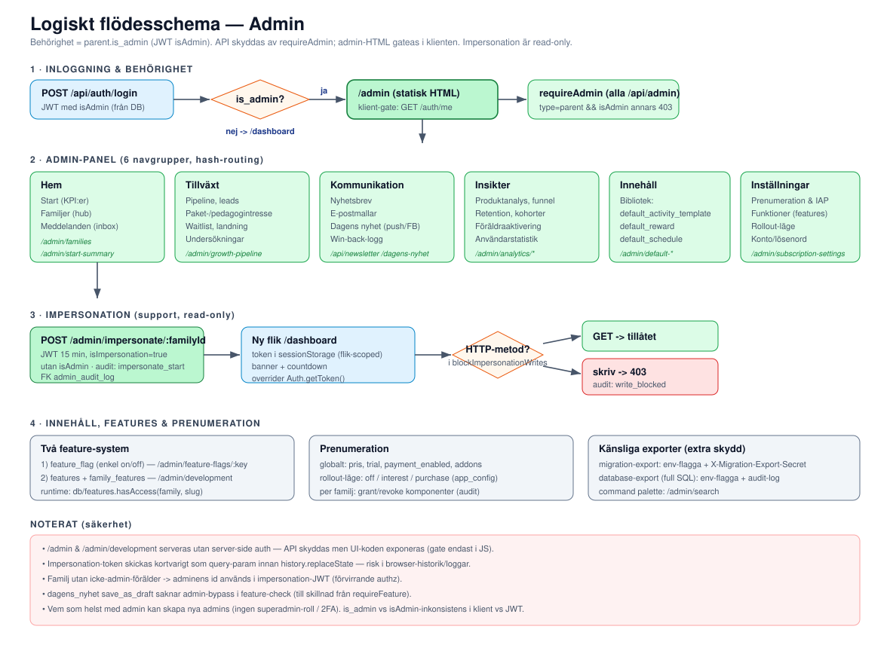
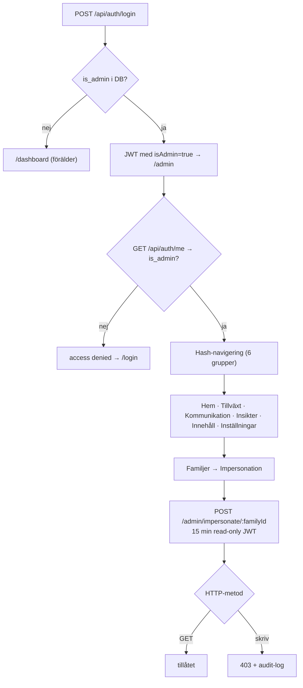
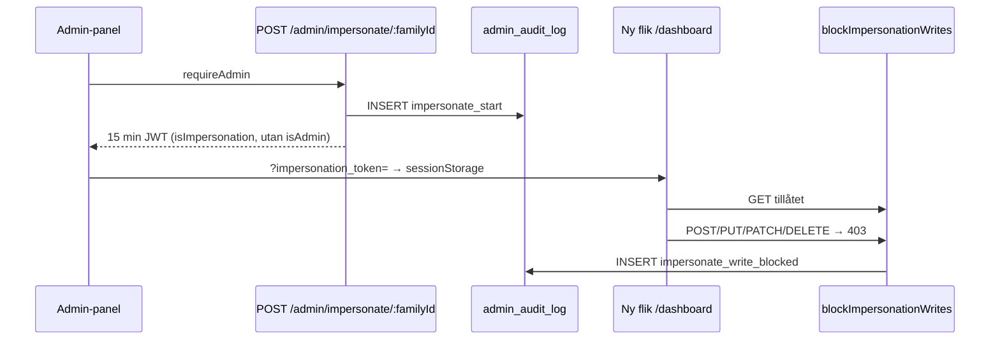

# 05 · Logiskt schema — Admin

Admin är en vanlig `parent`-rad med flaggan `is_admin = true` (ingen separat admin-tabell). Behörigheten bärs i JWT som `isAdmin`. Alla `/api/admin`-routes skyddas av `requireAdmin`; själva admin-HTML:en gateas i klienten.

## Flödesöversikt

## 1. Behörighet

- `requireAdmin` (`src/middleware/auth.js`): kräver `type === 'parent'` och `isAdmin`, annars 403.
- JWT sätts vid login med `isAdmin: parent.is_admin` (`src/routes/auth/session.js`).
- `POST /api/admin/create-admin` skapar ny admin; `PUT /api/admin/parents/:id/admin` togglar (förhindrar själv-demotering).
- Admin bypassar underhållsläge och global rate limit för `/api/admin/*`.

## 2. Panelen — 6 navgrupper

Definieras i `public/admin/admin-nav.js`. ~30 API-moduler under `src/routes/admin/`.

| Grupp | Sektioner | Funktion |
|-------|-----------|----------|
| **Hem** | Start, Familjer, Meddelanden | KPI-dashboard, familjehub (impersonation, föräldrahantering, paketkomponenter, audit), kontaktformulär-inbox |
| **Tillväxt** | Pipeline, Paket-/Pedagogintresse, Waitlist, Landningssidor, Undersökningar | Lead-pipeline, intresseanmälningar, `landing_news`, enkäter (`surveys`) |
| **Kommunikation** | Nyhetsbrev, E-postmallar, Dagens nyhet, E-postlogg | Nyhetsbrev (Resend), 4 mallar, Dagens nyhet (push/Facebook/e-post), win-back-kö |
| **Insikter** | Produktanalys, Retention, Föräldraaktivering, Användarstatistik | Funnel, kohort-retention, aktiveringsexperiment, login-stats |
| **Innehåll** | Bibliotek | Globala `default_activity_template` / `default_reward` / `default_schedule` |
| **Inställningar** | Prenumeration & IAP, Funktioner, Konto | Pris/trial/IAP-toggle/addons/rollout, feature registry (`/admin/development`), lösenordsbyte |

## 3. Admin-API-grupper

`src/routes/admin.js` kör `router.use(requireAdmin)` på alla sub-routers. Urval:

| Modul | Bas-path | Syfte |
|-------|----------|-------|
| `family.js` | `/families`, `/parents`, `/impersonate`, `/create-admin` | Familj-/föräldra-CRUD, impersonation, audit |
| `family-components.js` | `/families/:id/subscription`, `/components/:slug` | Per-familj prenumerationskomponenter |
| `analytics.js` | `/analytics/*` | Produktanalys, snapshots, funnel |
| `features.js` | `/features` | `features`-tabellen + familjetilldelning |
| `system.js` | `/stats`, `/feature-flags`, `/app-config`, `/messages`, `/push` | Statistik, enkla flaggor, systemmeddelanden |
| `subscription-settings.js` | `/subscription-settings` | Pris, trial, IAP, addons |
| `migration-export.js` / `database-export.js` | `/migration-export`, `/export/sql` | Känsliga exporter (extra skydd) |

Admin-skyddade men utanför mappen: `dagens-nyhet.js`, `newsletter.js`, `surveys/admin.js`.

## 4. Impersonation (support, read-only)

- JWT 15 min, `isImpersonation: true`, **utan** `isAdmin`. Loggar `impersonate_start`.
- `blockImpersonationWrites` (globalt på `/api`) blockerar alla muterande metoder och loggar `impersonate_write_blocked`.
- Klienten håller token i `sessionStorage` (flik-scoped) + banner/countdown.

## 5. Feature flags & prenumeration (två system)

1. **Legacy `feature_flag`** — enkel on/off via `/admin/feature-flags/:key` (t.ex. `win_back_auto_approve`).
2. **Modernt `features` + `family_features`** — status dev/live/off, familjetilldelning, runtime via `db/features.hasAccess(familyId, slug)`.

Prenumeration: globala inställningar, rollout-läge (`off`/`interest`/`purchase` i `app_config`) och per-familj grant/revoke (audit-loggat).

## Noterade säkerhetsbrister

1. `/admin` och `/admin/development` serveras **utan** server-side auth — API skyddas men UI-koden exponeras (gate endast i JS).
2. Impersonation-token skickas kortvarigt som query-param innan `history.replaceState` — risk i browser-historik/loggar.
3. Familj utan icke-admin-förälder → adminens id används i impersonation-JWT (förvirrande authz).
4. `dagens_nyhet save_as_draft` saknar admin-bypass i feature-checken (till skillnad från `requireFeature`).
5. Vem som helst med admin kan skapa nya admins (ingen superadmin-roll / 2FA).
6. `is_admin` (klient) vs `isAdmin` (JWT) — fungerar idag men fragilt om `/me`-formatet ändras.

Se [06-kodanalys.md](06-kodanalys.md) för detaljer och åtgärdsförslag.
