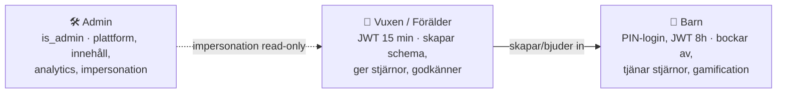

# Systemdokumentation — Min Stjärndag

Teknisk översikt, logiska scheman och kodanalys för **Min Stjärndag** (`mystarday`) — en svensk familjeapp för barns dagliga rutiner, stjärnbelöningar och schemahantering.

> Genererad 2026-06-25 genom en strukturerad kodgenomgång (backend, frontend, datamodell, schedulers och integrationer). Filreferenser anges som `fil:rad` där det är relevant. Sanningskällan är alltid koden — denna dokumentation är en ögonblicksbild.

## Innehåll

| Dokument | Beskrivning |
|----------|-------------|
| [01-arkitektur.md](01-arkitektur.md) | Teknisk stack, middleware-pipeline, autentisering, schedulers, integrationer |
| [02-datamodell.md](02-datamodell.md) | Logisk datamodell (ER), domängruppering, relationer, modellbrister |
| [03-logiskt-schema-foralder.md](03-logiskt-schema-foralder.md) | Vuxen/förälder: registrering → onboarding → daglig användning → samarbete → rapporter |
| [04-logiskt-schema-barn.md](04-logiskt-schema-barn.md) | Barn: PIN-inloggning → schema → bocka av → stjärnor → belöningar → gamification |
| [05-logiskt-schema-admin.md](05-logiskt-schema-admin.md) | Admin: behörighet, panel, impersonation, innehåll, feature flags |
| [06-kodanalys.md](06-kodanalys.md) | Prioriterad lista över buggar, brister och förbättringsmöjligheter |

## Diagram (bildfiler)

Alla diagram finns både som inbäddade Mermaid-diagram i dokumenten ovan och som fristående SVG-bildfiler i [`diagram/`](diagram/):

| Bild | Innehåll |
|------|----------|
| [`diagram/arkitektur-oversikt.svg`](diagram/arkitektur-oversikt.svg) | Hela systemet: klienter → middleware → routes → tjänster → data/integrationer |
| [`diagram/middleware-pipeline.svg`](diagram/middleware-pipeline.svg) | Global middleware-ordning steg för steg |
| [`diagram/datamodell-er.svg`](diagram/datamodell-er.svg) | ER-diagram över kärnentiteterna |
| [`diagram/flode-foralder.svg`](diagram/flode-foralder.svg) | Logiskt flödesschema — förälder |
| [`diagram/flode-barn.svg`](diagram/flode-barn.svg) | Logiskt flödesschema — barn |
| [`diagram/flode-admin.svg`](diagram/flode-admin.svg) | Logiskt flödesschema — admin |

> SVG-filerna kan öppnas direkt i en webbläsare eller bildvisare. De är handritade (inte AI-genererade) och exakta. Mermaid-diagrammen i markdown renderas automatiskt i Cursor, VS Code (med tillägg) och GitHub.

## Systemet i en mening

En **Express.js**-server (statisk frontend i `public/`, ~120 API-route-filer, ~94 domänbibliotek, ~51 namngivna DB-moduler) mot **PostgreSQL** (Neon i prod), paketerad som **PWA** och som **native iOS/Android via Capacitor**, med push (Web Push / APNs / FCM), e-post (Resend) och betalning via **RevenueCat IAP**.

## Tre användartyper

## Snabbfakta

- **Entrypoint:** `server.js` → `app.js` (`createApp()`), startar 13 schedulers.
- **Auth:** JWT i httpOnly-cookies (access 15 min vuxen / 8 h barn, refresh 30 dagar, SHA-256 i DB), CSRF double-submit, scrypt för lösenord/PIN.
- **DB-pool:** `pg.Pool` max 5, `statement_timeout` 15 s.
- **Deploy:** VPS (`systemd`-tjänst `mystarday`, `https://mystarday.se`) via GitHub Actions; även Render.
